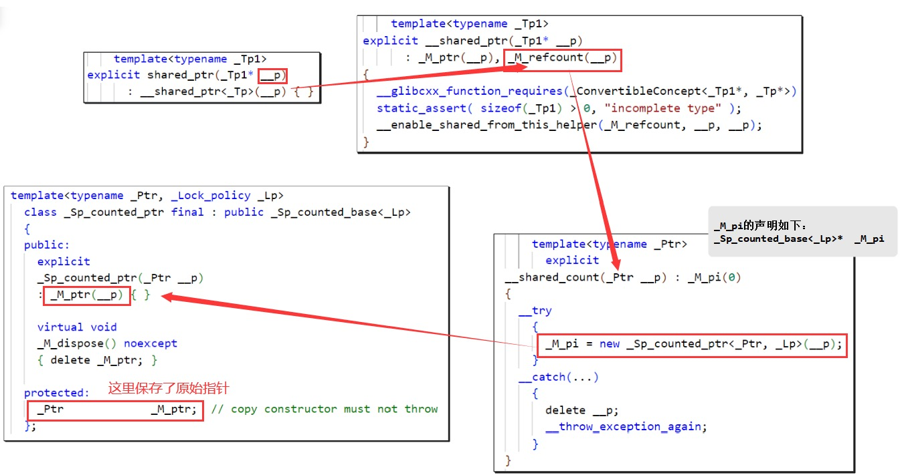
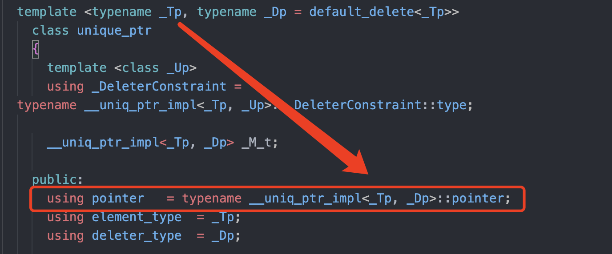
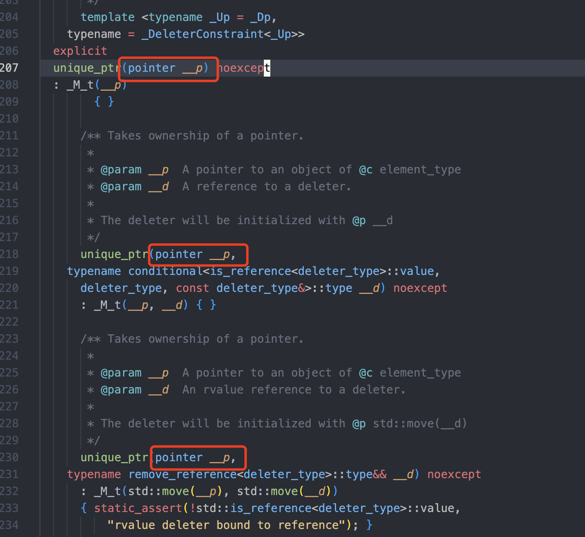

# shared_ptr相关细节

## 优先使用 make_shared

直接构造 `shared_ptr` 需要先 `new` 相应的对象

```cpp
template< class Y > 
explicit shared_ptr( Y* ptr );
template< class Y, class Deleter > 
shared_ptr( Y* ptr, Deleter d );
template< class Y, class Deleter, class Alloc > 
shared_ptr( Y* ptr, Deleter d, Alloc alloc );
```

`std::make_shared` 函数模板

```cpp
// since c++11
template< class T, class... Args >
shared_ptr<T> make_shared( Args&&... args );
// since c++20
template< class T >
shared_ptr<T> make_shared( std::size_t N );
template< class T >
shared_ptr<T> make_shared();
template< class T >
shared_ptr<T> make_shared( std::size_t N, const std::remove_extent_t<T>& u );
template< class T >
shared_ptr<T> make_shared( const std::remove_extent_t<T>& u );

auto sp0 = std::make_shared<int[5]>();
auto sp1 = std::make_shared<int[]>(5);
```

### `std::make_shared` 异常安全，发生异常时仍释放资源

```cpp
class Foo;
void func(std::shared_ptr<Foo>, int value);

// 假设函数形参 value 是调用另一个函数 get_value 获得的
// 直接构造 std::shared_ptr
func(std::shared_ptr<Foo>(new Foo), get_value())
// 使用 std::make_shared 构造 std::shared_ptr
func(std::make_shared<Foo>(), get_value())
```

当直接构造 `std::shared_ptr` 时，需要完成三个步骤

1. `new Foo`

2. `std::shared_ptr<Foo>()`

3. `get_value()`

但编译器不保证执行这三个步骤的顺序，所以当执行顺序是 1-> 3 -> 2 且 `get_value()` 抛出异常时，第一步已经成功初始化的资源便无法回收导致泄漏

使用 `std::make_shared` 时，需要完成两个步骤

1. `get_value`

2. `std::make_shared<Foo>()`

编译器不保证执行这两个步骤的顺序，所以当 `get_value` 发生异常时不会影响 `std::make_shared`，所以使用 `std::make_shared` 是异常安全的

### `std::make_shared` 比起直接使用 `new` 效率更高

```cpp
// shared_ptr.h
template<typename _Tp>
class shared_ptr : public __shared_ptr<_Tp>;

// shared_ptr_base.h
template<typename _Tp, _Lock_policy _Lp>
class __shared_ptr : public __shared_ptr_access<_Tp, _Lp>{
public:
  using element_type = typename remove_extent<_Tp>::type;

private:
  element_type* _M_ptr;
  __shared_cout<_Lp> _M_refcount;
};

// shared_ptr_base.h
template<_Lock_policy _Lp>
class __shared_count {
private:
  _Sp_counted_base<_Lp>* _M_pi;
};

// shared_ptr_base.h
template<_Lock_policy _Lp = __default_lock_policy>
class _Sp_counted_base : public _Mutex_base<_Lp> {
private:
  _Atomic_word _M_use_count;
  _Atomic_word _M_weak_count;
};
```

可以看出，`shared_ptr` 内部有两块资源，分别是原始资源 `element_type* _M_ptr` 和控制块 `_Sp_counted_base _M_pi`

直接调用构造函数时，需要先创建原始资源，再创建控制块，即需要通过两次 `new` 创建资源

```cpp
// shared_ptr.h
template<typename _Tp, typename _Alloc, typename... _Args>
inline shared_ptr<_Tp> allocate_shared(const _Alloc& __a,
                                       _Args&&... __args) {
    return shared_ptr<_Tp>(_Sp_alloc_shared_tag<_Alloc>{__a},
                          std::forward<_Args>(__args)...);
};

// shared_ptr.h
template<typename _Tp, typename... _Args>
inline shared_ptr<_Tp> make_shared(_Args... __args) {
    typedef typename std::remove_cv<_Tp>::type _Tp_nc;
    return std::allocate_shared<_Tp>(std::allocator<_Tp_nc>(),
                                     std::forward<_Args>(__args)...);
};
```

从源码中可以看到 `std::make_shared` 调用的是 `std::shared_ptr` 私有构造函数 `shared_ptr(_Sp_alloc_shared_tag<_Alloc> __tag, _Args&&... __args)`，而私有构造函数调用相应 `__shared_ptr` 的保护构造函数

```cpp
// shared_ptr_base.h
template<typename _Alloc, typename... _Args>
__shared_ptr(_Sp_alloc_shared_tag<_Alloc> __tag, _Args&&... __args)
: _M_ptr(), _M_refcount(_M_ptr, __tag, std::forward<_Args>(__args)...) {
    _M_enable_shared_from_this_with(_M_ptr);
}

// shared_ptr_base.h
template<typename _Tp, typename _Alloc, typename... _Args>
__shared_count(_Tp*& __p, _Sp_alloc_shared_tag<_Alloc> __a, _Args&&... __args) {
    typedef _Sp_counted_ptr_inplace<_Tp, _Alloc, _Lp> _Sp_cp_type;
    // __a._M_a 是 std::allocator
    typename _Sp_cp_type::__allocator_type __a2(__a._M_a);
    // 只分配一次空间，返回一个 __allocated_ptr
    auto __guard = std::__allocate_guarded(__a2);
    _Sp_cp_type* __mem = __guard.get();
    // placement new
    auto __pi = ::new (__mem) _Sp_cp_type(__a._M_a, std::forward<_Args>(__args)...);
    __guard = nullptr;
    // _Sp_counted_ptr_inplace 是 _Sp_counted_base 子类
    _M_pi = __pi;
    // 这里 __p 是引用变量，给外面的 _M_ptr 赋值
    __p = __pi->_M_ptr();
}

template<typename _Tp, typename _Alloc, _Lock_policy _Lp>
class _Sp_counted_ptr_inplace final : public _Sp_counted_base<_Lp> {
    class _Impl : _Sp_ebo_helper<0, _Alloc> {
        typedef _Sp_ebo_helper<0, _Alloc>	_A_base;

        __gnu_cxx::__aligned_buffer<_Tp> _M_storage;
    };

    _Impl _M_impl;
};
```

构造 `__shared_count` 时，通过引入 `_Sp_counted_ptr_inplace` 将原始数据和控制块组合在一起，达到一次分配内存同时创建两个资源的效果

由于 `std::make_shared` 仅分配一次资源，从而比直接构造 `shared_ptr` 效率更高

### make_shared 劣势

构造函数是保护或私有时，无法使用 `std::make_shared`

`std::make_shared` 无法指定删除器

## shared_ptr 与 unique_ptr 在释放资源时的不同

```cpp
namespace Test {
  class Object {
  public:
    using pointer = std::shared_ptr<Object>;
    virtual ~Object() {
      std::cout << "destruct Object" << std::endl;
    };
    // ~Object() {
    //   std::cout << "destruct Object" << std::endl;
    // };
  };

  class RealObject: public Object {
  public:
    RealObject(const std::string& str) {
	    str_ = str;
      std::cout << "construct " << str_ << std::endl;
    }
    ~RealObject() {
      std::cout << "destruct " << str_ << std::endl;
    }

  private:
    std::string str_;
  };

  void testCase() {
    std::shared_ptr<Object> sObj = std::make_shared<RealObject>("shared_ptr");
    std::unique_ptr<Object> uObj = std::make_unique<RealObject>("unique_ptr");
    Object* rObj = new RealObject("raw_ptr");
    delete rObj;
  }
};

int main(int argc, char** argv) {
  Test::testCase();
  return 0;
}

/*
非虚基类析构函数
construct shared_ptr
construct unique_ptr
construct raw_ptr
destruct Object
destruct Object
destruct shared_ptr
destruct Object
*/

/*
虚析构函数
construct shared_ptr
construct unique_ptr
construct raw_ptr
destruct raw_ptr
destruct Object
destruct unique_ptr
destruct Object
destruct shared_ptr
destruct Object
*/
```

从 demo 的输出结果，可以得到下面结论

1. 当基类析构函数是虚函数时，`std::shared_ptr` 和 `std::unique_ptr` 都能正确释放资源

2. 当基类析构函数不是虚函数时，`std::shared_ptr` 可以正确释放资源，而 `std::unique_ptr` 没能正确释放子类资源

3. `std::shared_ptr` 在两种情况下都能正确释放资源，是因为能够正确调用子类析构函数

4. `std::unique_ptr` 在基类析构函数不是虚函数时，只会调用父类析构函数，这跟原始指针的行为时一致的

造成 `std::shared_ptr` 和 `std::unqiue_ptr` 在释放资源上不同的原因在它们的构造函数

先来看 `std::shared_ptr` 的构造函数



从图中可以看到 `std::shared_ptr` 的构造函数是模板函数，因此内部保存了传入的原始指针类型

再来看 `std::unique_ptr` 的构造函数



`std::unique_ptr` 先内部定一个了一个 `pointer` 类型，该类型取决于 `_Tp`



`std::unique_ptr` 的构造函数都只接受 `pointer` 类型，因此内部只保存了模板类参数类型的指针，所以当父类析构函数非虚函数时，只会调用父类的析构函数

## 线程安全

`shared_ptr` 中有两个指针，一个指向所管理数据的地址，另一个指向执行控制块的地址

### 引用计数

执行控制块包括对关联资源的引用计数以及弱引用计数等

```cpp
template<_Lock_policy _Lp = __default_lock_policy>
    class _Sp_counted_base
    : public _Mutex_base<_Lp>
    {
    public:
      _Sp_counted_base() noexcept
      : _M_use_count(1), _M_weak_count(1) { }

      void
      _M_add_ref_copy()
      { __gnu_cxx::__atomic_add_dispatch(&_M_use_count, 1); }

      void
      _M_release() noexcept
      {
        // Be race-detector-friendly.  For more info see bits/c++config.
        _GLIBCXX_SYNCHRONIZATION_HAPPENS_BEFORE(&_M_use_count);
        if (__gnu_cxx::__exchange_and_add_dispatch(&_M_use_count, -1) == 1)
          {
            _GLIBCXX_SYNCHRONIZATION_HAPPENS_AFTER(&_M_use_count);
            _M_dispose();
            // There must be a memory barrier between dispose() and destroy()
            // to ensure that the effects of dispose() are observed in the
            // thread that runs destroy().
            // See http://gcc.gnu.org/ml/libstdc++/2005-11/msg00136.html
            if (_Mutex_base<_Lp>::_S_need_barriers)
              {
                __atomic_thread_fence (__ATOMIC_ACQ_REL);
              }

            // Be race-detector-friendly.  For more info see bits/c++config.
            _GLIBCXX_SYNCHRONIZATION_HAPPENS_BEFORE(&_M_weak_count);
            if (__gnu_cxx::__exchange_and_add_dispatch(&_M_weak_count,
                                                       -1) == 1)
              {
                _GLIBCXX_SYNCHRONIZATION_HAPPENS_AFTER(&_M_weak_count);
                _M_destroy();
              }
          }
      }

      void
      _M_weak_add_ref() noexcept
      { __gnu_cxx::__atomic_add_dispatch(&_M_weak_count, 1); }

      void
      _M_weak_release() noexcept
      {
        // Be race-detector-friendly. For more info see bits/c++config.
        _GLIBCXX_SYNCHRONIZATION_HAPPENS_BEFORE(&_M_weak_count);
        if (__gnu_cxx::__exchange_and_add_dispatch(&_M_weak_count, -1) == 1)
          {
            _GLIBCXX_SYNCHRONIZATION_HAPPENS_AFTER(&_M_weak_count);
            if (_Mutex_base<_Lp>::_S_need_barriers)
              {
                // See _M_release(),
                // destroy() must observe results of dispose()
                __atomic_thread_fence (__ATOMIC_ACQ_REL);
              }
            _M_destroy();
          }
      }

      long
      _M_get_use_count() const noexcept
      {
        // 使用 relaxed 模型，与其他线程没有同步关系
        return __atomic_load_n(&_M_use_count, __ATOMIC_RELAXED);
      }

    private:
      _Atomic_word  _M_use_count;     // #shared
      _Atomic_word  _M_weak_count;    // #weak + (#shared != 0)
    };
```

### 修改指向

多线程代码操作的是同一个 `shared_ptr` 的对象，多个线程同时读是安全的，多个线程同时读写是不安全的

```cpp
void fn(shared_ptr<A>& sp) {
    if (..) {
        sp = other_sp;
    } else if (...) {
        sp = other_sp2;
    }
}
std::thread td(fn, std::ref(sp1));

/*
修改指向，sp 原先指向的引用计数的值要 -1，other_sp 指向的引用计数值要 +1，这几步操作加起来并不是一个原子操作

如果多个线程都在修改 sp 的指向的时候，那么有可能会出问题。比如在导致计数在操作 -1 的时候，其内部的指向已经被其他线程修改过了，引用计数的异常会导致某个管理的对象被提前析构，后续在使用到该数据的时候触发coredump
*/
```

多线程代码操作的不是同一个 `shared_ptr` 的对象，但管理的数据是同一份，该对象是线程安全的，但不意味着管理的对象时线程安全的

```cpp
void fn(shared_ptr<A> sp) {
    if (..) {
        sp = other_sp;
    } else if (...) {
        sp = other_sp2;
    }
}
std::thread td(fn, sp1);
```