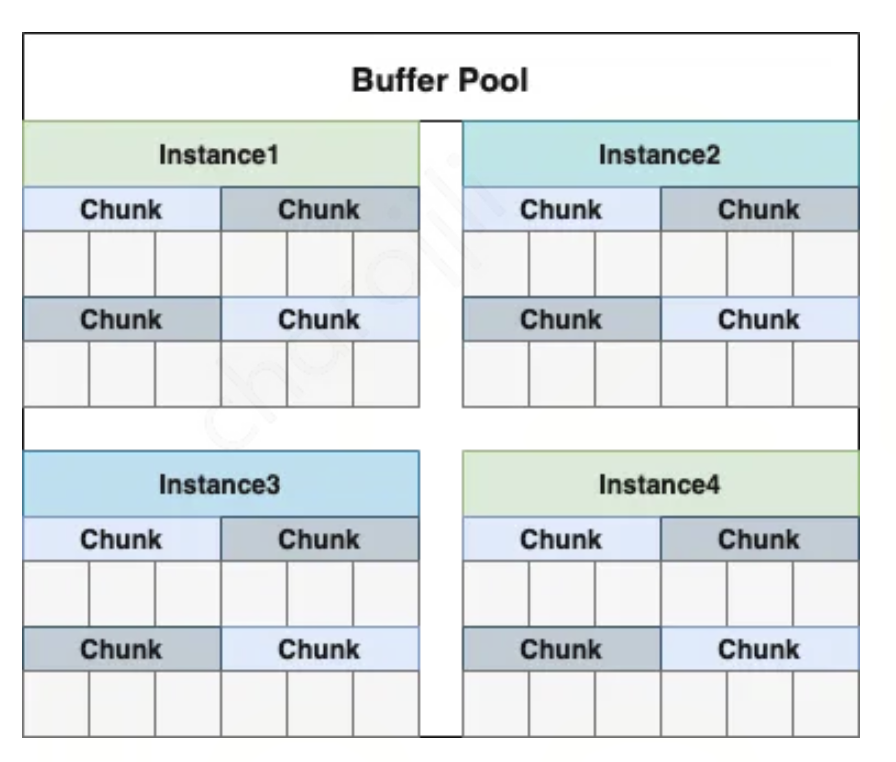
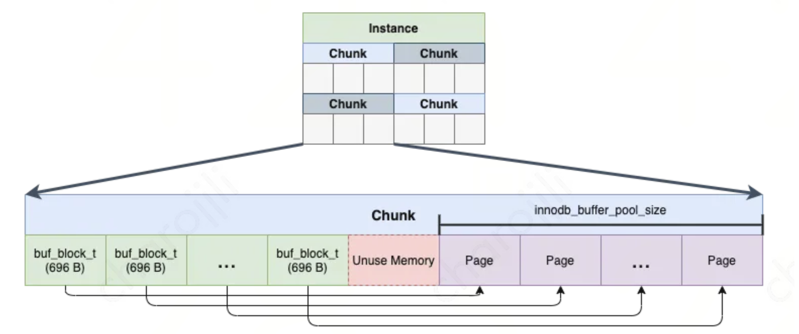

# InnoDB 架构

InnoDB 内存中整体包含四个核心组件：

- 缓冲池 Buffer Pool
- 写缓冲 Change Buffer
- 自适应哈希索引 Adaptive Hash Index
- 日志缓冲 Log Buffer

## 自适应哈希索引

对于 Memory 引擎， 是可以通过 hash 的方式建立索引。在 InnoDB 中是无法手动创建 hash 索引， 但是 InnoDB 会自动调优， 如果判定建立自适应哈希索引，能够提升查询效率，InnoDB 自己会建立相关哈希索引

InnoDB 如果发现很多 SQL 都会命中同样的页面，并且索引的路径都很长， 就会在内存中开辟一块空间, 建立 hash 索引用来加速索引查询。这个 hash 索引的 key 是索引的键值， value 是页面的位置记录

## Buffer Pool

Buffer pool 不仅仅缓存了磁盘的数据页，也存储了锁信息、change buffer 信息、adaptive hash index、double write buffer 等信息

- Instance：Buffer Pool 实例，一个数据库实例可以有多个 Buffer Pool 实例，每个实例的锁对象等信息是独立的，可以并发访问，通过`innodb_buffer_pool_instances`控制实例个数
- Chunk：真正缓存着页的结构，一个 Buffer Pool 实例由多个 Chunk 组成

Buffer Pool 默认大小是 128MB， 可以通过 `innodb_buffer_pool_size` 设置，也可以通过 `innodb_buffer_pool_chunk_size` 直接设置 Chunk 数量

### Chunk

Chunk 是真正负责缓存页数据的模块

当数据库读取一个磁盘页时，首先将数据从磁盘读到 Chunk 中，下一次再读相同的页时，首先判断该页是否在 Chunk 中，若在 Chunk 中则直接返回数据，否则读取磁盘上的页

- Page：Chunk 中用于缓存磁盘页数据的结构，称为缓存页，大小为 16KB
- buf_block_t：缓存页的控制块，内部有指针指向一个页，存储着页的描述信息，通过控制块可以访问到具体的缓存页
- Unuse Memory：无法被利用上的碎片空间

在 InnoDB 对 Chunk 进行初始化时，InnoDB 会提前划分好控制块以及缓存页的内存位置，控制块占据前半段，缓存页占据后半段。但是整个 Chunk 的大小又要满足是 Page Size（即 16 KB） 的倍数，而 buf_block_t 控制块结构体只有 696 个字节，所以控制块的总大小加上缓存页的总大小可能无法正好等于 Page Size 的倍数，所以就产生了 Unuse Memory

会被 Chunk 缓存的数据分为两类：

1. 从磁盘中读取或者要写入磁盘的数据都会在 Chunk 中进行缓存
2. 额外的数据，比如锁信息，自适应哈希索引等

每个缓存页会有三个链表来管理这些描述数据。链表中存储的都是描述数据， 真正的磁盘数据都存储在缓存页。三个链表分别是 free 链表、flush 链表、LRU 链表

### free 链表

free 链表是一个双向链表， 用来保存空闲 buf_block_t

InnoDB 将数据以页为单位加载到 Buffer Pool 时，会从 free 链表中获取一个描述数据的信息，根据描述节点的信息拿到其对应的缓存页，然后将数据页信息放到该缓存页中，同时将链表中的该描述数据的节点移除

### flush 链表

在执行增删改的时候会将数据以数据页的形式加载到 Buffer Pool 的缓存页中，增删改的操作都是在内存中执行的，并且会有一个后台的线程数将脏数据刷新到磁盘中

flush 链表的结构与 free 链表类似，记录了被修改过的脏数据所在的缓存页对应的描述数据，当某个脏缓存页被刷新到磁盘后，其空间就腾出来了，然后又会跑到 free 链表中

### LRU 链表

InnoDB 一直进行增删改查操作， 那么肯定会不停的消耗 free 链表和 flush 链表， 内存会越来越少，所以 InnoDB 引入 LRU 链表来做内存淘汰

如果 Buffer Pool 不够使用了，那么就会将 LRU 链表中的尾节点刷入到磁盘中

由于有预读机制， 查询数据的时候往往为了提高效率，会将某个数据页的相邻的数据页也加载到缓存池中，导致一些预读的页被误放到 LRU 的前列

- 如果预读的页后续被访问到，那么该机制极大的提高语句执行的效率
- 如果使用不到， 就会导致 LRU 尾部的一些页被淘汰掉， 反而降低了缓存命中率

如果执行 `select * from` 这种全表扫描的，会直接加载非常多低频使用的数据到缓存从而把使用频率非常高的缓存页替换掉

InnoDB 把 LRU 按一定比例划分为两个部分：一部分存储使用频率非常高的缓存页，所以这一部分链表也叫做热数据；一部分存储使用频率不是很高的缓存页，所以这一部分链表也叫做冷数据

## Change Buffer

与聚簇索引不同，二级索引通常是非唯一的，对二级索引的写操作往往以相对随机的顺序发生，即相邻的增删改操作大概率影响索引树中不相邻的二级索引页

对唯一索引的增改因为需要判断索引值是否唯一，所以可能会比非唯一索引多一个 IO 访问（当唯一索引在内存中时不需要通过 IO 判断是否唯一，但当唯一索引不在内存中时就需要通过 IO 判断是否唯一）

Change Buffer 是一种特殊的数据结构，用于优化对非唯一二级索引的写操作。当二级索引不在 Buffer Pool 中时，InnoDB 会将写操作缓存在 Change Buffer 中。当后续读取该索引页时，将 Change Buffer 中的变更合并到 Buffer Pool，触发异步刷盘

Change Buffer 避免了从磁盘读取二级索引页至 Buffer Pool 所需的大量随机访问 I/O，系统在空闲时段或缓慢关闭期间运行的清除操作会周期性地将更新的索引页写入磁盘

Change Buffer 也有其弊端：

- 当存在大量需要更新的二级索引时，Change Buffer 合并操作需要大量时间，并且在此期间磁盘 I/O 会增加，可能导致磁盘密集型查询显著变慢
- Change Buffer 占用 Buffer Pool 的一部分空间

## Log Buffer

Log Buffer 是 InnoDB 存储引擎用于临时缓存 Redo Log 的内存区域，可以通过`innodb_log_buffer_size`来设置大小， 默认是 16MB

当有一条记录需要更新的时候，InnoDB 引擎就会先把记录写到 redo log 里面并更新内存，这个时候更新就算完成了。 而对 Redo Log 的写入会先写入 Log Buffer，随后按策略批量刷新到磁盘的 Redo Log 文件中

redo log 是写入一组日志文件中， 文件名称是`ib_logfile[x]`。写入 redo log 可以让写操作从随机写变成顺序写， 提升写入磁盘性能

- `innodb_log_files_in_group`：redo log 文件的个数， 默认为 2
- `innodb_log_file_size`：单个 redo log 文件的大小， 默认 48MB
- 在将 redo log 写入日志文件组时，是从 ib_logfile0 开始写，如果 ib_logfile0 写满了，就接着ib_logfile1 写，ib_logfile1 写满了就去写 ib_logfile2，依此类推。如果写到最后一个文件也满了，就会重新转到 ib_logfile0 覆盖写入

log buffer 刷盘时机：

1. 如果写入 log buffer 的 redo log 占据总容量的一半， 就需要将 log buffer 刷盘
2. 事务提交时可以不把修改过的 buffer pool 脏页刷盘， 但为了保证持久性，必须把 redo log 刷盘
3. 后台有一个线程会每隔 1 秒，把 log buffer 刷到磁盘文件里去
4. checkpoint 时
5. mysql 服务关闭会将所有 redo log buffer 刷盘

事务提交刷盘方式，由 `innodb_flush_log_at_trx_commit` 控制：

- 0：事务提交时不会立即向磁盘中同步 redo log，写入 Log Buffer 即认为成功，由后台线程每隔一秒将 Log Buffer 中的数据批量 write 到 OS cache，同时 MySQL主动 fsync。这种策略性能最佳， 但如果数据库奔溃，有一秒的数据丢失
- 1：每次事务提交，都将 Log Buffer 中的数据 write 入OS cache，同时 MySQL 主动 fsync。这种策略是InnoDB的默认配置，为的是保证事务 ACID 特性
- 2：每次事务提交，都将 Log Buffer 中的数据 write 入 OS cache。每隔一秒，MySQL 主动将 OS cache 中的数据批量 fsync。因为 OS 也会 fsync，MySQL 主动 fsync 的周期是一秒，所以最多丢一秒数据