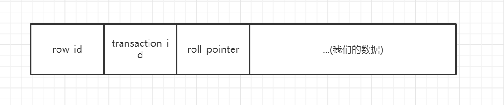
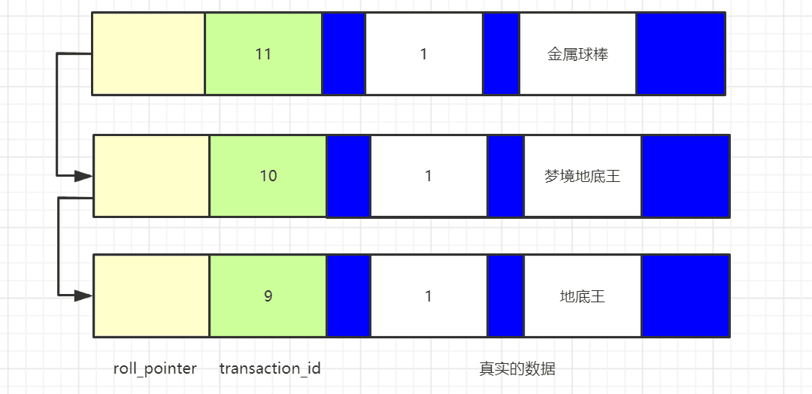
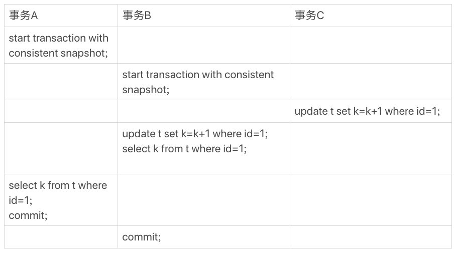
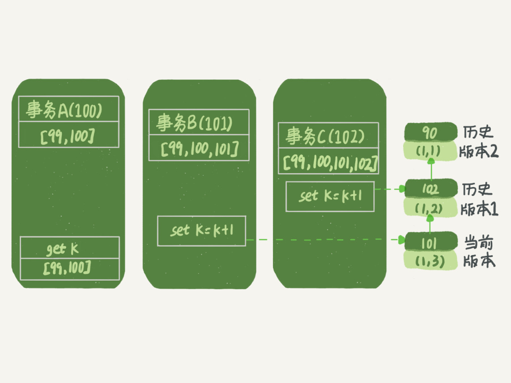
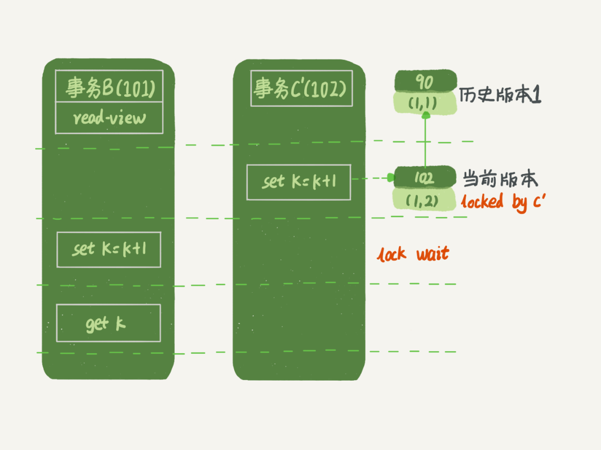

# 事务

事务是一个不可分割的数据库操作序列，要么完全地执行，要么完全地不执行，是数据库并发控制的基本单位

通过将一组相关操作组合为一个要么全部成功要么全部失败的单元，可以简化错误恢复并使应用程序更加可靠

一个逻辑工作单元要成为事务，必须满足所谓的 ACID 属性

- 原子性 Atomicity：原子性是指事务包含的所有操作要么全部成功，要么全部失败

- 一致性 Consistency：一致性规定了事务提交前后，永远只可能存在事务提交前的状态和事务提交后的状态，不可能出现中间的过程态

- 隔离性 Isolation：当多个用户开启事务并发操作同一张表时，事务之间是隔离的，一个事务不应该影响其它事务运行效果。当不同的事务同时操纵相同的数据时，每个事务都有各自的完整数据空间

- 持久性 Durability：持久性是指一个事务一旦被提交了，那么对数据库中的数据的改变就是永久性的，即便是在数据库系统遇到故障的情况下也不会丢失提交事务的操作

在 MySQL 中，事务支持是在引擎层实现的

## 并发操作带来的一致性问题

数据库事物无非两种：读取事物、修改事物

在没有事务隔离控制的时候，多个事务在同一时刻对同一数据的操作可能就会影响到最终期望的结果，通常有四种情况：

- 脏写：一个事务的更新覆盖了另一个事务还没提交的更新。事务 A和 B 读入同一数据并修改，B 提交的结果破坏了 A 提交的结果，导致 A 的修改被丢失

- 脏读：一个事务读取了另一个事物未提交的数据。事务 A 修改某一数据，并将其写回磁盘，事务 B 读取同一数据后，A 由于某种原因被撤销，这时 A 已修改过的数据恢复原值，B 读到的数据就与数据库中的数据不一致，则 B 读到的数据为脏数据

- 不可重复读：一个事务两次读取同一个数据，两次读取的数据不一致。事务 A 读取某一数据后，事务 B 对其作了修改，当事务 A 再次读取数据时，得到与前一次不同的值。事务 A 按一定的条件从数据库中读取了某些数据后，事务 B 删除了其中部分记录，当 A 再次以相同条件读取时，发现某些记录消失了

- 幻读：一个事务按相同的查询条件重新读取以前检索过的数据，却发现其他事务插入了满足其查询条件的新数据

与脏读不一样的是，幻读和不可重复读都是读取了另一条已经提交的事务。

幻读和不可重复读的区别是，不可重复读针对的是单个数据项，而幻读针对的是一批数据整体

## 事务隔离等级

同一时间，只允许一个事务请求同一数据，不同的事务之间彼此没有任何干扰

- 未提交读 READ UNCOMMITTED：最低的隔离级别，一个事务在提交之前，对其他事务是可见的，即事务可以读取未提交的数据。该隔离等级存在脏读问题

- 提交读 READ COMMITTED：事务在提交之前，对其它事务是不可见的。该隔离等级解决了脏读的问题，但存在不可重复读问题（两次查询的得到的结果可能不同，即可能在查询的间隙，有其他事务提交了修改）

- 可重复读 REPEATABLE READ：默认隔离等级，在同一事务中多次读取的数据是一致的。该隔离等级解决了脏读和不可重复读问题，但存在幻读（在事务两次查询间隙，有其他事务又插入或删除了新的记录）

- 串行化 SERIALIZABLE：通过对每个读的数据行加上共享锁，强制事务串行化执行，即一个事务一个事务挨个来执行。该隔离等级可以解决上述所有问题，隔离级别最高，但牺牲了系统的并发性

可重复读隔离等级通常是通过在事务开始时创建一致性快照或者通过行级锁来实现的。比如，InnoDB 使用多版本并发控制 MVCC，在事务期间读取的是快照数据，所以其他事务的修改不会影响到当前事务的读取，这样同一事务内多次读取同一行数据的结果是一致的，避免了不可重复读。

幻读的问题在于，即使使用了行锁，也无法阻止其他事务插入新的行，因为这些新行之前并不存在，所以不会被锁定。不过，这里可能要看具体的数据库实现，比如 InnoDB 在可重复读级别下通过间隙锁 Gap Lock 来防止幻读，所以可能实际中解决了幻读

## 事务启动时机

`begin/start transaction` 命令并不是一个事务的起点，在执行到它们之后的第一个操作 InnoDB 表的语句，事务才真正启动

如果想要马上启动一个事务，可以使用 `start transaction with consistent snapshot` 这个命令

## MVCC

MVCC 是一种多版本读写并发控制机制，是 InnoDB 存储引擎实现隔离级别的一种具体方式，用于实现 READ COMMIITTED 和 REPEATABLE READ 这两种隔离级别

MVCC 保存了数据在某个时间点的快照，每行数据都存在多个版本，对数据库的任何修改的提交都不会直接覆盖之前的数据，而是产生一个新的版本与老版本共存，使得读取时可以不加锁（除非使用 `SELECT ... FOR UPDATE` 强行加锁）

- 读操作访问旧版本，写操作创建新版本，两者互不干扰，因此不需要加锁
- 解决了一致性读的问题，MVCC 都是快照读，只能看到这个时间点之前事务提交更新的结果，不能看到时间点之后事务提交的更新结果

### 事务版本号

每次事务开启前都会从数据库获得一个自增长的事务 ID，可以从事务 ID 判断事务的执行先后顺序

### 隐藏字段

MySQL 会为每一行真实数据记录添加两三个隐藏的字段，分别为 row_id、transaction_id 和 roll_pointer

- row_id：非必需隐藏字段。如果表中有自定义的主键或者有 Unique 键，就不会添加 row_id 字段，如果两者都没有，MySQL 会自动添加 row_id 字段

- transaction_id：必需隐藏字段。代表这一行数据由哪个事务 id 创建

- roll_pointer：必需隐藏字段。回滚指针，指向这行数据上一个版本在 Undo log 的地址



对于事务 id，只有执行 insert/update/delete 才会产生事务 id，只执行 select 则没有事务 id

### Undo log

Undo Log 是 MVCC 的核心组件，其核心价值在于：

- 原子性：通过记录旧值支持事务回滚
- 隔离性：为 MVCC 提供历史版本，实现非阻塞读
- 高效存储：通过版本链和清理机制平衡性能与空间

Undo log 主要用于记录数据被修改之前的日志，在表信息修改之前先会把数据拷贝到 Undo log 里，当事务进行回滚时可以通过 Undo log 里的日志进行数据还原

Undo Log 以链式结构组织，每条记录包含以下关键信息：

- 事务ID（TRX_ID）：标识生成该记录的事务
- 回滚指针（ROLL_PTR）：指向更早版本的 Undo Log 记录，形成版本链
- 旧值信息：被修改字段的原始值
- 日志类型：区分 `INSERT`、`UPDATE` 或 `DELETE` 操作



存储数据表的 B+ 树节点总是只保留最新的数据，而老版本的数据被放在 Undo log 里，并且以指针的形式关联起来，形成一个链表。查询时会在 B+ 树查找后多引入一个链表查询，但是清理废弃数据时会比较简单，只要把 Undo log 找到一个合适的位置一刀切了即可

后台线程定期清理不再需要的 Undo Log（如已提交且无其他事务引用的旧版本），清理策略由参数（如 `innodb_purge_batch_size`）控制，避免影响性能

### 当前读

当前读是指事务在读取数据时，绕过 MVCC 的快照机制直接获取当前最新已提交的版本，而不是基于事务开始时的快照版本

为了保证数据一致性，当前读通常伴随加锁操作，防止其他事务并发修改数据

- 显式加锁的读操作：如 `SELECT ... FOR UPDATE`（排他锁）或 `SELECT ... LOCK IN SHARE MODE`（共享锁）
- 数据修改操作：如 `UPDATE`、`DELETE`、`INSERT ... ON DUPLICATE KEY UPDATE` 等，这些操作需要先读取最新数据，再修改

##### 更新操作的基本流程

1. 读取阶段：根据 `WHERE` 条件找到需要修改的行，并读取这些行的最新已提交版本
2. 加锁阶段：对目标行加排他锁，阻止其他事务修改或加锁
3. 修改阶段：生成新版本数据，写入 Undo Log（用于回滚和 MVCC），并更新数据页

如果不是当前读而是基于快照读，可能导致丢失更新

- 快照读：事务 A 和事务 B 同时读取同一行（快照读），均基于旧值修改并提交，后提交的事务会覆盖前一个事务的修改
- 当前读 \+ 加锁，确保修改操作基于最新数据，且操作期间数据不被其他事务修改

##### 与隔离等级关系

- READ COMMIT：普通 `SELECT` 是快照读，读取最新已提交版本，加锁的 `SELECT` 或 `UPDATE` 是当前读，读取最新版本并加锁
- REPEATABLE READ：普通 `SELECT` 是快照读，读取事务启动时的快照版本，加锁的 `SELECT` 或 `UPDATE` 是当前读，读取最新版本并加锁

##### 加锁机制

当前读通过行锁（如 InnoDB 的 `Record Lock`）或间隙锁（`Gap Lock`）阻塞其他事务的并发修改。

##### 与 READ VIEW 关系

 当前读依赖 READ VIEW 来判断当前最新数据是否已提交

- 若最新版本由未提交事务生成（`trx_id` 在活跃事务列表中），当前读会等待该事务提交或回滚（通过锁机制）
- 若最新版本已提交，则直接读取

### ReadView 

Read View 是事务在启动时生成的一个一致性快照，用于决定该事务能看到哪些数据版本

ReadView 机制只在 Read Committed 和 Repeatable Read 隔离级别下生效，所以只有这两种隔离级别才有 MVCC

#### ReadView 组成

ReadView 包含四个比较重要的内容：

- m_ids：表示在生成 ReadView 时，系统中活跃的事务 id 集合，这些事务 id 都是未提交事务

- min_trx_id：表示在生成 ReadView 时，系统中活跃的最小事务 id，也就是 m_ids 中的最小值

- max_trx_id：表示在生成 ReadView 时，系统应该分配给下一个事务的 id

- creator_trx_id：表示生成该 ReadView 的事务 id

#### ReadView 用法

有了 ReadView，根据相关信息则可以判断版本信息：

- 如果被访问的版本的 trx_id 和 ReadView 中的 creator_trx_id 相同，就意味着当前版本就是由当前事务创建的，可以读出来
- 如果被访问的版本的 trx_id 小于 ReadView 中的 min_trx_id，表示生成该版本的事务在创建 ReadView 的时候已经提交了，所以该版本可以读出来
- 如果被访问版本的 trx_id 大于等于 ReadView 中的 max_trx_id 值，说明生成该版本的事务在当前事务生成 ReadView 后才开启，所以该版本不可以被读出来
- 如果生成被访问版本的 trx_id 在 min_trx_id 和 max_trx_id 之间，那就需要判断下 trx_id 在不在 m_ids 中。如果在，说明创建 ReadView 的时候，生成该版本的事务还是活跃的（没有被提交），该版本不可以被读出来。如果不在，说明创建 ReadView 的时候，生成该版本的事务已经被提交了，该版本可以被读出来
- 如果某个数据的最新版本不可以被读出来，就顺着 roll_pointer 找到该数据的上一个版本，继续做如上的判断

#### 生成时机

- READ COMMITTED：每次读取数据都会创建 ReadView
- REPEATABLE READ：事务启动时创建 ReadView，整个事务期间都使用同一个 ReadView

#### 例子

```sql
CREATE TABLE `t` ( 
    `id` int(11) NOT NULL, 
    `k` int(11) DEFAULT NULL, 
    PRIMARY KEY (`id`)
    ) ENGINE=InnoDB;
    
insert into t(id, k) values(1,1),(2,2);
```



事务 C 没有显式地使用 `begin/commit`，表示这个 `update` 语句本身就是一个事务，语句完成的时候会自动提交

事务 B 在更新了行之后查询

事务 A 在一个只读事务中查询，并且时间顺序上是在事务 B 的查询之后

事务 B 查到的 k 的值是 3，而事务 A 查到的 k 的值是 1

##### 分析

做如下假设：

- 事务 A 开始前，系统里面只有一个活跃事务 ID 是 99

- 事务 A、B、C 的版本号分别是 100、101、102，且当前系统里只有这四个事务

- 三个事务开始前，(1,1）这一行数据的 transaction_id 是 90

事务 A 的 m_ids 是[99,100]，事务 B 的 m_ids 是[99,100,101], 事务 C 的 m_ids 是[99,100,101,102]



第一个有效更新是事务 C

1. `update` 当前读，所以把数据从 (1, 1) 改成了 (1, 2)。这时候这个数据的最新版本的 transaction_id 是 102，而 90 这个版本已经成为了历史版本

第二个有效更新是事务 B

1. `update` 当前读，找到 (1,2)，所以可以把数据从 (1,2) 改成了 (1,3)。这时候这个数据的最新版本 transaction_id 是 101，而 102 又成为了历史版本
1. 查询时，一看自己的版本号是 101 和最新数据的版本号相同，可以直接使用，所以查询得到的 k 的值是 3

事务 A 读数据时，它的 m_ids 是 [99,100]，它的读数据流程：

1. 找到 (1,3) 的时候，判断出 transaction_id = 101，比 100 大，不可见

2. 接着找到上一个历史版本，transaction_id = 102，比 100 大，不可见

3. 接着找到上一个历史版本，transaction_id = 90，比 99 小，可见

如果把事务 A 的查询语句 select * from t where id=1 修改一下，加上 `lock in share mode` 或 `for update`，也会使用当前读从而返回的 k 的值是 3

##### 拓展

假设事务 C 不是马上提交的，而是变成了下面的事务 C'


事务 C' 的不同是，更新后并没有马上提交，在它提交前，事务 B 的更新语句先发起了

虽然事务 C' 还没提交，但是 (1,2) 这个版本也已经生成了，并且是当前的最新版本

事务 C' 没提交，也就是说 (1,2) 这个版本上的写锁还没释放。而事务 B 是当前读，必须要读最新版本，而且必须加锁，因此就被锁住了，必须等到事务 C' 释放这个锁，才能继续它的当前读

