# 分布式缓存

分布式缓存需要满足三个要求:

- 数据共享
- 内存存储
- kv 结构

一个系统中的不同层之间的访问速度不一样，所以才需要缓存，把一些需要频繁访问的数据放在缓存中，以加快它们的访问速度

缓存的容量终究是有限的，缓存中的数据量也是有限的，肯定是没法时刻都满足访问需求的。缓存和后端慢速系统之间，必然存在数据写回和再读取的交互过程。缓存中的数据需要按一定规则淘汰出去，写回后端系统，而新的数据又要从后端系统中读取进来，写入缓存

## 缓存一致性

一致性情况包括：

- 缓存中有数据，缓存的数据值需要和数据库中的值相同

- 缓存中本身没有数据，数据库中的值必须是最新值

## 缓存处理请求

- 缓存命中：Redis 中有相应数据，就直接读取 Redis，性能非常快

- 缓存缺失：Redis 中没有保存相应数据，就从后端数据库中读取数据，性能就会变慢。而且，一旦发生缓存缺失，为了让后续请求能从缓存中读取到数据，需要把缺失的数据写入 Redis，这个过程叫作缓存更新

使用 Redis 缓存时，基本有三个操作：

1. 应用读取数据时，需要先读取 Redis

2. 发生缓存缺失时，需要从数据库读取数据

3. 发生缓存缺失时，还需要更新缓存

## 缓存类型

分成只读缓存和读写缓存

### 只读缓存

1. 如果有数据新增，会直接写入数据库，不用对缓存做任何操作
2. 有数据删改时，需要把只读缓存中的数据标记为无效
3. 访问这些增删改的数据时，因为缓存中没有相应的数据，就会发生缓存缺失，应用再从数据库中把数据读入缓存，这样后续再访问数据时，就能够直接从缓存中读取了

缓存中本身就没有新增数据，而数据库中是最新值，这种情况符合一致性的第 2 种情况，所以此时缓存和数据库的数据是一致的

在更新数据库和删除缓存值的过程中，无论这两个操作的执行顺序谁先谁后，只要有一个操作失败了，就会导致客户端读取到旧值，导致不满足缓存一致性

- 先删除缓存，再更新数据库，如果缓存删除成功，但是数据库更新失败，那么应用再访问数据时，缓存中没有数据，就会发生缓存缺失。然后，应用再访问数据库，但是数据库中的值为旧值，应用就访问到旧值了
- 先完成了数据库的更新，但是在删除缓存时失败，那么数据库中的值是新值，而缓存中的是旧值，这肯定是不一致的。这个时候，如果有其他的并发请求来访问数据，按照正常的缓存访问流程，就会先在缓存中查询，但此时就会读到旧值了

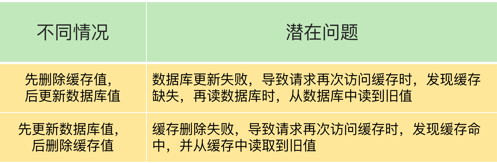

### 读写缓存

对于读写缓存来说，如果要对数据进行增删改，就需要在缓存中进行，同时还要根据采取的写回策略，决定是否同步写回到数据库中

得益于 Redis 的高性能访问特性，数据的增删改操作可以在缓存中快速完成，处理结果也会快速返回给业务应用，这就可以提升业务应用的响应速度

在使用读写缓存时，最新的数据是在 Redis 中，而 Redis 是内存数据库，一旦出现掉电或宕机，内存中的数据就会丢失，给应用业务带来风险

- 同步直写策略：写缓存时，也同步写数据库，缓存和数据库中的数据一致。等到缓存和数据库都写完数据，才给客户端返回。同步直写提供了数据可靠性保证，但降低了缓存的访问性能，增加了缓存的响应延迟

- 异步写回策略：写缓存时不同步写数据库，等到数据从缓存中淘汰时，再写回数据库。使用这种策略时，如果数据还没有写回数据库，缓存就发生了故障，数据库就没有最新的数据了

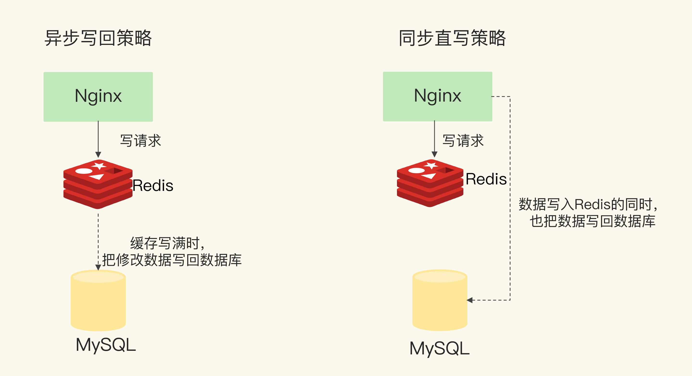

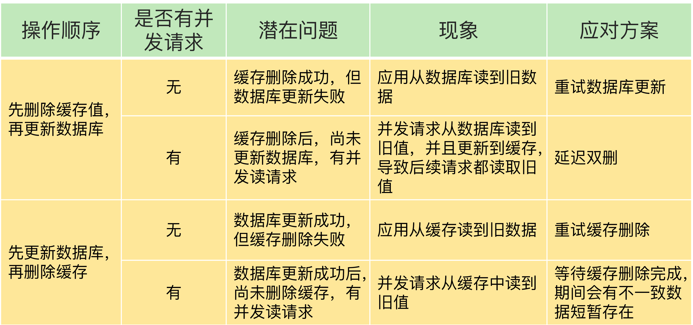

只读缓存和使用直写策略的读写缓存都会把数据同步写到后端数据库中，它们的区别在于：

- 使用只读缓存时，是先把修改写到后端数据库中，再把缓存中的数据标记失效。当下次访问这个数据时，会以数据库中的值为准，并重新加载到缓存中。这样做的优点是，数据库和缓存可以保证完全一致，并且缓存中永远保留的是经常访问的热点数据。缺点是每次修改操作都会把缓存中的数据标记失效，之后访问时都会先触发一次缓存缺失，然后从后端数据库加载数据到缓存中，这个过程访问延迟会变大

- 使用读写缓存时，是同时修改数据库和缓存中的值。这样做的优点是，被修改后的数据永远在缓存中存在，下次访问时能够直接命中缓存，不用再从后端数据库中查询，这个过程拥有比较好的性能，比较适合先修改又立即访问的业务场景。但缺点是在高并发场景下，如果存在多个操作同时修改同一个值的情况，可能会导致缓存和数据库的不一致

- 当使用只读缓存时，如果修改数据库失败了，那么缓存中的数据也不会被删除，此时数据库和缓存中的数据依旧保持一致。而使用读写缓存时，如果是先修改缓存后修改数据库，如果缓存修改成功，而数据库修改失败了，那么此时数据库和缓存数据就不一致了。如果先修改数据库，再修改缓存，也会产生上面所说的并发场景下的不一致

只读缓存是标记数据失效而不是修改数据。如果不是标记失效，而是直接更新缓存的值，这种情况相当于把 Redis 当做读写缓存使用，删改操作同时操作数据库和缓存

## 重试机制

可以把要删除的缓存值或者是要更新的数据库值暂存到消息队列中，当应用没有能够成功地删除缓存值或者是更新数据库值时，就可以从消息队列中重新读取这些值，然后再次进行删除或更新

如果能够成功地删除或更新，就要把这些值从消息队列中去除，以免重复操作

即使更新数据库和删除缓存值成功，当有大量并发请求时，应用还是有可能读到不一致的数据

#### 先删除缓存，再更新数据库

1. 线程 A 删除缓存值后，还没有来得及更新数据库，线程 B 就开始读取数据

2. 线程 B 会发现缓存缺失，就只能去数据库读取，导致线程 B 读取到了旧值
3. 线程 B 会把旧值写入缓存，这可能会导致其他线程从缓存中读到旧值
4. 等到线程 B 从数据库读取完数据、更新了缓存后，线程 A 才开始更新数据库，此时，缓存中的数据是旧值，而数据库中的是最新值，两者就不一致了

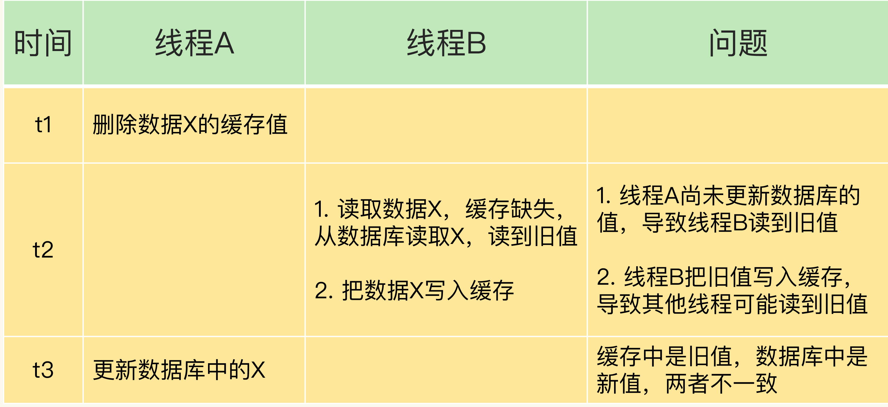

延迟双删是在第一次删除缓存值后，延迟一段时间再次进行删除：

1. 在线程 A 删除缓存值并更新完数据库值以后，可以让它先 sleep 一小段时间，再进行一次缓存删除操作
2. 线程 A sleep 的时间需要大于线程 B 读取数据再写入缓存的时间
3. 其它线程读取数据时，会发现缓存缺失，所以会从数据库中读取最新值

#### 先更新数据库值，再删除缓存值

1. 线程 A 删除了数据库中的值，但还没来得及删除缓存值线程 B 就开始读取数据
2. 线程 B 查询缓存时，发现缓存命中，就会直接从缓存中读取旧值

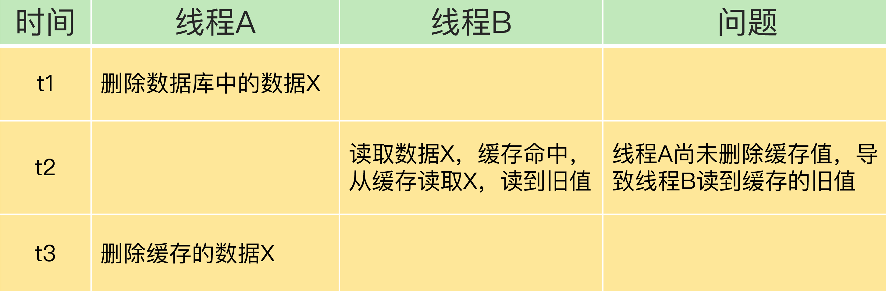

## 缓存异常

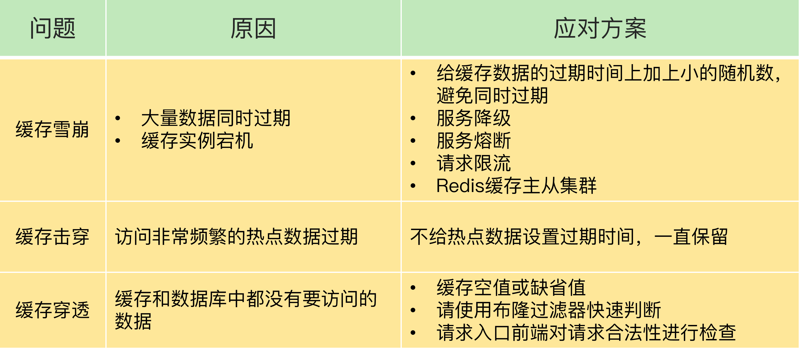

### 缓存雪崩

大量的请求无法在 Redis 缓存中进行处理，从而应用将大量请求发送到数据库层，导致数据库层的压力激增

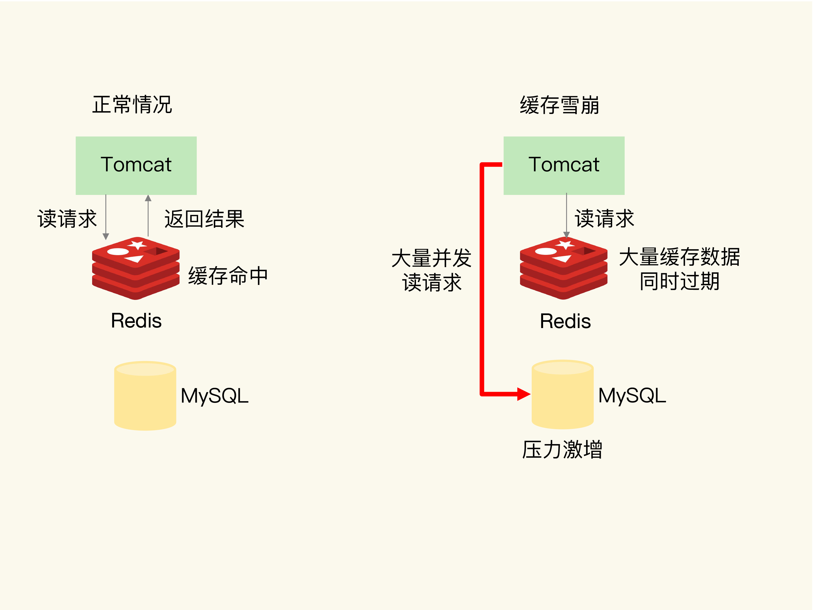

#### 缓存中有大量数据同时过期

- 给数据的过期时间增加一个较小的随机数，不同数据的过期时间有所差别，但差别又不会太大，既避免了大量数据同时过期，同时也保证了这些数据基本在相近的时间失效，仍然能满足业务需求

- 服务降级，发生缓存雪崩时，针对不同的数据采取不同的处理方式。访问非核心数据时，暂时停止从缓存中查询这些数据，而是直接返回预定义信息、空值或是错误信息。访问核心数据时，允许查询缓存，如果缓存缺失，也可以继续通过数据库读取

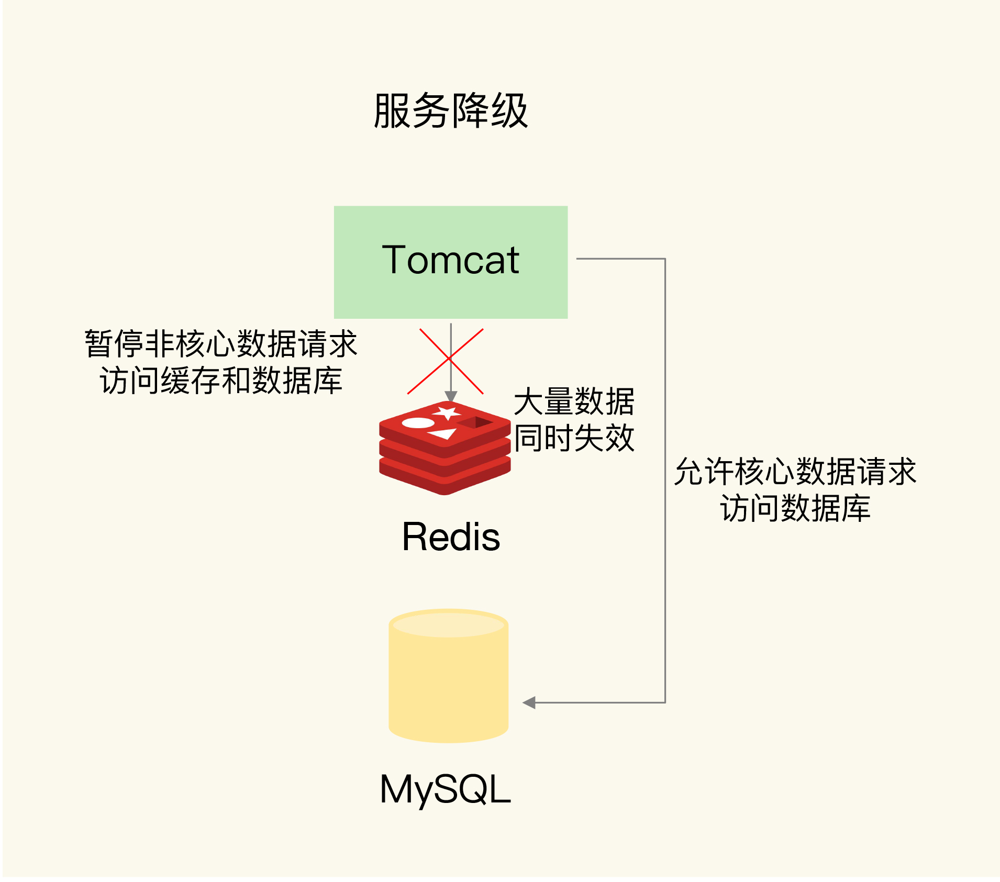

#### Redis 缓存实例发生故障宕机

在业务系统中实现服务熔断或请求限流机制：在发生缓存雪崩时，为了防止引发连锁的数据库雪崩，甚至是整个系统的崩溃，这时可以暂停业务应用对缓存系统的接口访问

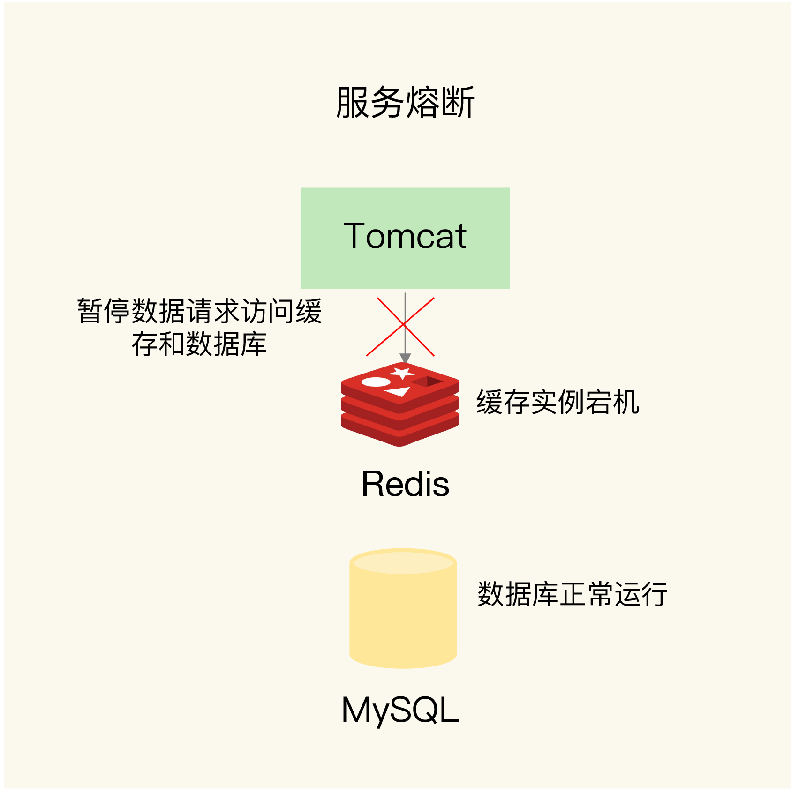

服务熔断虽然可以保证数据库的正常运行，但是暂停了整个缓存系统的访问，对业务应用的影响范围大

为了尽可能减少这种影响，可以进行请求限流，在业务系统的请求入口前端控制每秒进入系统的请求数，避免过多的请求被发送到数据库

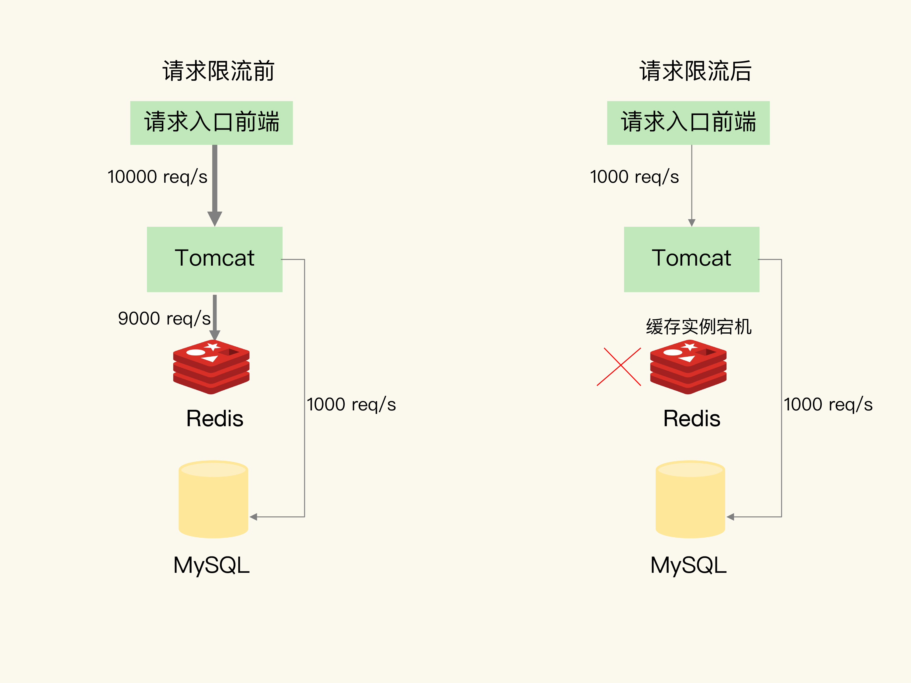

通过主从节点的方式构建 Redis 缓存高可靠集群，主节点故障宕机，从节点还可以切换成为主节点，继续提供缓存服务，避免了由于缓存实例宕机而导致的缓存雪崩问题

### 缓存击穿

缓存击穿是指针对某个访问非常频繁的热点数据因为失效，无法在缓存中进行处理从而大量请求都发送到了后端数据库，导致影响数据库处理其他请求

合理设置热点数据过期时间

- 热点数据不设置过期时间，由后台异步更新缓存

- 热点数据过期前通知后台线程更新过期时间

- 缓存失效后先获取分布式锁，这样只会一个请求读取数据库

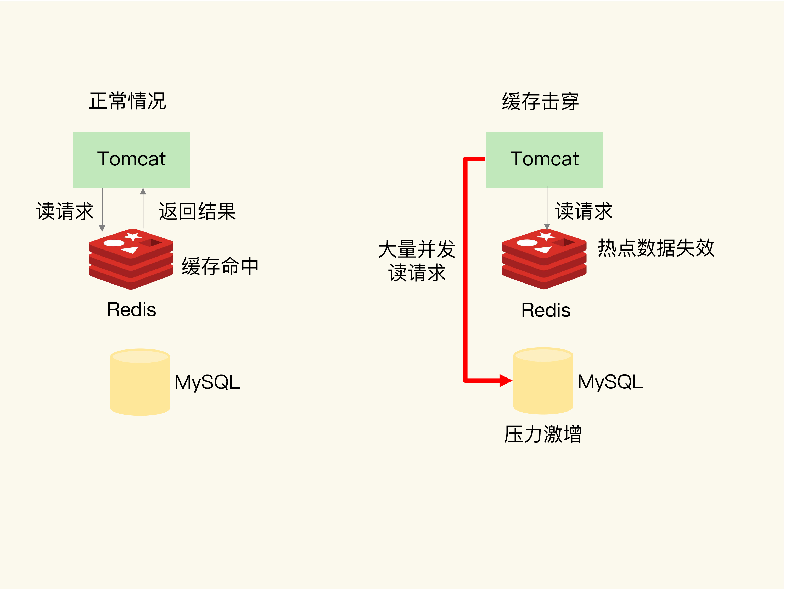

### 缓存穿透

缓存穿透是指要访问的数据不在 Redis 缓存中，然后访问数据库时发现数据库中也没有要访问的数据

应用无法从数据库中读取数据写入缓存来服务后续请求，缓存失去了保护数据库的意义，还会同时给缓存和数据库带来巨大压力

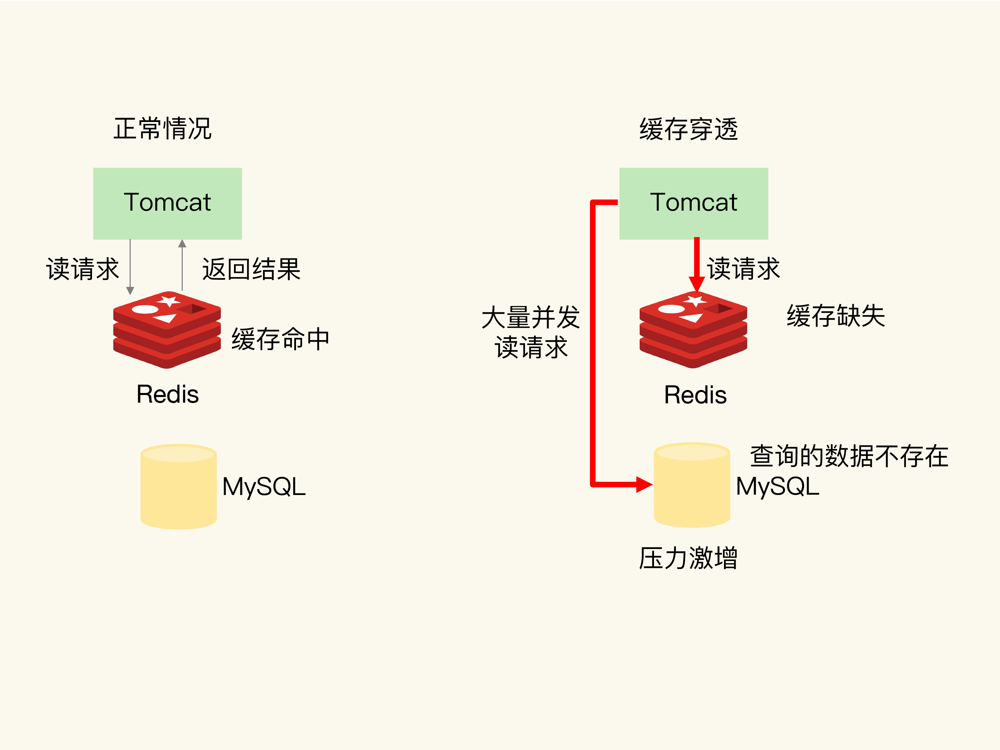

原因：

- 业务层误操作：缓存中的数据和数据库中的数据被误删除了，所以缓存和数据库中都没有数据

- 恶意攻击：专门访问数据库中没有的数据

#### 缓存空值或缺省值

一旦发生缓存穿透，可以针对查询的数据在 Redis 中缓存一个缺省值

应用发送的后续请求再进行查询时，就可以直接从 Redis 中读取空值或缺省值，返回给业务应用了，避免了把大量请求发送给数据库处理，保持了数据库的正常运行

但采用默认值的方式也有其弊端：

- 缓存中存在很多数据库中没有的数据，导致存储空间增加，因此可以给这类数据设置一个过期时间

- 如果在默认值有效期间数据库写入了数据，会出现缓存与数据库数据不一致的情况，因此需要使用消息队列或其他异步的方式清理缓存

#### 业务逻辑前置判断

针对业务逻辑特点，前置过滤判断，校验数据合法性

#### 布隆过滤器

使用布隆过滤器快速判断数据是否存在，避免从数据库中查询数据是否存在，减轻数据库压力

在把数据写入数据库时，使用布隆过滤器做个标记。当缓存缺失后需要查询数据库时，可以通过查询布隆过滤器快速判断数据是否存在

这样即使发生缓存穿透了，大量请求只会查询 Redis 和布隆过滤器，而不会积压到数据库，也就不会影响数据库的正常运行

布隆过滤器可以使用 Redis 实现，本身就能承担较大的并发访问压力
