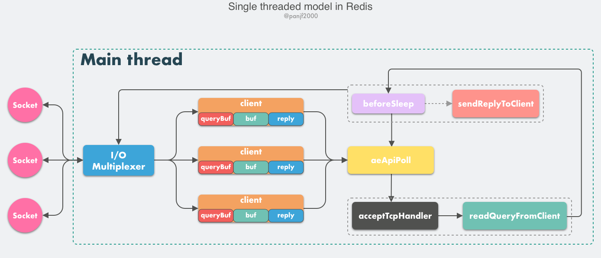
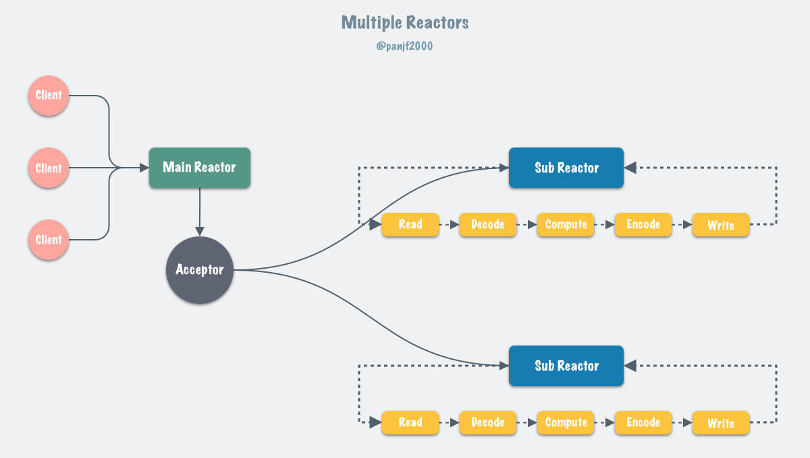

# 多线程网络模型

1. Redis v1.0 开始一直是一个典型的单 Reactor 模型，利用 `epoll/select/kqueue` 等多路复用技术，在单线程的事件循环中不断去处理客户端请求，最后回写响应数据到客户端

2. Redis v4.0 引入多线程处理异步任务

3. Redis v6.0 正式在网络模型中实现 I/O 多线程

## 为何选择单线程

对于一个 DB 来说，CPU 通常不会是瓶颈，因为大多数请求不会是 CPU 密集型的，而是 I/O 密集型

具体到 Redis 的话，如果不考虑 RDB/AOF 等持久化方案，Redis 是完全的纯内存操作，执行速度是非常快的，因此这部分操作通常不会是性能瓶颈，Redis 真正的性能瓶颈在于网络 I/O，也就是客户端和服务端之间的网络传输延迟，因此 Redis 选择了单线程的 I/O 多路复用来实现它的核心网络模型

### 多线程开销

- 避免过多的上下文切换

多线程调度过程中必然需要在 CPU 之间切换线程上下文 context，而上下文的切换又涉及程序计数器、堆栈指针和程序状态字等一系列的寄存器置换、程序堆栈重置甚至是 CPU 高速缓存、TLB 快表的汰换

- 避免同步机制的开销

因为 Redis 是一个数据库，如果选择多线程模型那么势必涉及到底层数据同步的问题，则必然会引入某些同步机制，这会增加程序复杂度的同时还会降低性能

- 简单可维护

多线程的引入会使得程序不再保持代码逻辑上的串行性，代码执行的顺序将变成不可预测的，稍不注意就会导致程序出现各种并发编程的问题。其次，多线程模式也使得程序调试更加复杂和麻烦

### 单线程事件循环

从 Redis 的 v1.0 到 v6.0 版本之前，Redis 的核心网络模型一直是一个典型的单 Reactor 模型

- client：客户端对象，客户端通过 socket 与服务端建立网络通道然后发送请求命令，服务端执行请求的命令并回复。客户端的所有相关信息，包括但不限于封装的套接字连接`*conn`，当前选择的数据库指针 `*db`，读入缓冲区 `querybuf`，写出缓冲区 `buf`，写出数据链表 `reply`等
- aeApiPoll：IO 多路复用 API，是基于 `epoll_wait`/`select`/`kevent` 等系统调用的封装，监听事件然后触发并处理，它是事件循环中的核心函数，是事件驱动得以运行的基础
- acceptTcpHandler：连接应答处理器，底层使用系统调用 `accept` 接受来自客户端的新连接，并为新连接注册绑定命令读取处理器，以备后续处理新的客户端 TCP 连接。除了 `acceptTcpHandler`，还有对应的 `acceptUnixHandler` 负责处理 Unix Domain Socket 以及 `acceptTLSHandler` 负责处理 TLS 加密连接
- readQueryFromClient：命令读取处理器，解析并执行客户端的请求命令
- beforeSleep：事件循环中进入 aeApiPoll 等待事件到来之前会执行的函数，其中包含一些日常的任务，比如把 `client->buf` 或者 `client->reply` 中的响应写回到客户端，持久化 AOF 缓冲区的数据到磁盘等，相对应的还有一个 afterSleep 函数，在 aeApiPoll 之后执行
- sendReplyToClient：命令回复处理器，当一次事件循环之后写出缓冲区中还有数据残留，则这个处理器会被注册绑定到相应的连接上，等连接触发写就绪事件时，它会将写出缓冲区剩余的数据回写到客户端。

客户端向 Redis 发起请求命令的工作原理：

1. Redis 服务器启动，开启主线程事件循环，注册 `acceptTcpHandler` 连接应答处理器到用户配置的监听端口，等待新连接到来
2. 客户端和服务端建立网络连接
3. `acceptTcpHandler` 被调用，主线程使用 AE 的 API 将 `readQueryFromClient` 命令读取处理器绑定到新连接对应的文件描述符上，并初始化一个 `client` 绑定这个客户端连接
4. 客户端发送请求命令，触发读就绪事件，主线程调用 `readQueryFromClient` 通过 socket 读取客户端发送过来的命令存入 `client->querybuf` 读入缓冲区
5. 接着调用 `processInputBuffer`，在其中使用 `processInlineBuffer` 或者 `processMultibulkBuffer` 根据 Redis 协议解析命令，最后调用 `processCommand` 执行命令
6. 根据请求命令的类型（SET, GET, DEL, EXEC 等），分配相应的命令执行器去执行，最后调用 `addReply` 函数族的一系列函数将响应数据写入到对应 `client` 的写出缓冲区：`client->buf` 或者 `client->reply` ，`client->buf` 是首选的写出缓冲区，固定大小 16KB，一般来说可以缓冲足够多的响应数据。但是如果客户端在时间窗口内需要响应的数据非常大，那么则会自动切换到 `client->reply` 链表上去，使用链表理论上能够保存无限大的数据。最后把 `client` 添加进一个 LIFO 队列 `clients_pending_write`
7. 在事件循环（Event Loop）中，主线程执行 `beforeSleep` --> `handleClientsWithPendingWrites`，遍历 `clients_pending_write` 队列，调用 `writeToClient` 把 `client` 的写出缓冲区里的数据回写到客户端，如果写出缓冲区还有数据遗留，则注册 `sendReplyToClient` 命令回复处理器到该连接的写就绪事件，等待客户端可写时在事件循环中再继续回写残余的响应数据

## 多线程异步处理

Redis 在 v4.0 版本的时候就已经引入了的多线程来做一些异步操作，此举主要针对的是那些非常耗时的命令，通过将这些命令的执行进行异步化，避免阻塞单线程的事件循环

`DEL` 命令是用来删除掉一个或多个 key 储存的值，它是一个阻塞的命令，大多数情况下你要删除的 key 里存的值不会特别多，最多也就几十上百个对象，所以可以很快执行完。但是如果要删的是一个超大的键值对，里面有几百万个对象，那么这条命令可能会阻塞至少好几秒，又因为事件循环是单线程的，所以会阻塞后面的其他事件，导致吞吐量下降

在 Redis v4.0 之后增加了一些的非阻塞命令如 `UNLINK`、`FLUSHALL ASYNC`、`FLUSHDB ASYNC`

`UNLINK` 命令其实就是 `DEL` 的异步版本，它不会同步删除数据，而只是把 key 从 keyspace 中暂时移除掉，然后将任务添加到一个异步队列，最后由后台线程去删除。不过这里需要考虑一种情况是如果用 `UNLINK` 去删除一个很小的 key，用异步的方式去做反而开销更大，所以它会先计算一个开销的阀值，只有当这个值大于 64 才会使用异步的方式去删除 key，对于基本的数据类型如 `List`、`Set`、`Hash` 这些，阀值就是其中存储的对象数量

## 多线程网络模型

随着互联网的飞速发展，互联网业务系统所要处理的线上流量越来越大，Redis 的单线程模式会导致系统消耗很多 CPU 时间在网络 IO 上从而降低吞吐量，所以 Redis 使用多核优化网络 IO

6.0 版本之后，Redis 正式在核心网络模型中引入了多线程，也就是所谓的 *I/O threading*，至此 Redis 真正拥有了多线程模型

6.0 版本之前，一直是单 Reactor 模式：所有事件的处理都在单个线程内完成，虽然在 4.0 版本中引入了多线程，但是那个更像是针对特定场景（删除超大 key 值等）而打的补丁，并不能被视作核心网络模型的多线程

单 Reactor 模式，引入多线程之后会进化为 Multi-Reactors 模式

区别于单 Reactor 模式，这种模式不再是单线程的事件循环，而是有多个线程（Sub Reactors）各自维护一个独立的事件循环，由 Main Reactor 负责接收新连接并分发给 Sub Reactors 去独立处理，最后 Sub Reactors 回写响应给客户端

### 总体设计

1. Redis 服务器启动，开启主线程事件循环，注册 `acceptTcpHandler` 连接应答处理器到用户配置的监听端口，等待新连接到来
2. 客户端和服务端建立网络连接
3. `acceptTcpHandler` 被调用，主线程使用 AE 的 API 将 `readQueryFromClient` 命令读取处理器绑定到新连接对应的文件描述符上，并初始化一个 `client` 绑定这个客户端连接
4. 客户端发送请求命令，触发读就绪事件，服务端主线程不会通过 socket 去读取客户端的请求命令，而是先将 `client` 放入一个 LIFO 队列 `clients_pending_read`
5. 在事件循环中，主线程执行 `beforeSleep` -->`handleClientsWithPendingReadsUsingThreads`，利用 Round-Robin 轮询负载均衡策略，把 `clients_pending_read`队列中的连接均匀地分配给 I/O 线程各自的本地 FIFO 任务队列 `io_threads_list[id]` 和主线程自己，I/O 线程通过 socket 读取客户端的请求命令，存入 `client->querybuf` 并解析第一个命令但不执行命令，主线程忙轮询，等待所有 I/O 线程完成读取任务
6. 主线程和所有 I/O 线程都完成了读取任务，主线程结束忙轮询，遍历 `clients_pending_read` 队列，执行所有客户端连接的请求命令，先调用 `processCommandAndResetClient` 执行第一条已经解析好的命令，然后调用 `processInputBuffer` 解析并执行客户端连接的所有命令，在其中使用 `processInlineBuffer` 或者 `processMultibulkBuffer` 根据 Redis 协议解析命令，最后调用 `processCommand` 执行命令
7. 根据请求命令的类型（SET, GET, DEL, EXEC 等），分配相应的命令执行器去执行，最后调用 `addReply` 函数族的一系列函数将响应数据写入到对应 `client` 的写出缓冲区：`client->buf` 或者 `client->reply` ，`client->buf` 是首选的写出缓冲区，固定大小 16KB，一般来说可以缓冲足够多的响应数据。但是如果客户端在时间窗口内需要响应的数据非常大，那么则会自动切换到 `client->reply` 链表上去，使用链表理论上能够保存无限大的数据，最后把 `client` 添加进一个 LIFO 队列 `clients_pending_write`
8. 在事件循环中，主线程执行 `beforeSleep` --> `handleClientsWithPendingWritesUsingThreads`，利用 Round-Robin 轮询负载均衡策略，把 `clients_pending_write` 队列中的连接均匀地分配给 I/O 线程各自的本地 FIFO 任务队列 `io_threads_list[id]` 和主线程自己，I/O 线程通过调用 `writeToClient` 把 `client` 的写出缓冲区里的数据回写到客户端，主线程忙轮询，等待所有 I/O 线程完成写出任务
9. 主线程和所有 I/O 线程都完成了写出任务， 主线程结束忙轮询，遍历 `clients_pending_write` 队列，如果 `client` 的写出缓冲区还有数据遗留，则注册 `sendReplyToClient` 到该连接的写就绪事件，等待客户端可写时在事件循环中再继续回写残余的响应数据

大部分逻辑和之前的单线程模型是一致的，变动的地方仅仅是把读取客户端请求命令和回写响应数据的逻辑异步化了，交给 I/O 线程去完成

需要特别注意的一点是：I/O 线程仅仅是读取和解析客户端命令而不会真正去执行命令，客户端命令的执行最终还是要在主线程上完成

### CPU 亲和性

Redis 的核心网络模型引入多线程之后，加上之前的多线程异步任务、多进程（BGSAVE、AOF、BIO、Sentinel 脚本任务等），Redis 现如今的系统并发度已经很大了，而 Redis 本身又是一个对吞吐量和延迟极度敏感的系统，所以用户需要 Redis 对 CPU 资源有更细粒度的控制，这里主要考虑的是两方面：CPU 高速缓存和 NUMA 架构

Redis 通过设置 CPU 亲和性，可以将主进程/线程和子进程/线程绑定到不同的核隔离开来，使之互不干扰，能有效地提升系统性能

Redis 通过设置 CPU 亲和性，让主进程/线程尽可能在固定的 NUMA 节点上的 CPU 上运行，更多地使用本地内存而不需要跨节点访问数据，同样也能大大地提升性能

### 数据保护

Redis 的多线程模型是全程无锁的，这是通过原子操作 + 交错访问来实现的

主线程和 I/O 线程之间共享的变量有三个：

- `io_threads_pending` 计数器是原子变量，不需要加锁保护
- `io_threads_op` I/O 标识符和 `io_threads_list` 线程本地任务队列，是通过控制主线程和 I/O 线程交错访问来规避共享数据竞争问题。I/O 线程启动之后会通过忙轮询和锁休眠等待主线程的信号，在这之前它不会去访问自己的本地任务队列 `io_threads_list[id]`，而主线程会在分配完所有任务到各个 I/O 线程的本地队列之后才去唤醒 I/O 线程开始工作，并且主线程之后在 I/O 线程运行期间只会访问自己的本地任务队列 `io_threads_list[0]` 而不会再去访问 I/O 线程的本地队列，这也就保证了主线程永远会在 I/O 线程之前访问 `io_threads_list` 并且之后不再访问，保证了交错访问

### 模型缺陷

1. 在 Redis 的多线程方案中，I/O 线程任务仅仅是通过 socket 读取客户端请求命令并解析，却没有真正去执行命令，所有客户端命令最后还需要回到主线程去执行，因此对多核的利用率并不算高，而且每次主线程都必须在分配完任务之后忙轮询等待所有 I/O 线程完成任务之后才能继续执行其他逻辑
2. 主线程和 I/O 线程的通信过于简单粗暴：忙轮询和锁，因为通过自旋忙轮询进行等待，导致 Redis 在启动的时候以及运行期间偶尔会有短暂的 CPU 空转引起的高占用率，而且这个通信机制的最终实现看起来非常不直观和不简洁