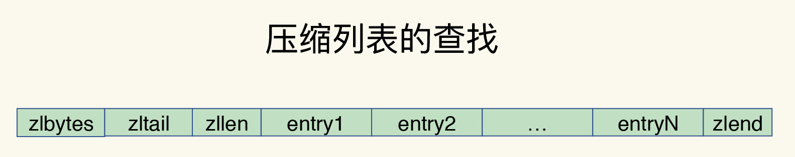
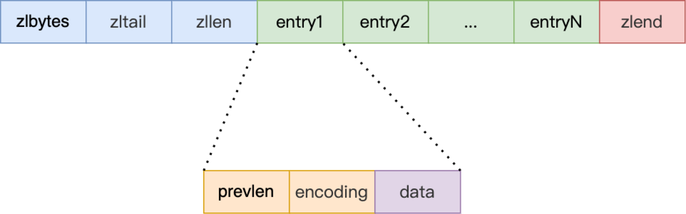

# ziplist

## 内存布局

ziplist 是为了节约内存而设计的，它不是一个用结构体定义的数据结构，而是一块连续的内存，这样不仅可以充分利用 CPU 缓存，并且可以针对不同长度的数据进行相应编码，从而有效地节省内存开销

- 数组中的每一个 entry 都对应保存一个数据

- entry 会挨个放置在内存中，不需要再用额外的指针进行连接，这样就可以节省指针所占用的空间

压缩列表在表头有三个字段 `zlbytes`、`zltail` 和 `zllen`，分别表示列表长度、列表尾的偏移量和列表中的 entry 个数

压缩列表在表尾还有一个 `zlend` 表示列表结束



|字段|长度|值|字节序|
|:-:|:-:|:-:|:-:|
|`zlbytes`|uint32_t|整个 ziplist 占用的内存字节数|小端|
|`zltail`|uint32_t|起始位置与最后一个元素的偏移量|小端|
|`zllen`|uint16_t|ziplist 中节点的数量<br />1. 当这个值小于 UINT16_MAX （65535）时，这个值就是 ziplist 中节点的数量<br />2.  当这个值等于 UINT16_MAX 时，节点的数量需要遍历整个 ziplist 才能计算得出|小端|
|`zlend`|uint8_t|255 的二进制值 1111 1111 （UINT8_MAX） ，用于标记 ziplist 的末端|小端|

由于没有 ziplist 结构体，所以内部使用 `unsigned char*` 指针指向 zippiest

```cpp
// ziplist 结束标志位
#define ZIP_END 255
// zlbytes(32) + zltail(32) + zllen(16)
#define ZIPLIST_HEADER_SIZE     (sizeof(uint32_t)*2+sizeof(uint16_t))
// zlend(8)
#define ZIPLIST_END_SIZE        (sizeof(uint8_t))

// 获取 zlbytes 值
#define ZIPLIST_BYTES(zl)       (*((uint32_t*)(zl)))
// 获取 zltail 值
#define ZIPLIST_TAIL_OFFSET(zl) (*((uint32_t*)((zl)+sizeof(uint32_t))))
// 获取 zllen 值
#define ZIPLIST_LENGTH(zl)      (*((uint16_t*)((zl)+sizeof(uint32_t)*2)))
// 获取 zlend 指针
// 由于需要从 zlbytes 取值所以需要大小端转换
// 因为 zl 是 unsigned char*，所以这里只需要 -1
#define ZIPLIST_ENTRY_END(zl)   ((zl)+intrev32ifbe(ZIPLIST_BYTES(zl))-1)
```

在压缩列表中，如果要查找定位第一个元素和最后一个元素，可以通过表头三个字段的长度直接定位，复杂度是 O(1)

查找其他元素则只能逐个查找，此时的复杂度就是 O(N)

### entry

压缩列表之所以能节省内存，就在于它是用一系列连续的 entry 保存数据



- prev_len：表示前一个 entry 的长度，可能会占用 1 字节或 5 字节。占用 1 字节时，表示上一个 entry 的长度小于 254 字节。虽然 1 字节的值能表示的数值范围是 0 到 255，但是压缩列表中 zlend 的取值默认是 255，因此，就默认用 255 表示整个压缩列表的结束，其他表示长度的地方就不能再用 255 这个值了。所以，当上一个 entry 长度小于 254 字节时，prev_len 占用 1 字节，否则，就占用 5 字节，并通过最低字节 254 做标记

- encoding：支持表示整型和字符串。当高两位（因为是小端编码所以在低地址处）是 11 时表示编码方式是整型，高两位其他情况时表示编码方式是字符串，并且还表示字符串长度

- data：保存实际数据，当 data 存储整型时，都会使用小端表示，即便运行的机器是大端序

```cpp
#define ZIP_BIG_PREVLEN 254
// 获取第一个 entry 地址
// 这里不需要打小端转换是因为 ZIPLIST_HEADER_SIZE 不从 ziplist 中取值
#define ZIPLIST_ENTRY_HEAD(zl)  ((zl)+ZIPLIST_HEADER_SIZE)
// 获取最后一个 entry 地址
// 由于需要从 zltail 取值所以需要大小端转换
#define ZIPLIST_ENTRY_TAIL(zl)  ((zl)+intrev32ifbe(ZIPLIST_TAIL_OFFSET(zl)))

// ptr 指向 entry
// 因为数据都是小端存储，所以可以直接通过 ptr[0] 取到低位的数据，从而判断与 254 的关系
// 返回本 entry 的 prevlen 字段所占内存大小
#define ZIP_DECODE_PREVLENSIZE(ptr, prevlensize) do {                          \
    if ((ptr)[0] < ZIP_BIG_PREVLEN) {                                          \
        (prevlensize) = 1;                                                     \
    } else {                                                                   \
        (prevlensize) = 5;                                                     \
    }                                                                          \
} while(0)

// 返回 entry prevlen 字段和 prevlen 字段所占内存
// 当 prevlen 占 5 个字节时，不会占用最低位的一个字节
#define ZIP_DECODE_PREVLEN(ptr, prevlensize, prevlen) do {                     \
    ZIP_DECODE_PREVLENSIZE(ptr, prevlensize);                                  \
    if ((prevlensize) == 1) {                                                  \
        (prevlen) = (ptr)[0];                                                  \
    } else { /* prevlensize == 5 */                                            \
        (prevlen) = ((ptr)[4] << 24) |                                         \
                    ((ptr)[3] << 16) |                                         \
                    ((ptr)[2] <<  8) |                                         \
                    ((ptr)[1]);                                                \
    }                                                                          \
} while(0)
```

|encoding 高两位|encoding 长度|data|例子||
|:-:|:-:|---|---|---|
|00|1 字节|字符串长度小于等于 63（2^6 -1），后 6 位表示长度|00pppppp||
|01|2 字节，后 14 位使用大端存储|字符串长度小于等于 16383（2^14 -1），后 14 位表示长度，大端序|01pppppp,qqqqqqqq||
|10|5 字节，后 32 位使用大端存储|字符串长度小于等于 2^32 -1，第一个字节的后六位未使用，大端序|10000000,qqqqqqqq,rrrrrrrr,ssssssss,tttttttt||
|       11        |            1 字节            |                                                              |                                              |      |

当 `encoding` 高两位是 11 时，后 6 位表示整形编码

- `11000000` 表示 `data` 是 `int16_t`
- `11010000` 表示 `data` 是 `int32_t`
- `11100000` 表示 `data` 是 `int64_t`
- `11110000` 表示 `data` 是 `int24`
- `11111110` 表示 `data` 是 `int8_t`
- `1111xxxx` 其中 `xxxx` 是 0001(1) 到 1101(13)，此时没有 `data` 数据，数据用 `xxxx` 减 1 来分别表示 0～12

```cpp
 /*
 *
 *  [0f 00 00 00] [0c 00 00 00] [02 00] [00 f3] [02 f6] [ff]
 *        |             |          |       |       |     |
 *     zlbytes        zltail     zllen    "2"     "5"   end
 */

// zlbytes 表示整个 ziplist 占 15 个字节
// zltail 最后一个元素离 ziplist 开始处 12 个字节
// entries 表示整个 ziplist 有两个元素
// 第一个 entry 的 prev_len 是 0，占一个字节
// 第一个 entry 的 f3 是 11110011，所以这个 entry 存储的值是 3 - 1 = 2
// 第二个 entry 的 prev_len 是 2
// 第二个 entry 的 f6 表示 encoding 是 11110110，所以这个 entry 存储的值是 6 - 1 = 5
```

## 插入过程

1. 计算插入位置

2. 重新分配空间，将后面元素后移

3. 插入元素

4. 调整 ziplist 大小

## 删除过程

1. 将后面的元素向前覆盖

2. 调整 ziplist 大小

## 缺陷

- 查找复杂度高
- 新增某个元素或修改某个元素时，如果空间不够则需要重新分配内存，造成连锁更新

虽然 `ziplist` 能够减少内存占用，但是在查找、更新、插入时效率低，所以只适合保存节点数量不多的场景，只要节点数量足够小，即使发生连锁更新，也是能接受的
