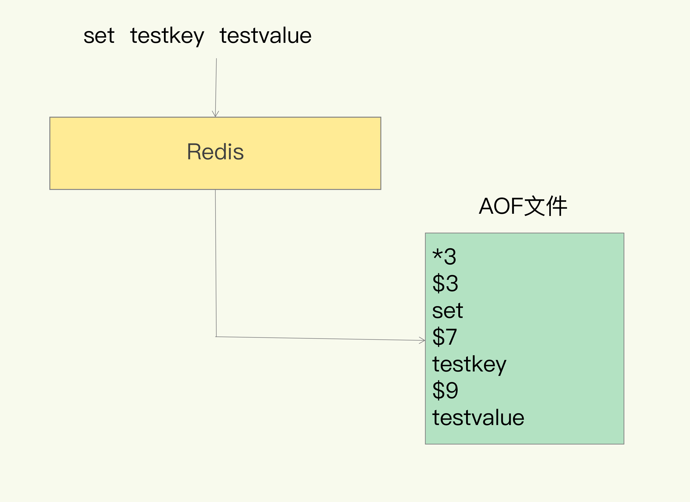
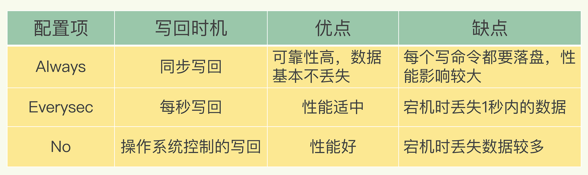
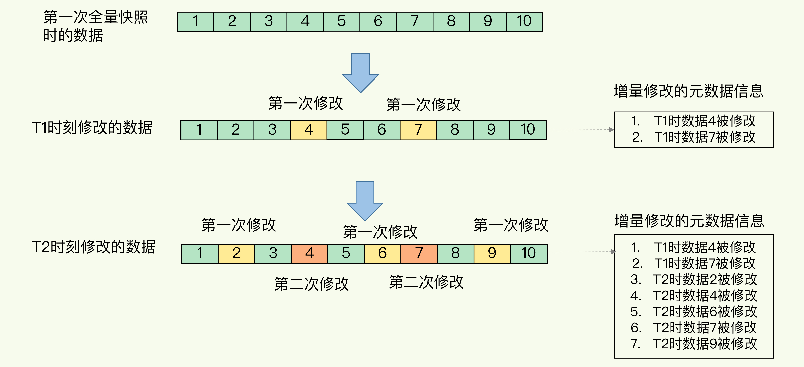
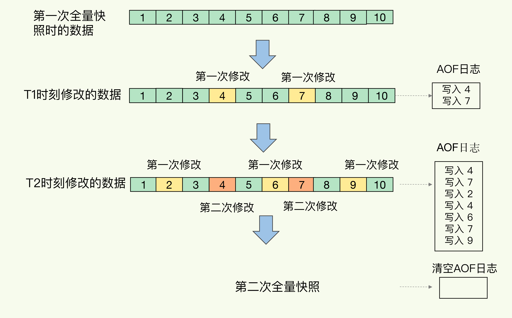

# 持久化机制

Redis 的持久化主要有两大机制，即 AOF（Append Only File）日志和 RDB 快照

## AOF

AOF 日志是写后日志，即 Redis 是先执行命令，把数据写入内存，然后才记录日志

### 文件格式

AOF 里记录的是 Redis 收到的每一条命令，这些命令是以文本形式保存的

以 Redis 收到 set testkey testvalue 命令后记录的日志为例，*3 表示当前命令有三个部分，每部分都是由 $+数字 开头，后面紧跟着具体的命令、键或值。数字表示这部分中的命令、键或值一共有多少字节。例如，$3 set 表示这部分有 3 个字节，也就是 set 命令

### 写后日志原因

- 为了避免额外的检查开销，Redis 在向 AOF 里面记录日志的时候，并不会先去对这些命令进行语法检查。所以如果先记日志再执行命令的话，日志中就有可能记录了错误的命令，Redis 在使用日志恢复数据时，就可能会出错

- 先让系统执行命令，只有命令能执行成功，才会被记录到日志中，可以避免出现记录错误命令的情况

- 在命令执行后才记录日志，不会阻塞当前的写操作

### 写 aof_buf

1. 在一条命令执行后，Redis 会先将命令序列化为字节流，放入 `server.aof_buf` 中后返回
2. 主线程在 `beforeSleep` 中触发 flush 过程，写入 AOF 文件并 sync 到硬盘

`aof_buf` 本身是一个 `SDS`，起到缓冲区的作用，暂存待写入的 AOF 文件内容

磁盘 IO 相比内存访问慢很多，AOF 避免在主路径上做 IO 损失数据库性能，因此主路径先只写到 `aof_buf`

`aof_buf` 也有将多条命令聚合在一起的作用，如此调用一次 `write` 就能全部写到 AOF 文件中

### 写磁盘

通过 `flushAppendOnlyFile` 将 `aof_buf` 写入磁盘

1. 将 `aof_buf` 通过 `write` 写入到 `aof_fd`。如果没完全写入，就截掉 `aof_buf` 中写入了的部分，保留未写入的内容
2. 写入 `aof_fd` 的数据会先写入内核缓存区，Redis 会根据策略通过 `fsync `将缓存中的数据强制刷盘

AOF 配置项 appendfsync 的三个可选值提供了三个选择

- Always 同步写回：每次写完 `aof_buf` 后强制刷盘，该选项可以做到基本不丢数据，但是它在每一个写命令后都有一个慢速的落盘操作，不可避免地会影响主线程性能

- Everysec 每秒写回：每隔一秒把缓冲区中的内容写入磁盘。如果发生宕机，上一秒内未落盘的命令操作仍然会丢失

- No 操作系统控制的写回：由操作系统决定何时将缓冲区内容写回磁盘，只要 AOF 记录没有写回磁盘，一旦宕机对应的数据就丢失了

需要注意的是，Always 会在主线程等待 `fsync` 返回，而 Everysec 会在后台线程中执行 `fsync` 而不是在主线程中

### 潜在风险

- 刚执行完一个命令，还没有来得及记日志就宕机了，那么这个命令和相应的数据就有丢失的风险

- AOF 虽然避免了对当前命令的阻塞，但可能会给下一个操作带来阻塞风险

### 重写机制

AOF 是以文件的形式在记录接收到的所有写命令，随着接收的写命令越来越多，AOF 文件会越来越大

AOF 文件过大带来的性能问题：

- 文件系统本身对文件大小有限制，无法保存过大的文件

- 如果文件太大，之后再往里面追加命令记录的话，效率也会变低

- 如果发生宕机，AOF 中记录的命令要一个个被重新执行，用于故障恢复，如果日志文件太大，整个恢复过程就会非常缓慢

因此 Redis 需要重写 AOF 来消除冗余，压缩信息以节约存储资源和维持可接受的重放时间

重写不以之前生成的 AOF 为输入，而是直接将数据库中数据转换为 AOF 格式并写入硬盘，也就是说，读取数据库中的所有键值对，然后对每一个键值对用一条命令记录它的写入

#### BASE、INCR、MANIFEST

从 Redis 7.0 开始，使用 BASE、INCR 和 MANIFEST 三种文件来管理硬盘上的 AOF 文件

- BASE：代表了初始的数据的快照，由 AOF 重写过程生成
- INCR：包含了从 BASE 状态开始的变更
- MANIFEST：追踪所有的 BASE 和 INCR 文件

上面说的通过 `flushAppendOnlyFile` 将 `aof_buf` 写入磁盘，其实就是写入 INCR 文件

#### 重写触发时机

AOF 重写的触发有两种途径：

- `BGREWRITEAOF` 命令
- 检测到 AOF INCR 的大小相比 BASE 的比例超过阈值时触发

#### 重写流程

1. 由于重写启动时 `aof_buf` 中可能还有没有写入 AOF 文件的数据，因此先将 `aof_buf` 数据全部写到 AOF 文件中并清空 `aof_buf`
2. 由于重写需要花费一定时间，重写期间 Redis 将继续响应用户请求，AOF 机制也会正常工作，因此需要准备一个新的 INCR 文件作为 AOF 目标文件，老文件不再使用，方便在重写完成后清理老文件
3. `rewriteAppendOnlyFileBackground` 启动重写，但不是同步地执行重写流程，而是将重写流程放在后台执行，主进程 fork 出后台的 bgrewriteaof 子进程
4. 子进程则最终进入 `rewriteAppendOnlyFile` 函数执行重写过程
5. 父进程每秒调用一次 `checkChildrenDone` 检查子进程状态
6. 若检测到子进程退出，则进入 `backgroundRewriteDoneHandler` 函数执行 AOF 重写后半段流程
7. 将老 BASE 文件标记为历史文件，命名新 BASE 文件名，完成新 BASE 文件的生成
8. 将所有 INCR 文件（除了 `server.aof_fd` 对应的那个）置为历史文件
9. 持久化新 MANIFES T文件，并更新到 `server.aof_manifest`
10. 清理所有的历史文件

### 潜在风险

fork 瞬间一定是会阻塞主线程，虽然 fork 采用 COW 机制，但 fork 子进程需要拷贝进程必要的数据结构，其中有一项就是拷贝内存页表，这个拷贝过程会消耗大量 CPU 资源，拷贝完成之前整个进程是会阻塞的，阻塞时间取决于整个实例的内存大小，实例越大，内存页表越大，fork 阻塞时间越久

由于采用 COW 机制，所以在写发生时，才真正拷贝内存的数据，这一过程中父进程也可能会产生阻塞的风险

## RDB

RDB（Redis DataBase）是把某一时刻的状态以文件的形式写到磁盘上，也就是快照。即使宕机，快照文件也不会丢失，数据的可靠性也就得到了保证

RDB 记录的是某一时刻的数据，并不是操作，所以在做数据恢复时，可以直接把 RDB 文件读入内存，从而很快地完成数据恢复

Redis 的数据都在内存中，为了提供所有数据的可靠性保证，它执行的是全量快照，也就是说，把内存中的所有数据都记录到磁盘中

### 生成快照

Redis 提供了两个命令来生成 RDB 文件，分别是 `save` 和 `bgsave`

- `save`：在主线程中执行，会导致阻塞

- `bgsave`：创建一个子进程，专门用于写入 RDB 文件，避免了主线程的阻塞，这也是 Redis RDB 文件生成的默认配置

### 增量快照

虽然 bgsave 执行时不阻塞主线程，但是如果频繁地执行全量快照，也会带来两方面的开销：

- 频繁将全量数据写入磁盘，会给磁盘带来很大压力

- 虽然子进程在创建后不会再阻塞主线程，但是 fork 这个创建过程本身会阻塞主线程，而且主线程的内存越大，阻塞时间越长

增量快照，即做了一次全量快照后，后续的快照只对修改的数据进行快照记录，这样可以避免每次全量快照的开销

记住哪些数据被修改了需要使用额外的元数据信息去记录哪些数据被修改了，这会带来额外的空间开销问题

## AOF 和 RDB 混合方法

内存快照以一定的频率执行，在两次 RDB 快照之间，使用 AOF 日志记录这期间的所有命令操作

RDB 快照不用很频繁地执行，这就避免了频繁 fork 对主线程的影响。而且，AOF 日志也只用记录两次快照间的操作，不需要记录所有操作。因此，就不会出现文件过大的情况了，也可以避免重写开销

