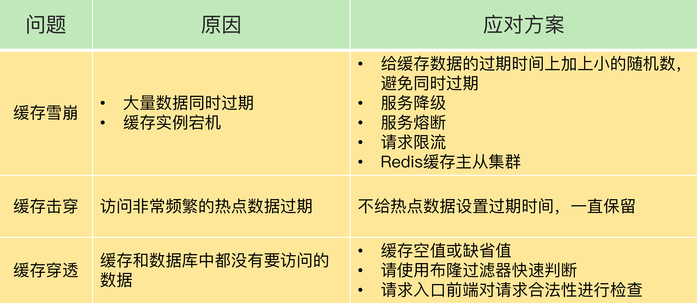
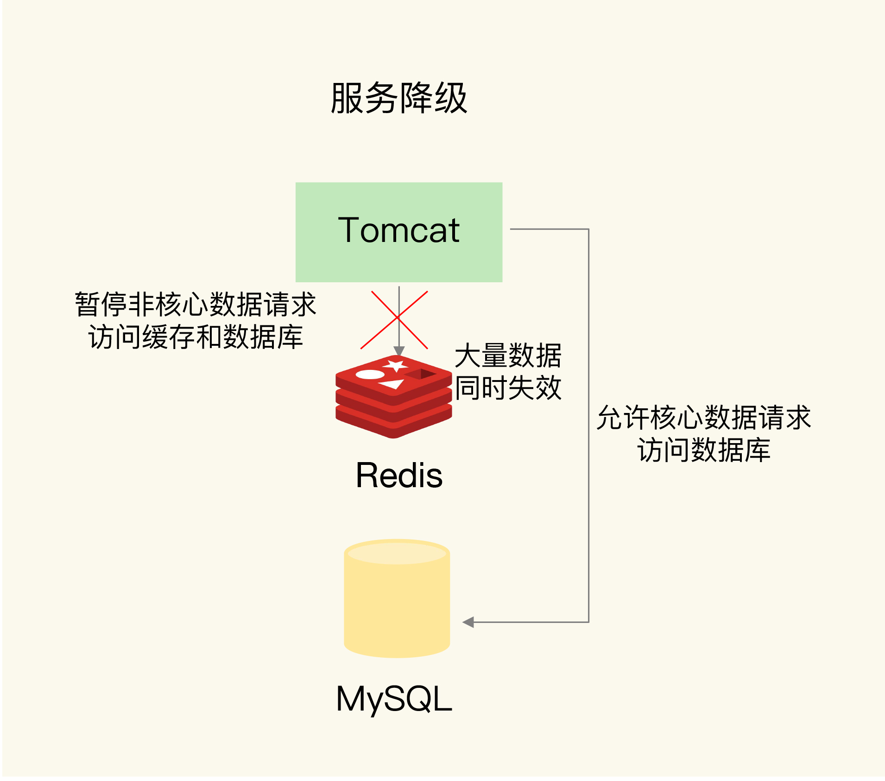

# 缓存异常

## 缓存雪崩

大量的请求无法在 Redis 缓存中进行处理，从而应用将大量请求发送到数据库层，导致数据库层的压力激增

### 缓存中有大量数据同时过期

- 给数据的过期时间增加一个较小的随机数，不同数据的过期时间有所差别，但差别又不会太大，既避免了大量数据同时过期，同时也保证了这些数据基本在相近的时间失效，仍然能满足业务需求

- 服务降级，发生缓存雪崩时，针对不同的数据采取不同的处理方式；访问非核心数据时，暂时停止从缓存中查询这些数据，而是直接返回预定义信息、空值或是错误信息；访问核心数据时，允许查询缓存，如果缓存缺失，也可以继续通过数据库读取

### Redis 缓存实例发生故障宕机

在业务系统中实现服务熔断或请求限流机制：在发生缓存雪崩时，为了防止引发连锁的数据库雪崩，甚至是整个系统的崩溃，这时可以暂停业务应用对缓存系统的接口访问

服务熔断虽然可以保证数据库的正常运行，但是暂停了整个缓存系统的访问，对业务应用的影响范围大

为了尽可能减少这种影响，可以进行请求限流，在业务系统的请求入口前端控制每秒进入系统的请求数，避免过多的请求被发送到数据库

通过主从节点的方式构建 Redis 缓存高可靠集群，主节点故障宕机，从节点还可以切换成为主节点，继续提供缓存服务，避免了由于缓存实例宕机而导致的缓存雪崩问题

## 缓存击穿

缓存击穿是指针对某个访问非常频繁的热点数据因为失效，无法在缓存中进行处理从而大量请求都发送到了后端数据库，导致影响数据库处理其他请求

### 合理设置热点数据过期时间

- 热点数据不设置过期时间，由后台异步更新缓存

- 热点数据过期前通知后台线程更新过期时间

- 缓存失效后先获取分布式锁，这样只会一个请求读取数据库

## 缓存穿透

缓存穿透是指要访问的数据不在 Redis 缓存中，然后访问数据库时发现数据库中也没有要访问的数据

应用无法从数据库中读取数据写入缓存来服务后续请求，缓存失去了保护数据库的意义，还会同时给缓存和数据库带来巨大压力

原因：

- 业务层误操作：缓存中的数据和数据库中的数据被误删除了，所以缓存和数据库中都没有数据

- 恶意攻击：专门访问数据库中没有的数据

### 缓存空值或缺省值

一旦发生缓存穿透，可以针对查询的数据在 Redis 中缓存一个缺省值

应用发送的后续请求再进行查询时，就可以直接从 Redis 中读取空值或缺省值，返回给业务应用了，避免了把大量请求发送给数据库处理，保持了数据库的正常运行

但采用默认值的方式也有其弊端：

- 缓存中存在很多数据库中没有的数据，导致存储空间增加，因此可以给这类数据设置一个过期时间

- 如果在默认值有效期间数据库写入了数据，会出现缓存与数据库数据不一致的情况，因此需要使用消息队列或其他异步的方式清理缓存

### 业务逻辑前置判断

针对业务逻辑特点，前置过滤判断，校验数据合法性

### 布隆过滤器

使用布隆过滤器快速判断数据是否存在，避免从数据库中查询数据是否存在，减轻数据库压力

在把数据写入数据库时，使用布隆过滤器做个标记。当缓存缺失后需要查询数据库时，可以通过查询布隆过滤器快速判断数据是否存在

这样即使发生缓存穿透了，大量请求只会查询 Redis 和布隆过滤器，而不会积压到数据库，也就不会影响数据库的正常运行

布隆过滤器可以使用 Redis 实现，本身就能承担较大的并发访问压力