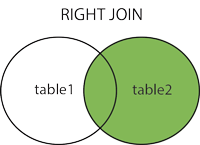

# DQL

DQL(Data Query Language) 数据查询语言，用以从表中获得数据，确定数据怎样在应用程序给出。常用的关键字有：`SELECT`、`FROM`、`WHERE`、`GROUP BY`、`HAVING`、`ORDER BY`、`LIMIT`、`UNION`、`JOIN`

### 查询数据

```sql
select filed1,... [from table1,...] [where ...] [group by ...] [having ...] [order by ...] [limit n] [offset m] 
```

- 一个 `select` 语句中，子句的顺序是固定的，必须是 `from`、`where`、`group by`、`having`、`order by`、`limit`、`offset`

- 每个子句执行后都会产生一个中间数据结果，即所谓的临时视图，供接下来的子句使用，如果不存在某个子句就跳过

- `where` 子句的字符串比较如果不使用 `like` 是不区分大小写的，可以使用 `binary` 来设定 `where` 子句的字符串比较是区分大小写的

### 结果排序

```sql
order by field1 [asc | desc],...
```

- 可以使用任何字段来作为排序的字段，从而返回排序后的查询结果

- 可以设定多个字段来排序

- 可以使用 `asc` 或 `desc` 关键字来设置查询结果是按升序或降序排列，默认情况下，它是按升序排列

- 多列排序的时候，先对第一个字段进行排序，然后对于相同的第一字段内部再采用第一个字段进行排序，以此类推

### 结果分组

`group by` 配合统计函数，对结果集中的列进行分组

```
group by columnname
```

### 结果聚合

`union` 用于连接两个以上的 `select` 语句的结果组合到一个结果集合中

```sql
select expression1, expression2, ... expression_n
from tables
[where conditions]
union [all | distinct]
select expression1, expression2, ... expression_n
from tables
[where conditions];
```

- 每个查询必须包含相同的列、表达式或者聚合函数，但它们出现的顺序可以不一致

- 默认值 `distinct` 删除结果集中重复的数据，`all` 返回包含重复数据的结果集

- 只能使用一条 `order by` 对结果集进行排序，而且必须出现在最后一条出现的 `select` 语句之后

- 多表查询的时候并不要求两个表完全相同，只需要检索的字段结构相似

### 表连接

表连接就是两张表根据关联字段，组合成一个数据集

- inner join 获取两个表中字段匹配关系的记录

```sql
select a.column1, a.column2, b.column1 from tab1 a inner join tab2 b on a.column1 = b.column1;
```


- left join 获取左表所有记录，即使右表没有对应匹配的记录

```sql
select a.column1, a.column2, b.column1 from tab1 a left join tab2 b on a.column1 = b.column1;
```


- right join 获取右表所有记录，即使左表没有对应匹配的记录

```sql
select a.column1, a.column2, b.column1 from tab1 a right join tab2 b on a.column1 = b.column1;
```



- full outer join 只要左表和右表其中一个表中存在匹配

  ```sql
  select a.column1, a.column2, b.column1 from tab1 a full join tab2 b on a.column1 = b.column1;
  ```

  


