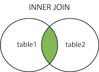
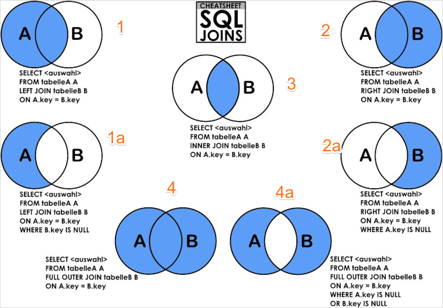

# sql

sql(structured query language) 是结构化查询语言

sql 主要由六个子语言组成：

- DDL(Data Definition Language) 数据定义语言，用于定义数据库的三级结构，包括外模式、概念模式、内模式及其相互之间的映像，定义数据的完整性约束、安全控制等。DDL 不需要 commit，常用关键字有： `CREATE`、`ALTER`、`DROP`、`TRUNCATE`、`COMMENT`、`RENAME`

- DQL(Data Query Language) 数据查询语言，用以从表中获得数据，确定数据怎样在应用程序给出。常用的关键字有：`SELECT`、`FROM`、`WHERE`、`GROUP BY`、`HAVING`、`ORDER BY`、`LIMIT`、`UNION`、`JOIN`

- DML(Data Manipulation Language) 数据操作语言，供用户对数据库中数据的操作，包括数据的增加、删除、更新，载入等操作。常用关键字有：`UPDATE`、`DELETE`、`INSERT INTO`、`LOAD`

- DCL(Data Control Language) 数据控制语言，用于对数据库，数据表的访问角色和权限的控制等。常用关键字有：`GRANT`、`REVOKE`、`DENY`

- TCL(Transaction Control Language) 事务控制语言，又名 TPL(Transaction Process Language) 事务处理语言，它能确保被 DML 语句影响的表的所有行及时得以更新。常用关键字有：`START TRANSACTION`、`BEGIN`、`SAVEPOINT`、`ROLLBACK`、`COMMIT`、`SET TRANSACTION`

- CCL(Cursor Control Language) 游标控制语言，游标 cursor 是 DBMS 为用户开设的一个数据缓冲区，存放 SQL 语句的执行结果。常用关键字有：`DECLARE CURSOR`、`OPEN CURSOR`、`FETCH INTO`、`UPDATE WHERE CURRENT`、`CLOSE CURSOR`

## DCL

### 新建用户

```sql
create user username@host [identified by password]

create user xx@localhost identified by 'xx'
create user xx@192.168.1.1 identified by 'xx'
create user xx@"%" identified by 'xx'
CREATE USER xx@"%"
```

- `username` 用户名

- `host` 指定该用户可以在哪台主机登陆，本地可以使用 `localhost`，任意主机可以使用 `%`

- `password` 表示用户密码

### 删除用户

```sql
drop user username@host

drop user xx@localhost
```

### 用户授权

```sql
grant privileges on databasename.tablename to username@host

grant select on *.* to xx@'%'
grant all on *.* TO xx@'%'

# 刷新一下权限
flush privileges
```

- `privileges` 是一个用逗号分隔的赋予 MySQL 用户的权限列表，如 `select`、`insert`、`update` 等，如果要授予所有的权限则使用 `all`

- `databasename` 数据库名，`tablename` 表名，如果要授予该用户对所有数据库和表的相应操作权限则可用 `*` 表示，如 `*.*`

- 使用 `grant` 为用户授权时，如果指定的用户不存在，则会新建该用户并授权

设置允许用户远程访问 MySQL 服务器时，一般使用该命令，并指定密码

```sql
grant select on *.* to xx@'%' identified by '123'
```

### 撤销权限

```sql
revoke privileges on databasename.tableanme from username@host

revoke select on *.* from xx@'%'
revoke all on *.* from xx@'%'
```

### 查看权限

```sql
# 从 mysql.user 表中查看
select * from mysql.user where user='username'

# 从授权信息中查看
show grants for username@host
```

### 修改密码

```sql
set password for username@host= password(newpassword)

set password for xx@localhost=password("1234")
# 修改当前用户密码
set password = password("1234")
```

## DDL

### 创建数据库

```sql
create database databasename

create database Student
```

### 删除数据库

```sql
drop database databasename

drop database Student
```

### 查看数据库

```sql
# 查看全部数据库
show databases

# 查看当前数据库
# 1
select database()
# 2
status
```

### 连接数据库

```sql
use databasename
```

### 创建数据表

```sql
create table tablename (
  filed1 type1 [is null] [key] [default value] [extra] [comment],
  ...
)[engine] [charset]
```

- 除了表名，字段名和字段类型，其它都是可选参数，可有可无，根据实际情况来定

- `is null` 表示该字段是否允许为空，不指明，默认允许为 `NULL`

- `key` 表示该字段是否是主键，外键，唯一键还是索引

- `default value` 表示该字段在未显示赋值时的默认值

- `extra` 表示其它的一些修饰，比如自增 `auto_increment[=value]`

- `comment` 表示对该字段的说明注释

- `engine` 表示数据库存储引擎，MySQL 支持的常用引擎有 ISAM、MyISAM、Memory、InnoDB 和 BDB，不显示指明默认使用 MyISAM

- `charset` 表示数据表数据存储编码格式，默认为 latin1

### 创建临时表

```sql
create temporary table tablename (
  ...
)
```

- 创建临时表与创建普通表的语句基本是一致的，只是多了一个 `temporary` 关键字

- 临时表的特点是：表结构和表数据都是存储到内存中的，生命周期是当前 MySQL 会话，会话结束后，临时表自动被 drop

- 临时表与 Memory 表的区别是：Memory 表的表结构存储在磁盘，临时表的表结构存储在内存；`show tables` 看不到临时表，看得到内存表；内存表的生命周期是服务端 MySQL 进程生命周期，MySQL 重启或者关闭后内存表里的数据会丢失，但是表结构仍然存在，而临时表的生命周期是 MySQL 客户端会话；内存表支持唯一索引，临时表不支持唯一索引；在不同会话可以创建同名临时表，不能创建同名内存表

### 创建内存表

```sql
create temporary table tablename (
  ...
) engine=memory
```

### 删除数据表

```sql
drop table tablename
```

### 查看表结构

```sql
desc tablename
```

### 查看建表语句

```sql
show create table tablename
```

### 重命名数据表

```sql
rename table tablename to newtablename
```

### 列操作

- 删除列

```sql
alter table tablename drop column columnname
```

- 增加列

```sql
alter table tablename add column columnname columndefinition

alter table student add column hometown varchar(32)
```

- 重命名列

```sql
alter table tablename change columnname newcolumnname type
```

- 修改列属性

```sql
alter table tablename modify columnname newdefinition
```

`change` 可以更改列名和列类型，但每次都要把新列名和旧列名写上，即使两个列名没有更改

`modify` 只能更改列属性，但只需要写一次列名

### 索引操作

- 增加索引

```sql
alter table tablename add index [indexname](filed1, filed2,...)

alter table student add index index_studentNo(studentNo)
alter table student add index(studentNo)
```

- 查看索引

```sql
show index from tablename
```

- 删除索引

```sql
alter table tablename drop index indexname
```

### 修改存储引擎

```sql
alter table tablename type engine=enginename
```

## DQL

### 查询数据

```sql
select filed1,... [from table1,...] [where ...] [group by ...] [having ...] [order by ...] [limit n] [offset m] 
```

- 一个 `select` 语句中，子句的顺序是固定的，必须是 `from`、`where`、`group by`、`having`、`order by`、`limit`、`offset`

- 每个子句执行后都会产生一个中间数据结果，即所谓的临时视图，供接下来的子句使用，如果不存在某个子句就跳过

- `where` 子句的字符串比较如果不使用 `like` 是不区分大小写的，可以使用 `binary` 来设定 `where` 子句的字符串比较是区分大小写的

### 结果排序

```sql
order by field1 [asc | desc],...
```

- 可以使用任何字段来作为排序的字段，从而返回排序后的查询结果

- 可以设定多个字段来排序

- 可以使用 `asc` 或 `desc` 关键字来设置查询结果是按升序或降序排列，默认情况下，它是按升序排列

- 多列排序的时候，先对第一个字段进行排序，然后对于相同的第一字段内部再采用第一个字段进行排序，以此类推

### 结果分组

`group by` 配合统计函数，对结果集中的列进行分组

```
group by columnname
```

### 结果聚合

`union` 用于连接两个以上的 `select` 语句的结果组合到一个结果集合中

```sql
select expression1, expression2, ... expression_n
from tables
[where conditions]
union [all | distinct]
select expression1, expression2, ... expression_n
from tables
[where conditions];
```

- 每个查询必须包含相同的列、表达式或者聚合函数，但它们出现的顺序可以不一致

- 默认值 `distinct` 删除结果集中重复的数据，`all` 返回包含重复数据的结果集

- 只能使用一条 `order by` 对结果集进行排序，而且必须出现在最后一条出现的 `select` 语句之后

- 多表查询的时候并不要求两个表完全相同，只需要检索的字段结构相似

### 表连接

- inner join 获取两个表中字段匹配关系的记录

```sql
select a.column1, a.column2, b.column1 from tab1 a inner join tab2 b on a.column1 = b.column1;
```



- left join 获取左表所有记录，即使右表没有对应匹配的记录

```sql
select a.column1, a.column2, b.column1 from tab1 a left join tab2 b on a.column1 = b.column1;
```


- right join 获取右表所有记录，即使左表没有对应匹配的记录

```sql
select a.column1, a.column2, b.column1 from tab1 a right join tab2 b on a.column1 = b.column1;
```


- full outer join 只要左表和右表其中一个表中存在匹配




## DML

### 插入数据

```sql
insert into tablename(column1,column2,...) values(value1,value2,...)

# 如果插入值刚好与数据表的所有列一一对应，那么可以省略书写插入的指定列
insert into tablename values(value1,value2,...)
```

### 删除数据

```sql
delete from tablename where condition
```

### 修改数据

```sql
update tablename set columnname=newvalue,... where condition
```

### 备份数据

- 导出数据库

```sql
mysqldump -u username -p databasename [tablename] > output.sql
```

- 还原数据库

```sql
source file.sql
```

- 导出 csv 文件

```sql
select * from tablename into outfile "file.csv"
select * from tablename into outfile "file.csv" fields terminated BY ',' optionally enclosed by '"' lines terminated by '\n'
```

- 导入 csv 文件

```sql
load data infile "/path/to/file.csv" into table tablename
```

## TCL

### 查看事务模式

MySQL 默认操作模式就是 autocommit 自动提交模式

自动提交事务由环境变量 `autocommit` 来控制，该变量只对当前会话有效

```sql
select @@global.autocommit

show variables like "%autocommit%"
```

`autocommit` 默认值是 1，表示在命令行模式下每条增删改语句在键入回车后，都会立即生效，而不需要手动 commit

### 关闭/开启自动提交事务

```sql
# 开启当前会话的自动提交事务
set autocommit = 1
# 关闭当前会话的自动提交事务
set autocommit = 0

# 永久关闭
# 通过修改配置文件 my.cnf 文件，添加配置项
autocommit=0
```

### 事务控制

- 开启事务

```sql
# 1
start transaction

# 2
begin
```

- 提交事务

```sql
commit
```

- 回滚

```sql
rollback
```

- 保存点

```sql
# 创建一个保存点
savepoint pointname

# 删除一个保存点
release savepoint pointname

# 回滚保存点
rollback to pointname
```

### 事务等级

- 查看事务等级

```sql
# 查看全局事务等级
select @@global.tx_isolation

# 查看当前会话事务等级
select @@session.tx_isolation
select @@tx_isolation
show variables like 'tx_isolation'
```

- 设置事务等级

```sql
set scopename transaction isolation level txlevel
# scopename 包括 global 和 session，默认值 session
# txlevel 包括 read uncommitted、read committed、repeatable read、serializable
# InnoDB 默认事务等级是 repeatable read
```

