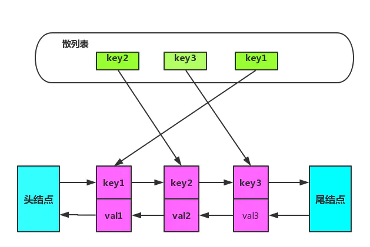

# 内存替换算法

常见的内存替换算法有：FIFO，LRU，LFU，LRU-K，2Q

## FIFO（First In First Out）

最近刚访问的，将来访问的可能性比较大

使用一个队列，新加入的放入队尾，每次淘汰队首，即最先进入的数据，最先被淘汰

FIFO 无法体现页面冷热信息

## LRU（Least Recently Used）

如果数据最近被访问过，那么将来被访问的几率也更高，所以应该淘汰最长时间没有被访问的数据

- 新数据直接插入到列表头部

- 缓存数据被命中，将数据移动到列表头部

- 缓存已满的时候，移除列表尾部数据

LRU 无法应对偶发的访问操作，比如说批量查询某些数据，可能使缓存中热门数据被这些偶发使用的数据替代，造成缓存污染，导致缓存命中率下降

链表添加节点删除节点时间复杂度 O(1)，非常适合当做存储缓存数据容器，但链表有几个缺点：每次获取任意节点数据，都需要从头结点遍历下去，这就导致获取节点复杂度为 O(N)；移动中间节点到头结点，需要知道中间节点前一个节点的信息，单向链表就不得不再次遍历获取信息

使用散列表存储节点，获取节点的复杂度将会降低为 O(1)，节点移动问题可以在节点中再增加前驱指针，记录上一个节点信息，这样链表就从单向链表变成了双向链表



```cpp
class LRUCache {
private:
  unordered_map<int, list<pair<int, int>>::iterator> lru;
  list<pair<int, int>> his;
  int cap;

public:
  LRUCache(int capacity) { cap = capacity; }

  int get(int key) {
    if (lru.count(key) != 0) {
      his.splice(his.begin(), his, lru[key]);
      return lru[key]->second;
    }
    return -1;
  }

  void put(int key, int value) {
    if (lru.count(key))
      his.erase(lru[key]);
    his.push_front(make_pair(key, value));
    lru[key] = his.begin();
    if (lru.size() > cap) {
      lru.erase(his.rbegin()->first);
      his.pop_back();
    }
  }
};
```

## LFU

如果数据过去被访问多次，那么将来被访问的频率也更高

每个数据块加入一个引用计数，所有数据块按照引用计数排序，具有相同引用计数的数据块则按照时间排序，每次淘汰队尾数据块

LFU 能够避免偶发性的操作导致缓存命中率下降的问题，但它有排序开销和无法淘汰一开始有高访问率而之后长时间没有被访问数据的问题

## LRU-K

最久未使用 K 次淘汰算法，K 代表最近使用的次数，因此 LRU 可以认为是 LRU-1

LRU-K 维护两个队列，访问列表和缓存列表

1. 数据第一次被访问时加入到访问列表，访问列表按照一定规则（如 FIFO，LRU）淘汰

2. 当访问列表中的数据访问次数达到 K 次后将数据从访问列表删除，并将数据添加到缓存列表头节点，如果数据已经在缓存列表中，则移动到头结点

3. 若缓存列表数据量超过上限，淘汰缓存列表中排在末尾的数据，即淘汰倒数第 K 次访问离现在最久的数据