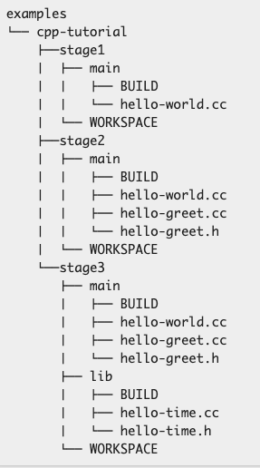

# 重要概念

## 工作区

工作区包括项目源文件、Bazel 构建产物和 Bazel 需要的文件

Bazel 所需文件包括：

- WORKSPACE 文件，位于项目目录结构的根目录

- 一个或多个 BUILD 文件，工作区中包含 BUILD 文件的目录被视为是一个包，BUILD 文件表示如何构建这个包

当 Bazel 构建项目时，所有输入和依赖项必须在同一个工作区中

位于不同工作区中的文件彼此独立，除非链接进本工作区

## WORKSPACE 文件

WORKSPACE 文件标明当前目录是项目的根目录，Bazel 会忽略子目录中的 WORKSPACE 文件，因为其他 WORKSPACE 文件会当视为其他项目的根目录

WORKSPACE 主要用于声明构建所需的外部依赖

Bazel 也支持将 WORKSPACE 文件命名为 WORKSPACE.bazel，如果两种命名同时存在时，Bazel 会使用 WORKSPACE.bazel，因为它优先级更高

项目根目录可以使用 `@` 替代

## 包

包是 BUILD 文件或 BUILD.bazel 文件所在的目录，它包括目录中的所有文件

## BUILD 文件

一个 BUILD 文件包含几种不同类型的 Bazel 指令，最重要的指令是构建规则，它告诉 Bazel 如何构建所需的输出

BUILD 文件中构建规则作用于 target，该 target 对应一组特定的源文件和依赖项

一个 target 还可以依赖其他 target

一个 target 的默认可见性是当前 BUILD 文件，即当前目录包中，但可以显式地指定 target 的可见性

BUILD 文件使用 Starlark 语言编写，不允许有函数的定义、`for` 语句、`if` 语句，可以有列表推导和 `if` 表达式，函数应该被定义在 .bzl 文件中，而且 `*args` 和 ` **kwargs` 不允许使用，除非显示列出所有参数

## target 名称

在 BUILD 文件和命令行中，target 名称格式是 `@myrepo//path_to_package:target_name`

- 如果引用的 target 跟当前 target 在同一工作区，可以使用 `//path_to_package:target_name`

- 如果引用的 target 在当前 BUILD 目录中，可以直接使用 `:target_name`

- 如果引用的 target 在 WORKSPACE 目录中，可以直接使用 `//:target_name`

## 加载扩展

扩展需要写在 .bzl 文件中，通过 `load` 引入