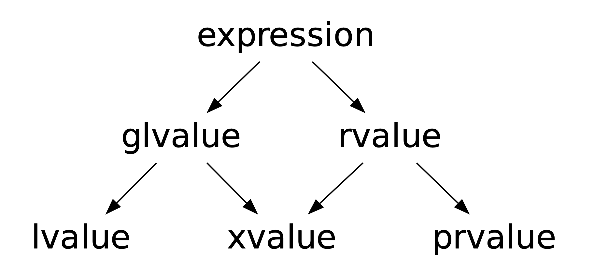

# 值类别

表达式的两个特征：

- 具名：具有一个可标识的名字

- 可被移动：移动构造函数、移动赋值运算符或实现了移动语义的其他函数重载能够绑定于这个表达式

自 C++11 开始，表达式的值类别根据表达式的两个特征分为五种，分别是左值 lvalue、将亡值 xvalue、纯右值 prvalue 以及两种混合类别泛左值 glvalue 和右值 rvalue 五种

- lvalue 具名且不可被移动

- xvaue 具名且可被移动

- prvalue 不具名且可被移动

- glvalue 具名，lvalue 和 xvalue 都属于 glvalue

- rvalue 可被移动的表达式，prvalue 和 xvalue 都属于 rvalue

只要具名就是泛左值，根据是否可移动分为左值和将亡值

只要可移动就是右值，根据是否具名分为纯右值和将亡值

## 左值 lvalue

左值就是赋值符号左边的值，是表达式结束（不一定是赋值表达式）后依然存在的对象

可以将左值看作是一个关联了名称的内存位置，允许程序的其他部分来访问它

左值具有以下特征：

- 可通过取地址运算符获取其地址

- 可修改的左值可用作内建赋值和内建符合赋值运算符的左操作数

- 可以用来初始化左值引用

左值类型：

- 变量名、函数名以及数据成员名

- 返回左值引用的函数调用

- 由赋值运算符或复合赋值运算符连接的表达式

- 解引用表达式

- 前置自增和自减表达式

- 成员访问运算符的结果

- 由指针访问成员运算符的结果

- 下标运算符的结果

- 字符串字面值

## 纯右值 prvalue

字面值或者函数返回的非引用类型变量都是纯右值

- 字面值，字符串字面值除外

- 返回值为非引用的函数调用或操作符重载

- 后置自增和自减表达式

- 算术表达式

- 逻辑表达式

- 比较表达式

- 取地址表达式

- lambda 表达式

## 将亡值 xvalue

将亡值即将消亡的值，是 C++11 新增的跟右值引用相关的表达式，通常是将要被移动的对象，比如返回右值引用 `T&&` 的函数返回值、`std::move` 的返回值，或者转换为 `T&&` 的类型转换函数的返回值

将亡值可以理解为通过盗取其他变量内存空间的方式获取到的值，在确保其他变量不再被使用、或即将被销毁时，通过盗取的方式可以避免内存空间的释放和分配，能够延长变量值的生命期

xvalue 只能通过两种方式来获得，这两种方式都涉及到将一个左值转化为一个右值引用：

- 返回右值引用的函数的调用表达式，如 `static_cast<T&&>(t)`

- 转换为右值引用的转换函数的调用表达式，如 `std::move(t)`