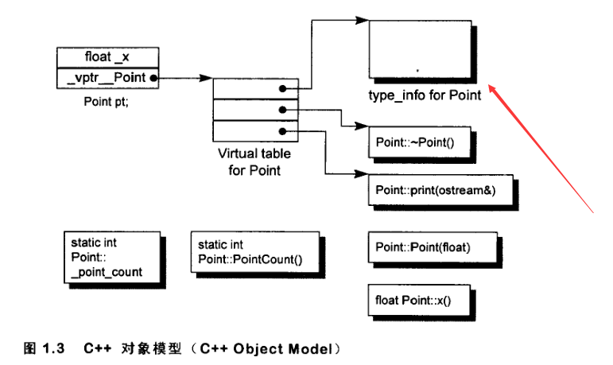

# 显式类型转换

## 显示类型转换表达式

### C 风格类型转换

```cpp
( new_type ) expression

double f = 3.14;
unsigned int n1 = (unsigned int)f; // C-style cast
```

编译器按照以下顺序尝试执行：

1. `const_cast<new_type>`

2. `static_cast<new_type>`

3. 先 `static_cast<new_type>` 后 `const_cast<new_type>`

4. `reinterpret_cast<new_type>`

5. 先 `reinterpret_cast<new_type>` 后 `const_cast<new_type>`

### 函数式类型转换

```cpp
new_type ( expression )

double f = 3.14;
unsigned int n2 = unsigned(f);     // functional cast
```

等价于 C 风格类型转换

## static_cast 表达式

```cpp
static_cast < new_type > ( expression )	
```

- 用于类层次结构中基类和派生类之间指针或引用的转换：向上转换是安全的，向下转换由于没有动态类型检查，所以是不安全的

- 用于基本数据类型之间的转换，如把 `int` 转换为 `char`

- 把空指针转换成目标类型的空指针

- 把任何类型的表达式转为 `void` 类型

- 转换成右值引用

## dynamic_cast 表达式

```cpp
dynamic_cast < new-type > ( expression )		
```

`new-type` 必须是指针、引用和空指针：

- `new-type` 是指针时，`expression` 必须是纯右值，转换失败时返回空指针

- `new-type` 是引用时，`expression` 必须是左值或泛左值，转换失败时抛出 `std::bad_cast` 异常

根据 C++ 对象模型，对象的 `type_info` 被存在了虚表的首部，所以要使用 `dynamic_cast` 进行向下转换时必须有多态，然后运行时比对要转换的类型是否和 `type_info` 中记录的类型

对于向下转换，`dynamic_cast` 是安全的（当类型不一致时，转换过来的是空指针或抛出异常），而 `static_cast` 是不安全的（当类型不一致时，转换过来的是错误意义的指针，可能造成踩内存，非法访问等各种问题）



由于使用 RTTI 进行类型检查，所以存在一定的性能损失

`dynamic_cast` 还可以进行交叉转换

## const_cast 表达式

```cpp
const_cast < new_type > ( expression )

/*
1. 唯一可以对常量进行操作的转换符

2. 去除常量性是一个危险的动作，尽量避免使用
*/
```

- 用于去除对象 `const` 或者 `volatile` 属性

- 常量指针转换为非常量指针，并且仍然指向原来的对象

- 常量引用被转换为非常量引用，并且仍然指向原来的对象

## reinterpret_cast 表达式

```cpp
reinterpret_cast < new_type > ( expression )		
```

从底层对数据进行重新解释，依赖具体的平台，所以可移植性差

不到万不得已，不用使用这个转换符，高危操作

## 类型转换运算符重载

类型转换操作符是一种特殊的类成员函数，将类类型值转变为其他类型值

不能声明返回类型，形参列表也必须为空

支持继承，可以为虚函数

```cpp
operator type() const;
```

只要存在转换，编译器将在可以使用内置转换的地方自动调用