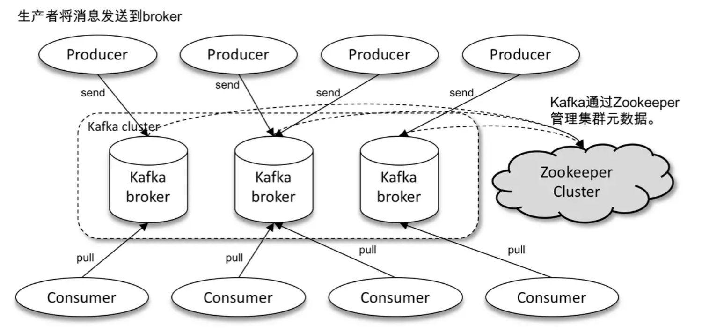
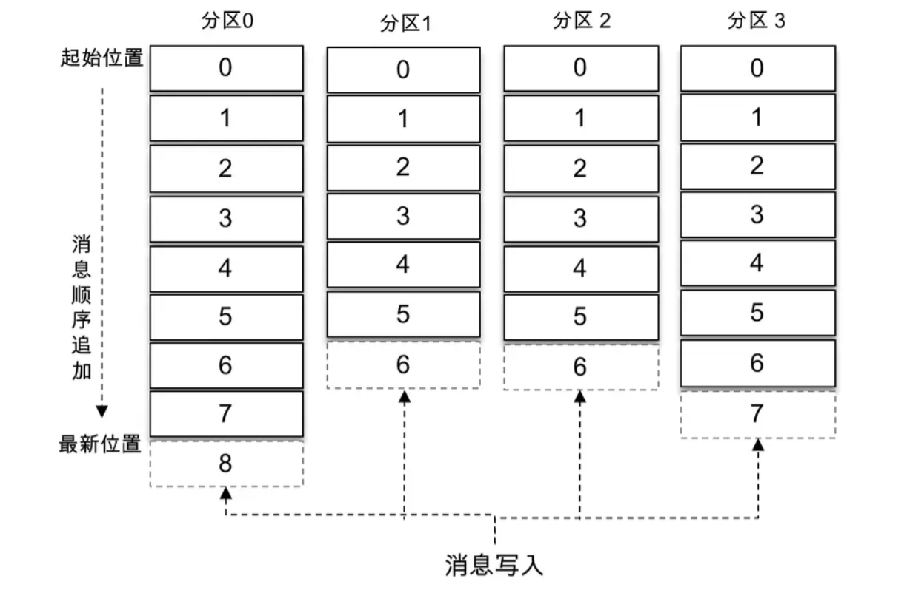
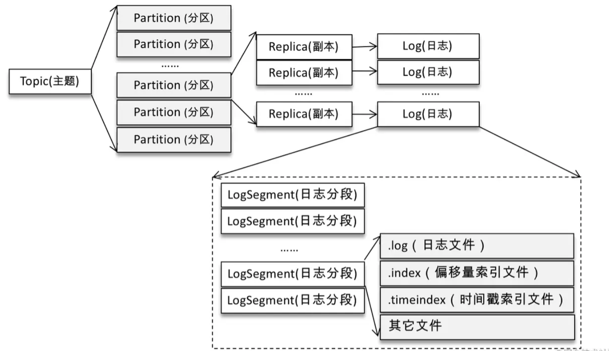

# 基础概念

## 传输模型

常见的两种消息传输模型：

- 点对点模型
- 发布-订阅模型

Kafka 同时支持这两种模型

## 削峰填谷

削峰填谷就是指消息队列缓冲上下游瞬时突发的流量，使其更平滑。对于发送能力很强的上游系统，如果没有消息队列的保护，下游系统可能会直接被压垮导致全链路服务雪崩，消息队列可以在很大程度上避免流量的震荡

消息队列的另外一大好处在于发送方和接收方的松耦合，减少系统间不必要的交互

## 体系架构

一个典型的 Kafka 体系架构包括若干 Producer、若干 Broker、若干 Consumer，以及一个 ZooKeeper 集群

- ZooKeeper 是 Kafka 用来负责集群元数据的管理、控制器的选举等操作的
- Producer 生产者，将消息发送到 Broker
- Broker 服务代理节点，负责将收到的消息存储到磁盘中
- Consumer 消费者，负责从 Broker 订阅并消费消息

## 主题 Topic 与分区 Partition

Kafka 中的消息以 Topic 为单位进行归类，生产者负责将消息发送到特定的 Topic，而消费者负责订阅 Topic 并进行消费

Topic 是一个逻辑上的概念，它还可以细分为多个 Partition，一个 Partition 只属于单个主题

同一 Topic 下的不同 Partition 包含的消息是不同的，Partition 在存储层面可以看作一个可追加的日志（Log）文件，消息在被追加到分区日志文件的时候都会分配一个特定的偏移量 offset

offset 是消息在 Partition 中的唯一标识，是一个单调递增且不变的值。Kafka 通过它来保证消息在 Partition 内的顺序性，不过 offset 并不跨越分区，也就是说，Kafka 保证的是分区内有序而不是主题内有序

Kafka 中的 Partition 可以分布在不同的 broker 上，也就是说一个 Topic 可以横跨多个 broker，以此来提供比单个 broker 更强大的性能

如果一个 Topic 只对应一个文件，那么这个文件所在的机器I/O将会成为这个主题的性能瓶颈，而 Partition 解决了这个问题。每一条消息被发送到 broker 之前，会根据分区规则选择存储到哪个具体的 Partition。如果分区规则设定得合理，所有的消息都可以均匀地分配到不同的分区中

在创建 Topic 的时候可以通过指定的参数来设置 Partition 的个数，当然也可以在主题创建完成之后去修改 Partition 的数量，通过增加 Partition 的数量可以实现水平扩展

不考虑多副本的情况，一个 Partition 对应一个日志 Log。为了防止 Log 过大，Kafka 又引入了日志分段 LogSegment 的概念，将 Log 切分为多个 LogSegment，相当于一个巨型文件被平均分配为多个相对较小的文件，这样也便于消息的维护和清理。事实上，Log 和 LogSegment 也不是纯粹物理意义上的概念，Log 在物理上只以文件夹的形式存储，而每个 LogSegment 对应于磁盘上的一个日志文件和两个索引文件，以及可能的其他文件（比如以“.txnindex”为后缀的事务索引文件

## 多副本机制

Kafka 为 Partition 引入了多副本（Replica）机制，通过增加副本数量可以提升容灾能力

同一 Partition 的不同副本中保存的是相同的消息（在同一时刻，副本之间并非完全一样），副本之间是一主多从的关系，其中 leader 副本负责处理读写请求，follower 副本只负责与 leader 副本的消息同步。不同副本处于不同的 broker 中，当 leader 副本出现故障时，从 follower 副本中重新选举新的 leader 副本对外提供服务。Kafka 通过多副本机制实现了故障的自动转移，当 Kafka 集群中某个 broker 失效时仍然能保证服务可用

 MySQL 的从库是可以处理读操作的，但是在 Kafka 中追随者副本不会对外提供服务。
