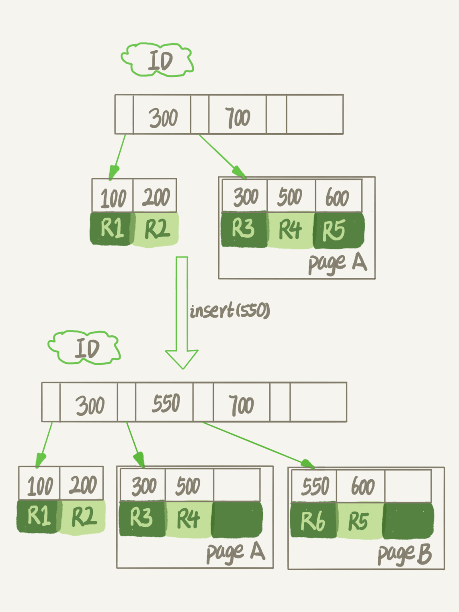

# InnoDB 表删除数据

## 表数据存储

一个 InnoDB 表包含表结构数据和实际数据（行记录和索引）

- 表结构数据不直接存储在表空间中，而是由 MySQL 的数据字典中进行统一管理
- 实际数据的存储分为两种模式。系统表空间，默认模式，所有表共享 ibdata1 文件，统一存储元数据、undo log 等。独立表空间，需要 `innodb_file_per_table=ON`，每个表都有独立的 .ibd 文件

一个表单独存储为一个文件更容易管理，在不需要这个表时通过 `drop table` 命令，系统就会直接删除这个文件

## 数据删除流程

删除某行数据时，InnoDB 引擎只会把记录标记为删除，之后新插入的数据可以复用这个位置，所以磁盘文件的大小并不会因为删除而缩小

同理，删掉一个数据页上的所有记录，整个数据页都可以被复用

但是，数据页的复用跟记录的复用是不同的。记录的复用，只限于符合范围条件的数据，而当整个页从 B+ 树里面摘掉以后，可以复用到任何位置

如果相邻的两个数据页利用率都很小，系统就会把这两个页上的数据合到其中一个页上，另外一个数据页就被标记为可复用

不止是删除数据会造成空洞，插入数据也会。如果数据是按照索引递增顺序插入的，那么索引是紧凑的。但如果数据是随机插入的，就可能造成索引的数据页分裂

更新索引上的值，可以理解为删除一个旧的值，再插入一个新值



## 重建表

经过大量增删改的表，都是可能是存在空洞的。所以，如果能够把这些空洞去掉，就能达到收缩表空间的目的

可以使用 `alter table A engine=InnoDB` 命令来重建表，该命令执行流程为新建一个与表 A 结构相同的表 B，然后按照主键 ID 递增的顺序，把数据一行一行地从表 A 里读出来再插入到表 B 中。这个临时表 B 不需要手动创建，MySQL 会自动完成转存数据、交换表名、删除旧表的操作。数据搬运过程中，有新的数据要写入到表 A 的话，就会造成数据丢失

MySQL 5.6 版本开始引入的 Online DDL，对这个操作流程做了优化

1. 建立一个临时文件，扫描表 A 主键的所有数据页

2. 用数据页中表 A 的记录生成 B+ 树，存储到临时文件中

3. 生成临时文件的过程中，将所有对 A 的操作记录在一个日志文件（row log）中，对应的是图中 state2 的状态

4. 临时文件生成后，将日志文件中的操作应用到临时文件，得到一个逻辑数据上与表 A 相同的数据文件

5. 用临时文件替换表 A 的数据文件

由于日志文件记录和重放操作这个功能的存在，这个方案在重建表的过程中，允许对表 A 做增删改操作

## 整表删除

`DROP` 会删除表结构和数据，而 `DELETE` 只是删除数据，`TRUNCATE` 会删除全部数据但保留表结构

### TRUNCATE

优先选择 `TRUNCATE TABLE`，适用于仅需清空数据但保留表结构的场景。它执行速度极快，因为是直接删除数据文件，而非逐行删除，且自动重置自增列

```sql
TRUNCATE TABLE large_table;
```

### DROP

使用于需彻底删除表结构和数据的场景，但需要先检查依赖关系，如果存在外键约束需要解除外键约束

```sql
-- 查看引用该表的外键约束
SELECT TABLE_NAME, COLUMN_NAME, CONSTRAINT_NAME
FROM INFORMATION_SCHEMA.KEY_COLUMN_USAGE
WHERE REFERENCED_TABLE_NAME = 'large_table';

ALTER TABLE child_table DROP FOREIGN KEY fk_name;

DROP TABLE large_table;
```

## 部分数据删除

大数据量下的 `DELETE` 操作可能导致的问题：

1. 事务日志的增长，因为每个删除都会被记录下来，尤其是如果在一个大事务里做的话，可能会导致日志文件暴涨，甚至填满磁盘空间，进而让数据库崩溃。这时候可能需要分批次删除，每次删几千条，分批提交，减少单次事务的大小
2. 长时间运行的 `DELETE` 会持有行锁或者表锁，阻塞其他查询和操作，尤其是在线的高并发环境，这会导致应用响应变慢甚至超时。所以要尽量在低峰期进行操作，或者用 `LIMIT` 分多次删除，减少每次的锁定时间
3. 如果有大量数据被删除，相关的索引也需要更新，这会增加 IO 负担和时间。另外删除后的表可能会有很多碎片，导致后续查询效率下降，需要考虑之后优化表结构，比如使用 `OPTIMIZE TABLE` 或者 `ALTER TABLE` 重建表

准备工作：

1. 避免无差别的全表删除，优先按条件筛选目标数据
2. 至少保留一份完整的备份，可以使用 `mysqldump` 导出表数据
3. 检查依赖关系：查看是否有触发器、外键引用该表

删除策略：

1. 小批量分批次删除，避免长事务导致的锁争用和日志膨胀，可以使用 `LIMIT` + 循环逐批删除
2. 临时禁用索引和约束
3. 控制事务大小，降低锁粒度
4. 回收表空间、元数据

