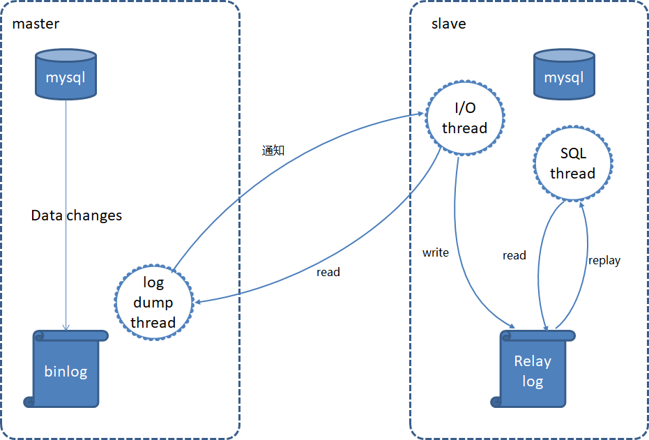

# 主从同步

为了减轻数据库压力，需要对数据库做读写分离和主从同步，写操作走主库，读操作走从库，分散了数据库的访问压力，提升整个系统的性能和可用性

## 主从复制原理

主从复制需要三个线程，master（binlog dump thread）、slave（I/O thread 、SQL thread）

- master 库 binlog dump 线程：当主库中有数据更新时，会将此次更新的事件类型写入到主库的 binlog 文件中。主库会创建 log dump 线程通知 slave 有数据更新，当 I/O 线程请求日志内容时，会将此时的 binlog 名称和当前更新的位置同时传给 slave 的 I/O 线程

- slave 库 I/0 线程：该线程会连接到 master，向 log dump 线程请求一份指定 binlog 文件位置的副本，并将请求回来的 binlog 存到本地的 relay log 中

- slave 库 SQL 线程：该线程检测到 relay log 有更新后，会读取并在本地做 redo 操作，将发生在主库的事件在本地重新执行一遍，来保证主从数据同步。如果一个 relay log 文件中的全部事件都执行完毕，那么 SQL 线程会自动将该 relay log 文件删除掉

## 接入方式

### 无中间件直连模式

客户端直接通过代码或配置管理主库和从库的连接，读写分离逻辑由应用层实现

- 实现简单，适合小型系统或读写分离逻辑简单的场景
- 耦合性高：业务代码需处理数据库路由逻辑
- 扩展性差：新增从库需修改客户端配置或代码
- 容灾能力弱：主库故障时需手动切换

### 使用中间件或代理

通过中间件或云服务自动路由请求，客户端仅需连接中间件的统一入口，由中间件负责读写分离和负载均衡

- 解耦性强：业务代码无需关心数据库拓扑变化
- 扩展灵活：新增从库只需在中间件配置，客户端无感知
- 高可用性：中间件可自动检测故障并切换主从
- 引入额外组件，增加运维复杂度
- 中间件可能成为性能瓶颈