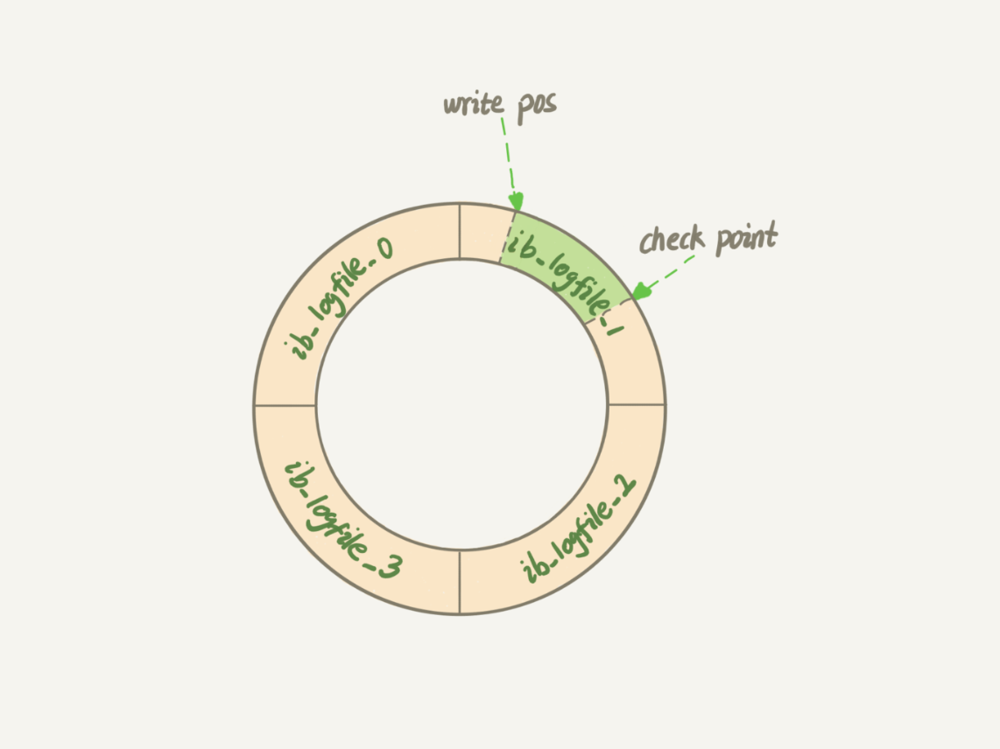

# 日志系统

MySQL 的日志系统是保证事务持久性**、**数据一致性和故障恢复的核心组件

undo log 用于事务回滚和 MVCC，属于 InnoDB 层

redo log 保证崩溃恢复时的数据持久性，也是 InnoDB 层的物理日志

binlog 是 MySQL Server 层的逻辑日志，用于主从复制和数据恢复

## undo log 回滚日志

核心作用：

- 事务回滚：记录事务修改前的数据旧版本，用于回滚未提交的事务
- MVCC 多版本控制：提供数据的历史版本，支持快照读（一致性读）

undo log 是逻辑日志，记录反向操作，如 `INSERT` 对应 `DELETE`，`UPDATE` 记录旧值

每个事务的修改操作会生成对应的 undo log，形成链式结构，通过 `ROLL_PTR` 指针串联

当事务提交后，undo log 不会立即删除，而是等待所有依赖它的快照读事务结束，由后台线程定期清理不再需要的 undo log

## redo log 重做日志

核心作用：

- 崩溃恢复：确保事务提交后的修改持久化，即使系统崩溃也能恢复数据
- Write-Ahead Logging (WAL)：修改数据前先写日志，避免直接写磁盘的随机 I/O

redo log 是物理日志，记录数据页的物理修改

当有一条记录需要更新的时候，InnoDB 就会先把记录写到 redo log，并更新内存，这个时候更新就算完成了

InnoDB 会在适当的时候，将这个操作记录更新到磁盘里面，而这个更新往往是在系统比较空闲的时候做

redo log 是固定大小的循环队列。write pos 是当前记录的位置，一边写一边后移。checkpoint 是当前要擦除的位置，也是往后推移并且循环的，擦除记录前要把记录更新到数据文件

write pos 和 checkpoint 之间的部分是可以用来记录新的操作。如果 write pos 追上 checkpoint，这时候不能再执行新的更新，需要把 checkpoint 推进一下

有了 redo log，InnoDB 就可以保证即使数据库发生异常重启，之前提交的记录都不会丢失

为了让 redo log 和 binlog 之间的逻辑一致，redo log 的写入使用两阶段提交，分为两个步骤：prepare 和 commit

### redo log buffer

redo log buffer 就是一块内存，用来先存 redo 日志的

真正把日志写到 redo log 文件，是在执行 commit 语句的时候做的

事务执行过程中不会主动去刷盘，以减少不必要的 IO 消耗，但是可能会出现被动写入磁盘，比如内存不够、其他事务提交等情况

## binlog 二进制日志

核心作用：

- 主从复制：记录所有修改数据的逻辑操作，供从库同步数据
- 数据恢复：支持基于时间点的数据恢复

binlog 是逻辑日志，记录 SQL 语句或行变更的逻辑操作

与 redo log 区别：

1. redo log 是物理日志，记录的是在某个数据页上做了什么修改。binlog 是逻辑日志，记录的是这个语句的原始逻辑

2. redo log 是循环写的，空间固定且会用完。binlog 是可以追加写入的

MySQL 以 binlog 的写入与否作为事务是否成功的标记

### binlog 完整性

MySQL 引入 binlog-checksum 参数，用来验证 binlog 内容的正确性

## 两段式提交

为了保证事务的持久性和数据一致性，InnoDB 通过两阶段提交（2PC）协调 Redo Log 和 Binlog 的写入

1. 写入 Redo Log，标记状态为 PREPARE
2. 此时事务尚未提交，但 Redo Log 已持久化

3. 写入 Binlog 并刷盘

4. 将 Redo Log 状态标记为 `COMMIT`，完成事务提交

对于 SQL 语句 `update T set c=c+1 where ID=2`：

1. 执行器先找引擎取 `ID=2` 这一行

2. 如果 `ID=2` 这一行所在的数据页本来就在内存中，就直接返回给执行器，否则需要先从磁盘读入内存，然后再返回

3. 执行器拿到引擎给的行数据，把这个值加上 1，再调用引擎接口写入这行新数据

4. 引擎将这行新数据更新到内存中，同时将这个更新操作记录到 redo log 里面，然后告知执行器执行完成，此时 redo log 处于 prepare 状态

5. 执行器生成这个操作的 binlog，并把 binlog 写入磁盘

6. 执行器调用引擎的提交事务接口，引擎把刚刚写入的 redo log 改成提交（commit）状态，更新完成

## 奔溃恢复规则

redo log 和 binlog 有一个共同的数据字段，叫 XID

崩溃恢复的时候，会按顺序扫描 redo log：

1. 如果碰到既有 prepare、又有 commit 的 redo log，就直接提交

2. 如果碰到只有 parepare、而没有 commit 的 redo log，就拿着 XID 去 binlog 找对应的事务。binlog 无记录，回滚事务。binlog 有记录，提交事务

先写 redo log 后写 binlog：假设在 redo log 写完，binlog 还没有写完的时候，MySQL 进程异常重启。由于 binlog 日志没有修改记录，使用 redo log + binlog 恢复的数据就是数据库旧的数据

先写 binlog 后写 redo log：假设在 binlog 写完，redo log 还没有完成的时候，MySQL 进程异常重启。因为 binlog 写入后会被从库使用，所以无法保证主库和备库的数据一致性

