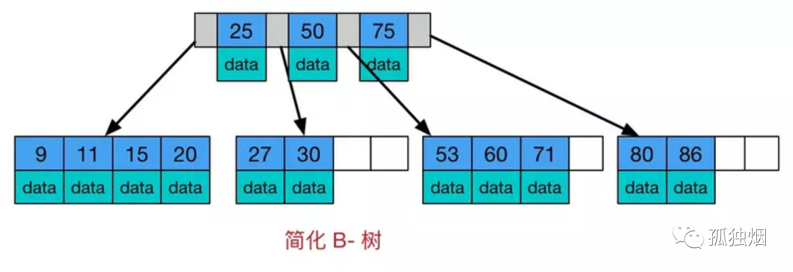
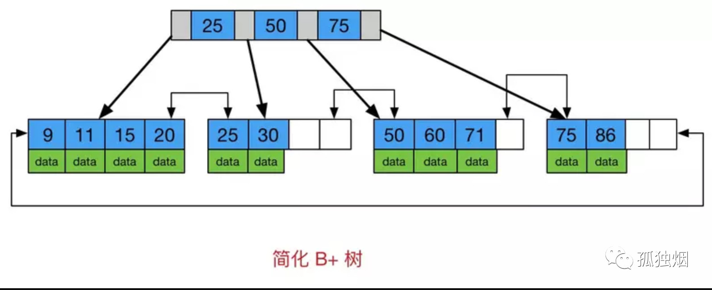

# 索引

## 磁盘 IO

磁盘读取数据靠的是机械运动，每次读取数据花费的时间可以分为寻道时间、旋转延迟、传输时间三个部分

- 寻道时间指的是磁臂移动到指定磁道所需要的时间，主流磁盘一般在 5ms 以下
- 旋转延迟就是经常听说的磁盘转速，比如一个磁盘 7200 转，旋转延迟就是 1 / 120 / 2 = 4.17 ms
- 传输时间指的是从磁盘读出或将数据写入磁盘的时间，一般在零点几毫秒，相对于前两个时间可以忽略不计

那么访问一次磁盘的时间，即一次磁盘 IO 的时间约等于 5 + 4.17 = 9ms 左右

### 预读

每一次 IO 读取的数据称之为一页，一般为 4k 或 8k

当进行一次 IO 时，系统不光会读取当前磁盘地址的数据，还会把相邻的数据也都读取到内存缓冲区内

B+ 树的一个节点会存储在同一页内

## 索引

索引的一个主要目的就是加快检索表中数据，添加索引使得每次查找数据时的磁盘 IO 次数可以控制在一个很小的数量级

索引是对数据库表中的一列或多列值进行排序的一种结构，使用索引可快速访问数据库表中的特定信息

DB 在执行一条 Sql 语句的时候，默认的方式是根据搜索条件进行全表扫描，遇到匹配条件的就加入搜索结果集合。如果对某一字段增加索引，查询时就会先去索引列表中快速定位到特定值的行数，大大减少遍历匹配的行数，所以能明显增加查询的速度

### 优点

- 通过创建唯一性索引，可以保证数据库表中每一行数据的唯一性

- 可以大大加快数据的检索速度，这也是创建索引的最主要的原因

- 可以加速表和表之间的连接，特别是在实现数据的参考完整性方面特别有意义

- 在使用分组和排序子句进行数据检索时，同样可以显著减少查询中分组和排序的时间

- 通过使用索引，可以在查询的过程中使用优化隐藏器，提高系统的性能

### 缺点

- 创建和维护索引要耗费时间

- 除了数据表占数据空间之外，每一个索引还要占一定的物理空间

### 原则

- 在查询中很少使用或者参考的列，不应该创建索引

- 只有很少数据值的列因为没有足够的区分度，也应该增加索引

- 定义为 text、image 和 bit 数据类型的列，不应该增加索引

- 当修改性能远远大于检索性能时，不应该创建索引

- 使用短索引，如果对长字符串列进行索引，应该指定一个前缀长度，这样能够节省索引空间

- 尽量扩展索引，不要新建索引

- 定义有外键的数据列一定要建立索引

### 实现

一般分为 B+ 树索引和哈希索引

- B+ 树是非线性结构，它的节点是天然有序的。hash 桶是线性结构，哈希表中多个数据在存储关系上是没有任务顺序关系的

- 哈希索引适合等值查询，无法进行范围查询和模糊查询。B+ 树索引可以进行等值、部分前缀、范围查询

- B+ 树索引其非叶子节点均为 key 值，叶子节点是 key-data 键值对，叶子节点前后相连且有序

- 哈希索引 O(1) 在速度上毋庸置疑要快于 B+ 树近似 O(logn)，但哈希索引速度不稳定，当某个键值存在大量重复时效率极差

- 无法利用哈希索引完成排序

- 哈希索引不支持多列联合索引的最左匹配规则

- 哈希索引存储行指针，并通过开链的方式解决冲突

- 哈希索引没办法避免回表查询，B+ 树在聚簇索引和索引覆盖的情况下可以只通过索引查询

### 索引存储

数据库索引都是存储在磁盘上的，当数据量比较大的时候，索引也会很大

当利用索引查询的时候，不能把索引全部加载到内存，只能逐一加载每个磁盘页，磁盘页即对应着索引树的节点

磁盘 IO 次数由树的高度决定，因此不适合使用 BST 存储索引，因此需要使用更加矮胖的树结构

在 MySQL 中，索引是在存储引擎层实现的，所以并没有统一的索引标准，即不同存储引擎的索引的工作方式并不一样

## 常见自平衡树

大多数自平衡搜索树（如 AVL 树和 RB 树）都会假定所有数据都在主内存中，但数据库必须考虑主内存无法存储全部索引数据的情况

### AVL 树

自平衡二叉搜索树，树中任一节点的两个子树的高度差最大为 1，其查找、插入和删除在平均和最坏情况下的时间复杂度都是 O(log n)

- 具有二叉查找树的特点(左子树任一节点小于父节点，右子树任一节点大于父节点)，任何一个节点的左子树与右子树都是平衡二叉树

- 任一节点的左右子树高度差小于 1

AVL 树通过旋转来调整平衡

### RB 树

AVL 树比红黑树更加平衡，但 AVL 树可能在插入和删除过程中引起更多旋转，如果频繁的插入和删除，应首选 RB 树，如果插入和删除操作的频率较低，而搜索操作的频率较高，则 AVL 树应优先于红黑树

### B 树

#### 定义

B 树叫平衡多路查找树，设计的主要思想是减少磁盘访问次数，大多数树操作（增、删、查、最大值、最小值等）都需要 O(h) 磁盘访问，h 为树的高度。

通常，B 树节点的大小保持与磁盘块大小相等，由于 B 树的高度较低，因此与平衡的二叉搜索树（如AVL 树、RB 树等）相比，大多数操作的磁盘访问次数显著减少。

先定义一条数据记录为一个二元组 [key, data]，key 为记录的键值。对于不同数据记录，key 是互不相同的，data 为数据记录除 key 外的数据

- M 阶 B 树表示每个节点最多 M 个子树，所有叶子节点都在同一层
- 每个非叶子节点由 n - 1 条数据和 n 个节点指针组成，其中 M / 2 <= n <= M，其中 M / 2 向上取整
- 每个叶子节点最少包含一个 key 和两个指针，最多包含 M - 1 个 key 和 M 个指针，叶节点的指针均为 null
- key 和指针互相间隔，节点两端是指针
- 一个节点中的 key 从左到右非递减排列
- 每个指针要么为 null，要么指向另外一个节点
- 如果某个指针在节点 node 最左边且不为 null，则其指向节点的所有 key 小于 v_key1，其中 v_key1 为 node 的第一个 key 的值
- 如果某个指针在节点 node 最右边且不为 null，则其指向节点的所有 key 大于 v_key2，其中 v_key2 为 node 的最后一个 key 的值
- 如果某个指针在节点 node 的左右相邻 key 分别是 key_i 和 key_i+1 且不为 null，则其指向节点的所有 key 小于 v_key_i+1 且大于 v_key_i
- 每个节点都存储数据

一颗 4 阶的 B 树，每个节点最多有 4 个子树、3 个 key，最少有 2 个子树、1 个 key



#### 插入保持平衡

- 首先考虑要插入的子树是否已经超出了 key 数量的限制

- 超出的话，如果要插入的位置是叶子节点，就只能拆一个 key 加到要插入位置的父节点

- 如果非叶子节点，就得从其他子树拆子树给新插入的元素做孩子

#### 删除保持平衡

删除子节点后，父节点是否还满足子树 k 介于 M / 2 和 M 的条件，不满足就得从别的节点拆子树甚至修改相关子树结构来保持平衡

#### 性质

由于 B 树的特性，在 B-Tree 中按 key 检索数据流程：

1. 首先从根节点进行二分查找，如果找到则返回对应节点的 data
2. 否则对相应区间的指针指向的节点递归进行查找，直到找到节点或找到 null 指针，前者查找成功，后者查找失败

因为 B 树的节点会存储数据，因此查询单条数据的时候，B 树的查询效率不固定，最好的情况是 O(1)，所以适合单一数据查询场景

由于 B 树中各节点之间没有指针相邻，因此 B 树不适合做一些数据遍历操作

### B+ 树

与 B 树相比，B+ 树有以下不同点：

- n 个 key 对应 n 个指针 n 颗树，M/2 <= n <= M

- 非叶子节点不存储 data，只存储 key。叶子节点不存储指针

- 所有叶子节点增加了一个链指针



B+ 树的数据只出现在叶子节点上，因此在查询单条数据的时候，查询速度非常稳定，所以在做单一数据的查询上，其平均性能并不如 B 树

B+ 树的叶子节点上有指针进行相连，因此在做数据遍历的时候，只需要对叶子节点进行遍历即可，这个特性使得 B+ 树非常适合做范围查询

### 选择 B+ 树

- B 树只适合随机检索，而 B+ 树同时支持随机检索和顺序检索

- B+ 树空间利用率更高，一次性读入内存中可以查找的 key 更多，从而降低 IO 次数降低，磁盘读写代价更低

- B+ 树的查询效率更加稳定

- 增删节点时，效率更高

## 索引类型

- 主键索引：数据列不允许重复，不允许为 NULL，一个表只能有一个主键

- 唯一索引：数据列不允许重复，允许为 NULL 值，并且允许同时有多条数据为 NULL。一个表允许多个列创建唯一索引

- 普通索引:：基本的索引类型，没有唯一性的限制，允许为 NULL 值

- 全文索引：基于相似度的查询，而不是原来的精确数值比较；`like + %` 在文本比较少时是合适的，但是对于大量的文本数据检索，是不可想象的；全文索引可能存在精度问题

### 聚簇索引和非聚簇索引

InnoDB 的 B+ 树可能存储的是整行数据，也有可能是主键的值

- 聚簇索引：在 InnoDB 里，索引 B+ 树的叶子节点存储了整行数据的是主键索引

- 非聚簇索引：索引 B+ 树的叶子节点存储了主键的值的是非主键索引

聚簇索引查询会更快，因为主键索引树的叶子节点直接就是要查询的整行数据了，而非主键索引的叶子节点是主键的值，查到主键的值以后，还需要再通过主键的值回表查询

### 非主键索引存储的是主键索引值

非主键索引直接存储数据的地址，会带来一些问题：

1. 数据库备份、迁移困难

2. 插入、删除数据时，B+ 树可能发生分裂，导致物理地址变化

3. 无法给物理地址加行级锁

### 覆盖索引

非主键索引并不一定都会回表查询

索引覆盖：当一个查询语句的执行只用从索引中就能够取得，则不必回表从完整数据中读取

常见方法：对被查询的字段建立联合索引

```sql
CREATE TABLE orders (
    order_id INT PRIMARY KEY,      -- 主键
    user_id INT NOT NULL,           -- 用户ID
    order_date DATE NOT NULL,       -- 订单日期
    total_amount DECIMAL(10,2),     -- 订单金额
    status VARCHAR(20)              -- 订单状态
);

-- 创建非主键索引
CREATE INDEX idx_user_date ON orders(user_id, order_date);

-- 需要回表
SELECT total_amount, status 
FROM orders 
WHERE user_id = 1001 
  AND order_date = '2023-06-15';
  
-- 覆盖索引
SELECT user_id, order_date 
FROM orders 
WHERE user_id = 1001 
  AND order_date = '2023-06-15';
```

适用场景：

- 查询少量列
- 聚合函数统计
- 排序/分组操作

### 联合索引

在创建多列索引时，根据业务需求，`where` 子句中使用最频繁的一列放在最左边，因为 MySQL 索引查询会遵循最左前缀匹配的原则，即最左优先，在检索数据时从联合索引的最左边开始匹配。

当创建一个联合索引的时候，如 (key1,key2,key3)，相当于创建了 (key1)、(key1, key2) 和 (key1, key2, key3) 三个索引

联合索引首先按 key1 排序，若 key1 相同则按 key2 排序，若 key1 和 key2 均相同，再按 key3 排序

`=` 和 `in` 可以乱序，查询优化器会帮你优化成索引可以识别的形式

### 最左前缀匹配

最左前缀匹配是复合索引（联合索引）的核心特性，它决定了索引能否被查询有效利用

当一个查询的过滤条件（`WHERE`、`JOIN`）或排序（`ORDER BY`）使用了复合索引的最左侧连续列时，即使未包含所有索引列，MySQL 仍可能使用该索引，但索引的使用必须从最左侧列开始，且不能跳过中间的列

范围条件查询可以用到索引，但是范围查询后面的列无法用到索引，即联合索引最多用于一个范围查询

`like` 语句中通配符出现在开头则不能使用索引

如果查询条件中含有函数或表达式，将导致索引失效而进行全表扫描

复合索引中只要有一列含有 NULL 值，那么这一列对于此复合索引就是无效的

```sql
CREATE INDEX idx_name_age_city ON users(name, age, city);

-- 使用最左列 name
SELECT * FROM users WHERE name = 'Alice';
-- 使用 name + age
SELECT * FROM users WHERE name = 'Bob' AND age = 30;
-- 使用全部三列 name + age + city
SELECT * FROM users 
WHERE name = 'Charlie' AND age = 25 AND city = 'New York';
-- 排序中使用最左前缀
SELECT * FROM users ORDER BY name, age;

-- 失败例子
-- 跳过最左列 name
SELECT * FROM users WHERE age = 30;
SELECT * FROM users WHERE city = 'London';
-- 中间列缺失
SELECT * FROM users WHERE name = 'David' AND city = 'Paris';
-- 范围查询后的列
SELECT * FROM users 
WHERE name = 'Eve' AND age > 20 AND city = 'Tokyo';
```

1. 将频繁出现在 `WHERE` 或 `ORDER BY` 中的列作为索引的最左列
2. 一个复合索引 `(a, b, c)` 可替代多个单列索引 `(a)`、`(a, b)`、`(a, b, c)`
3. 如果查询的字段全部在索引中，可直接从索引树返回数据，避免回表

### 前缀索引

可以定义字符串的一部分作为索引

如果创建索引的语句不指定前缀长度，那么索引就会包含整个字符串

使用前缀索引后，可能会导致查询语句回表查询的次数变多

使用前缀索引，定义好长度，就可以做到既节省空间，又不用额外增加太多的查询成本

使用前缀索引用不上覆盖索引对查询性能的优化

在建立前缀索引时，区分度越高越好，可以通过 `select count(distinct key(n)) from T` 查看前缀长度的区分度

## 索引下推

索引下推是 MySQL 中的一种优化技术，允许在存储引擎层过滤数据，减少回表次数

- 传统查询流程：存储引擎根据索引查找数据 → 返回所有匹配索引条件的数据到 Server 层 → Server 层进一步过滤其他条件
- 开启 ICP 后：存储引擎在扫描索引时，直接应用所有可用的索引条件（包括非最左前缀的列），提前过滤数据 → 仅返回有效数据到 Server 层

使用联合索引时，索引下推优化可以在索引遍历过程中，对索引中包含的字段先做判断，直接过滤掉不满足条件的记录，减少回表次数

## 自增主键

B+ 树为了维护索引有序性，在插入新值的时候需要做必要的维护

- 页分裂：插入情况下，如果所在数据页已经满了，根据 B+ 树的算法，这时候需要申请一个新的数据页，然后挪动部分数据过去。页分裂除了影响分类，还影响数据页利用率

- 页合并：当相邻两个页由于删除了数据，利用率很低之后，会将数据页做合并

自增主键是指自增列上定义的主键，在建表语句中一般这么定义 `NOT NULL PRIMARY KEY AUTO_INCREMENT`

插入新记录的时候可以不指定 ID 的值，系统会获取当前 ID 最大值加 1 作为下一条记录的 ID 值

每次插入一条新记录，都是追加操作，都不涉及到挪动其他记录，也不会触发叶子节点的分裂，而业务逻辑的字段做主键，则往往不容易保证有序插入，这样写数据成本相对较高

主键长度越小，普通索引的叶子节点就越小，普通索引占用的空间也就越小

从性能和存储空间方面考量，自增主键往往是更合理的选择

## 索引失效

- 如果查询条件用 `or`，必须 `or` 条件中的每个列都加上索引，否则无效

- 违反最左匹配原则，则不适用索引

- `like` 语句中通配符出现在开头则不能使用索引

- 存在索引列的数据类型隐形转换，则不使用索引

- `where` 字句里对索引列有数学运算或者使用函数，则不使用索引

- mysql 优化器觉得全表扫描更快时，则不适用索引

- `!=` 和 `<>` 不使用索引

## 普通索引和唯一索引

当某个字段较大时，不适合做主键，会浪费大量磁盘空间，因此可以考虑在该字段设置唯一索引或普通索引

假设在 id 字段建立索引，执行 `select id from T where k=5`

### 查询区别

先通过 B+ 树从树根开始，按层搜索到叶子节点，找到相应的数据页，然后可以认为在数据页内部通过二分法来定位记录

- 对于普通索引来说，查找到满足条件的第一个记录后，需要查找下一个记录，直到碰到第一个不满足条件的记录

- 对于唯一索引来说，由于索引定义了唯一性，查找到第一个满足条件的记录后，就会停止继续检索

这两个的不同带来的性能差距是微乎其微，因为 InnoDB 的数据是按数据页为单位来读写的，当需要读一条记录的时候，并不是将这个记录本身从磁盘读出来，而是以页为单位，将其整体读入内存

因为引擎是按页读写的，当找到第一个的记录的时候，它所在的数据页就都在内存里了。那么，对于普通索引来说，要多做的查找和判断下一条记录的操作，就只需要一次指针寻找和一次计算

如果第一个记录刚好是这个数据页的最后一个记录，那么要取下一个记录，必须读取下一个数据页，但这种情况概率很低

### 更新过程

当需要更新一个数据页时，如果数据页在内存中就直接更新。如果这个数据页没有在内存中，在不影响数据一致性的前提下，InnoDB 会将这些更新操作缓存在 change buffer 中，这样就不需要从磁盘中读入这个数据页了

在下次查询需要访问这个数据页的时候，将数据页读入内存然后执行 change buffer 中与这个页有关的操作

change buffer 是可以持久化的数据，在内存中有拷贝，也会被写入到磁盘上

将 change buffer 中的操作应用到原数据页，得到最新结果的过程称为 merge

除了访问这个数据页会触发 merge 外，系统有后台线程会定期 merge。在数据库正常关的过程中，也会执行 merge 操作

将更新操作先记录在 change buffer，可以减少读磁盘次数，语句的执行速度会得到明显的提升

数据读入内存是需要占用 buffer pool 的，所以这种方式还能够避免占用内存，提高内存利用率

但对于唯一索引来说，所有的更新操作都要先判断这个操作是否违反唯一性约束，而判断唯一性必须要将数据页读入内存才能判断。所以唯一索引的更新不能使用 change buffer 进行缓存，实际上也只有普通索引可以使用

change buffer 用的是 buffer pool 里的内存，因此不能无限增大

因为 merge 的时候是真正进行数据更新的时刻，而 change buffer 的主要目的就是将记录的变更动作缓存下来，所以在一个数据页做 merge 之前，change buffer 记录的变更越多，收益就越大

对于更新的目标页在内存中：

- 对于唯一索引来说，判断到没有冲突，插入这个值，语句执行结束

- 对于普通索引来说，插入这个值，语句执行结束

此情况下，普通索引和唯一索引对更新语句性能影响的差别，只是一个判断，只会耗费微小的 CPU 时间

对于更新的目标页不再内存中：

- 对于唯一索引来说，需要将数据页读入内存，判断到没有冲突，插入这个值，语句执行结束

- 对于普通索引来说，则是将更新记录在 change buffer，语句执行就结束了

change buffer 因为减少了随机磁盘访问，所以对更新性能的提升是会很明显的

对于写多读少的业务来说，页面在写完以后马上被访问到的概率比较小，此时 change buffer 的使用效果最好

对于写完马上做查询的业务，即使满足了条件，将更新先记录在 change buffer，但之后由于马上要访问这个数据页，会立即触发 merge 过程，这样随机访问 IO 的次数不会减少，反而增加了 change buffer 的维护代价，change buffer 反而起到了副作用

### redo log 和 change buffer

change buffer 和 redo log 颗粒度不一样

change buffer 只是针对如果更改的数据所在页不在内存中才暂时储存在 change buffer 中

redo log 会记录一个事务内进行数据更改的所有操作，即使修改的数据已经在内存中了，那也会记录下来

redo log 主要节省的是随机写磁盘的 IO 消耗（转成顺序写）

change buffer 主要节省的则是随机读磁盘的 IO 消耗

## 不建议创建索引的情况

1. 数据量极小的表
2. 写多读少的表
3. 大文本字段的列
4. 区分度低的列
5. 不被查询使用的列
6. 频繁更新的列
7. 已被索引覆盖的列
