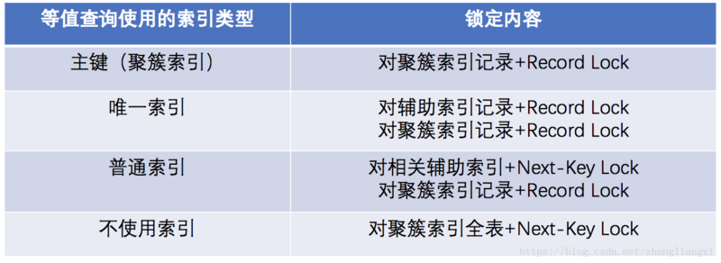

# 锁

根据加锁的范围，MySQL 里面的锁大致可以分成全局锁、表级锁和行锁三类

## 全局锁

全局锁就是对整个数据库实例加锁，MySQL 提供了一个加全局读锁的方法，命令是 `flush tables with read lock`，让整个库处于只读状态，修改表的线程全部阻塞

让整个库只可读，有一些隐患：

- 如果在主库上备份，那么在备份期间都不能执行更新，业务基本上就得停摆

- 如果在从库上备份，那么备份期间从库不能执行主库同步过来的 binlog，会导致主从延迟

## 表级锁

MySQL 里面表级别的锁有两种：一种是表锁，一种是元数据锁 MDL

### 表锁

表锁的语法是 `lock tables … read/write`，可以用 `unlock tables` 主动释放锁，也可以在客户端断开的时候自动释放

`lock tables` 语法除了会限制别的线程的读写外，也限定了本线程接下来的操作对象

如果在会话 A 中执行 `lock tables t1 read, t2 write;` 这个语句，则其他会话写 t1、读写 t2 的语句都会被阻塞。同时会话 A 在执行 `unlock tables` 之前，也只能执行读 t1、读写 t2 的操作。写 t1 是不允许，同理也不能访问其他表

### MDL

MDL(meta data lock) 不需要显式使用，在访问一个表的时候会被自动加上

MDL 的作用是保证读写的正确性。如果一个查询正在遍历一个表中的数据，而执行期间另一个线程对这个表结构做变更，删了一列，那么查询线程拿到的结果跟表结构对不上，肯定是不行的

- 当对一个表做增删改查操作的时候，加 MDL 读锁

- 当要对表做结构变更操作的时候，加 MDL 写锁

- 读锁之间不互斥，因此可以有多个线程同时对一张表增删改查

- 读写锁之间、写锁之间是互斥的，用来保证变更表结构操作的安全性

申请 MDL 锁的操作会形成一个队列，队列中写锁获取优先级高于读锁。一旦出现写锁等待，不但当前操作会被阻塞，同时还会阻塞后续该表的所有操作

事务中的 MDL 锁在语句执行开始时申请，但是语句结束后并不会马上释放，而会等到整个事务提交后再释放

## 行锁

行锁就是针对数据表中行记录的锁

InnoDB 两阶段锁协议：InnoDB 事务中，行锁是在需要的时候才加上的，但并不是不需要了就立刻释放，而是要等到事务结束时才释放

尽量将并发度高的行，放在事务的最后进行执行

## 死锁

当并发系统中不同线程出现循环资源依赖，涉及的线程都在等待别的线程释放资源时，就会导致这几个线程都进入无限等待的状态

InnoDB 能检测到死锁的循环依赖并立即返回一个错误。主动死锁检测在发生死锁的时候，是能够快速发现并进行处理的，但是它也是有额外负担的。每当一个事务被锁的时候，就要看看它所依赖的线程有没有被别人锁住，如此循环，最后判断是否出现了循环等待。每个新来的被阻塞的线程，都要判断会不会由于自己的加入导致了死锁，这是一个时间复杂度是 O(n) 的操作

解决方法：

- 尽量使用较低的隔离级别

- 设计索引，并尽量使用索引访问数据，使加锁更精确，从而减少锁冲突的机会

- 显示加锁时，一次性请求足够级别的锁

- 如果不同程序会并发读取多个表，尽量约定以相同的顺序访问表

- 尽量用相等条件访问数据

- 在同一个事务中，尽可能做到一次锁定所需要的所有资源，减少死锁产生概率

- 对于非常容易产生死锁的业务部分，可以尝试使用升级锁定颗粒度，通过表级锁定来减少死锁产生的概率

- 用分布式事务锁或者使用乐观锁

MyISAM 中是不会产生死锁的，因为 MyISAM 总是一次性获得所需的全部锁，要么全部满足，要么全部等待。而在 InnoDB 中，锁是逐步获得的，就造成了死锁的可能

## InnoDB 锁

### IS 锁和 IX 锁

意向锁是表级锁的一种，由 InnoDB 引擎自己维护，用户无需自己操作，也无法操作意向锁

- IS 意向共享锁：事务有意向对表中的某些行记录加共享锁
- IX 意向排他锁：事务有意向对表中的某些行记录加排他锁

```sql
## 事务想要获得某些行记录的共享锁，必须要先获得表级别的 IS
select * from table lock in share mode;
## 事务想要获得某些行记录的排他锁，必须要先获得表级别的 IX
select * from table for update;
```

意向锁的目的是为了快速判断表里是否有行记录被加锁。因为 InnoDB 支持行级锁，如果没有意向锁，那么判断表级锁和行级锁冲突就要遍历所有数据行看是否有行锁。有了意向锁之后，就可以直接通过意向锁来判断表的数据行是否有行级锁而不需要遍历一行一行的记录

```sql
## 事务 A 获取了某一行的排他锁，但是事务 A 并未提交
## 事务 A 会对 user 表加两把锁
## 1. 表级别的意向排他锁
## 2. id=6 的数据行上的排他锁
select * from user where id=6 for update;

## 事务 B 想要获取 user 表的共享锁
## 事务 B 检测到事务 A 持有 user 表的意向排他锁，那么就知道事务 A 必然持有 user 表某些行记录的排他锁
## 由于排他锁和共享锁是互斥的，那么事务 B 对表加表级别共享锁就会被排斥，事务 B 无需去检测表中每一行数据是否持有排他锁
lock tables user READ
```

### 行锁和表锁

InnoDB 行锁是通过给索引加锁来实现的。只有通过索引条件检索数据，InnoDB 才使用行级锁，否则将使用表锁

如果一条 SQL 语句操作了主键索引，InnoDB 就会锁定这条主键索引。如果一条 SQL 语句操作了非主键索引，InnoDB 就会先锁定该非主键索引，再锁定相关的主键索引

由于 InnoDB 的行锁是针对索引加的锁，不是针对记录加的锁，因此虽然是访问不同行的记录，但是如果是使用相同的索引键，是会出现锁冲突的（查询非唯一索引时，非唯一索引可能对应多条聚簇索引，因此会锁住多行）

当表有多个索引的时候，不同的事务可以使用不同的索引锁定不同的行

即便在条件中使用了索引字段，但是否使用索引来检索数据是由 MySQL 通过判断不同的执行计划的代价来决定的。如果 MySQL 认为全表扫描效率更高，比如对一些很小的表，它就不会使用索引，这种情况下 InnoDB 将使用表锁，而不是行锁

### 锁算法

#### Record lock 记录锁

单行记录上的锁，锁定索引中的一条具体记录。当查询的索引含有唯一属性时，使用 record lock

RC 级别使用该方式加锁

- 使用聚簇索引等值查询


- 使用唯一索引等值查询


#### Gap lock 间隙锁

间隙锁，锁定一个索引范围（左开右开），不包括记录本身。设计的目的是为了阻止多个事务将记录插入到同一范围内，防止幻读的产生

在 RR 隔离级别下生效

- 使用一般索引等值查询：不仅给相应索引和聚簇索引加 record lock，还要给索引间隙加 gap lock


- 无索引查询：将聚簇索引中的所有行以及间隙都锁起来，等于锁表了

  

#### Next-key lock 临键锁

record + gap 锁定一个范围，并包含记录本身

对于行的查询使用 next-key lock，解决幻读问题；把查询出来的记录锁住，同时也会把该范围查询内的所有间隙空间也会锁住，再之它会把相邻的下一个区间也会锁住

当使用唯一索引且得到的结果只有 1 条则降级为 Record lock；RR 级别使用该方式加锁



### 隔离级别与锁

- 未提交读 READ UNCOMMITTED：读取数据不加锁

- 提交读 READ COMMITTED：读取数据加 Record lock

- 可重复读 REPEATABLE READ：读取数据加 Record lock 和 Gap lock，也就是会有 Next-key lock;

- 可串行化 SERIALIZABLE：锁定整个范围的键并一直有锁，直到事务完成

## 乐观锁、悲观锁

- 乐观锁：假设不会发生并发冲突不会上锁，只在提交操作时检查是否违反数据完整性；适用于多读的应用类型，这样可以提高吞吐量

- 悲观锁：假定会发生并发冲突，每次在拿数据的时候都会上锁，屏蔽一切可能违反数据完整性的操作

