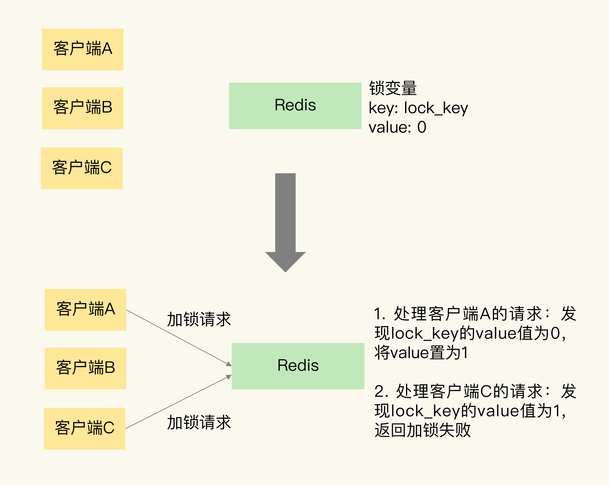

# 分布式锁

在分布式系统中，当有多个客户端需要获取锁时需要使用分布式锁。此时，锁需要保存在一个共享存储系统中的，可以被多个客户端共享访问和获取

和单机上的锁类似，分布式锁同样可以用一个变量来实现，加锁和释放锁的操作就变成了读取、判断和设置共享存储系统中的锁变量值

分布式锁的两个要求：

1. 分布式锁的加锁和释放锁的过程，涉及多个操作。所以，在实现分布式锁时需要保证这些锁操作的原子性

2. 共享存储系统保存了锁变量，如果共享存储系统发生故障或宕机，那么客户端也就无法进行锁操作了。在实现分布式锁时，需要考虑保证共享存储系统的可靠性，进而保证锁的可靠性

## 使用 mysql 实现分布式锁

- MySql 中有事务保证业务操作数据库的原子性。当开启一个事务的时候，MySql会自动为其分配一个互斥锁，提交事务的时候会释放锁，出现异常回滚的时候，也会释放锁
- 有主从机制，所以高可用性还不错

## 基于单 Redis 节点实现分布式锁

Redis 本身可以被多个客户端共享访问，正好就是一个共享存储系统，可以用来保存分布式锁，而且 Redis 的读写性能高，可以应对高并发的锁操作场景

赋予锁变量一个变量名，把这个变量名作为键值对的键，而锁变量的值，则是键值对的值，这样一来，Redis 就能保存锁变量了，客户端也就可以通过 Redis 的命令操作来实现锁操作



### SETNX + DEL

可以用 `SETNX` 和 ` DEL` 命令组合来实现加锁和释放锁操作

`SETNX` 命令用于设置键值对的值，这个命令在执行时会判断键值对是否存在，如果不存在，就设置键值对的值，如果存在，就不做任何设置

对于释放锁操作来说，使用 `DEL` 命令删除锁变量

可以将客户端唯一标识放在 key 中，删除操作时需要判断锁变量是否有自己的标识，这样就能避免其他客户端误删锁

### SETNX + EXPIRE

给锁变量设置一个过期时间，这样即使持有锁的客户端发生了异常导致无法主动地释放锁，Redis 也会根据锁变量的过期时间，在锁变量过期后把它删除。其它客户端在锁变量过期后，就可以重新请求加锁，这就不会出现无法加锁的问题了

但 `SETNX` 和 `EXPIRE` 两个命令无法保证一起执行，因此也会存在锁永不释放的问题

### 过期时间放入 value

把过期时间放到 `SETNX` 的 value 值里面巧妙移除 `EXPIRE` 单独设置过期时间的操作

因为过期时间是客户端自己生成的，所以要求分布式环境下每个客户端的时间必须同步

### Lua 脚本

使用Lua脚本来保证原子性

```lua
if redis.call('setnx',KEYS[1],ARGV[1]) == 1 then
   redis.call('expire',KEYS[1],ARGV[2])
else
   return 0
end;
```

### SET EX NX

原子命令 `SET key value[EX seconds][PX milliseconds][NX|XX]`

但是也存在锁过期释放了但业务没有执行完的问题

### WATCH DOG

为了解决锁过期释放但业务没执行完的问题，可以启动一个后台线程，由它是每隔 10 秒检查一下工作线程是否还持有锁，如果持有锁则不断的延长锁的生存时间


## 基于 Redis 集群的分布式锁

只用一个 Redis 实例来保存锁变量，如果这个 Redis 实例发生故障宕机了，那么锁变量就没有了。此时，客户端也无法进行锁操作了，这就会影响到业务的正常执行

但采用主从集群模式部署的单机分布式锁，也不能保证锁的可靠性。由于主从复制是异步的，加锁操作的命令还未同步到 slave，此时主从切换，新 master 节点依旧会丢失该锁，对业务来说相当于锁失效了

### Redlock

为了避免 Redis 实例故障而导致的锁无法工作的问题，Redis 使用分布式锁算法 Redlock

Redlock 算法的基本思路是让客户端和多个独立的 Redis 实例依次请求加锁，如果客户端能够和半数以上的实例成功地完成加锁操作，那么就认为客户端成功地获得分布式锁了，否则加锁失败。这样一来，即使有单个 Redis 实例发生故障，因为锁变量在其它实例上也有保存，所以，客户端仍然可以正常地进行锁操作，锁变量并不会丢失

Redlock 算法的实现需要有 N 个独立的 Redis 实例，分成 3 步来完成加锁操作

1. 客户端获取当前时间

2. 客户端按顺序依次向 N 个 Redis 实例执行加锁操作，加锁操作和在单实例上执行的加锁操作一样。为避免某个实例宕机，需设置一个超时时间。如果客户端在和一个 Redis 实例请求加锁时，一直到超时都没有成功，那么此时客户端会和下一个 Redis 实例继续请求加锁。加锁操作的超时时间需要远远地小于锁的有效时间，一般也就是设置为几十毫秒

3. 一旦客户端完成了和所有 Redis 实例的加锁操作，客户端就要计算整个加锁过程的总耗时

加锁成功条件：

1. 客户端从超过半数（大于等于 N/2+1）的 Redis 实例上成功获取到了锁

2. 客户端获取锁的总耗时没有超过锁的有效时间

在满足了这两个条件后，需要重新计算这把锁的有效时间，计算的结果是锁的最初有效时间减去客户端为获取锁的总耗时

如果客户端在和所有实例执行完加锁操作后，没能同时满足这两个条件，那么客户端向所有 Redis 节点发起释放锁的操作

因为操作的是多个节点，所以耗时肯定会比操作单个实例耗时更久，而且因为是网络请求，网络情况是复杂的，有可能存在延迟、丢包、超时等情况发生，网络请求越多，异常发生的概率就越大。所以，即使大多数节点加锁成功，但如果加锁的累计耗时已经超过了锁的过期时间，那此时有些实例上的锁可能已经失效了，这个锁就没有意义了

释放锁时，不管之前有没有加锁成功，需要释放所有节点的锁，以保证清理节点上「残留」的锁