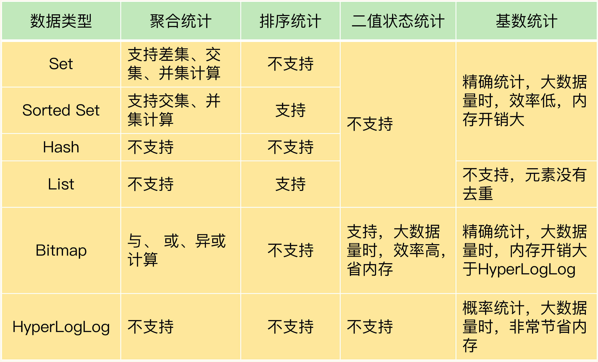

# 数据统计

常见的业务场景：

- 给一个 userId ，判断用户登陆状态
- 显示用户某个月的签到次数和首次签到时间
- 两亿用户最近 7 天的签到情况，统计 7 天内连续签到的用户总数

由于用户量和访问量都是巨大，所以需要选择能够高效统计的聚合类型

常见的四种统计模式，包括聚合统计、排序统计、二值状态统计和基数统计

不同统计模式适合使用不同的集合类型

## 聚合统计

统计多个集合元素的聚合结果，包括：

- 统计多个集合的共有元素（交集统计）
- 把两个集合相比，统计其中一个集合独有的元素（差集统计）
- 统计多个集合的所有元素（并集统计）

当需要对多个集合进行聚合计算时，Set 类型会是一个非常不错的选择，但 Set 的差集、并集和交集的计算复杂度较高，在数据量较大的情况下，如果直接执行这些计算，会导致 Redis 实例阻塞

可以从主从集群中选择一个从库，让它专门负责聚合计算，或者是把数据读取到客户端，在客户端来完成聚合统计

## 排序统计

List 和 Sorted Set 属于有序集合，List 安元素插入顺序进行排序，Sorted Set 按元素权重排序

### List

使用 `LPUSH` 将新数据插入队头，使用 `LRANGE` 获取指定区间内的数据

但对于频繁更新的 List，`LRANGE` 可能导致列表元素重复或漏掉，所以 List 只适合静态列表或更新不频繁的列表

### Sorted Set

在面对需要展示最新列表、排行榜等场景时，如果数据更新频繁或者需要分页显示，建议优先考虑使用 Sorted Set

可以将发布时间戳作为 score，这样新插入数据不会影响已有数据的排序位置

## 二值状态统计

二值状态就是指集合元素的取值就只有 0 和 1 两种，如签到、登陆等状态

### String

假如在判断用户是否登陆的场景中使用 Redis 的 String 类型实现，key 是 userId，value 是登陆状态。存储 100 万个用户的登陆状态，就需要存储 100 万个字符串了。String 类型除了记录实际数据以外，还需要额外的内存记录数据长度、空间使用等信息。并且还有 `RedisObject` 的开销，所以使用 String 内存开销太大

### Bitmap

Bitmap 提供了 GETBIT/SETBIT 操作，使用一个偏移值 offset 对 bit 数组的某一个 bit 位进行读和写，提供了 BITCOUNT 操作用来统计这个 bit 数组中所有 1 的个数

Bitmap 支持用 BITOP 命令对多个 Bitmap 按位做与或异或的操作，操作的结果会保存到一个新的 Bitmap 中

## 基数统计

基数统计是统计一个集合中不重复的元素个数，如 UV、PV 等

### Set、Hash

Set 和 Hash 类型默认支持去重，但集合较大时会非常消耗内存

### HyperLogLog

HyperLogLog 是一种用于统计基数的数据集合类型，它的最大优势就在于，当集合元素数量非常多时，它计算基数所需的空间总是固定的，而且还很小

在 Redis 中，每个 HyperLogLog 只需要花费 12KB，就可以计算接近 2^64 个元素的基数

HyperLogLog 的统计规则是基于概率完成的，所以它给出的统计结果是有一定误差的，标准误算率是 0.81%，虽然误差率不算大，但是如果需要精确统计结果的话，最好还是继续用 Set 或 Hash 类型
