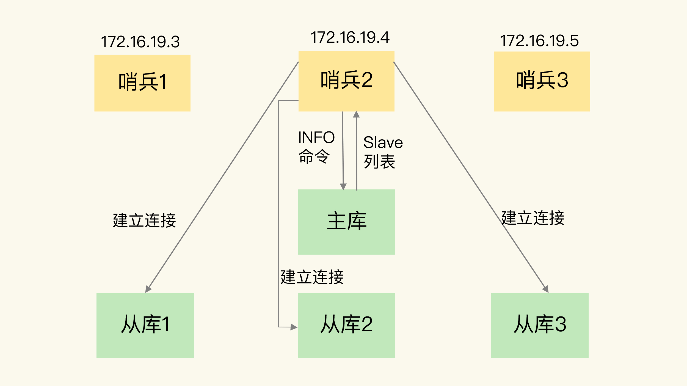
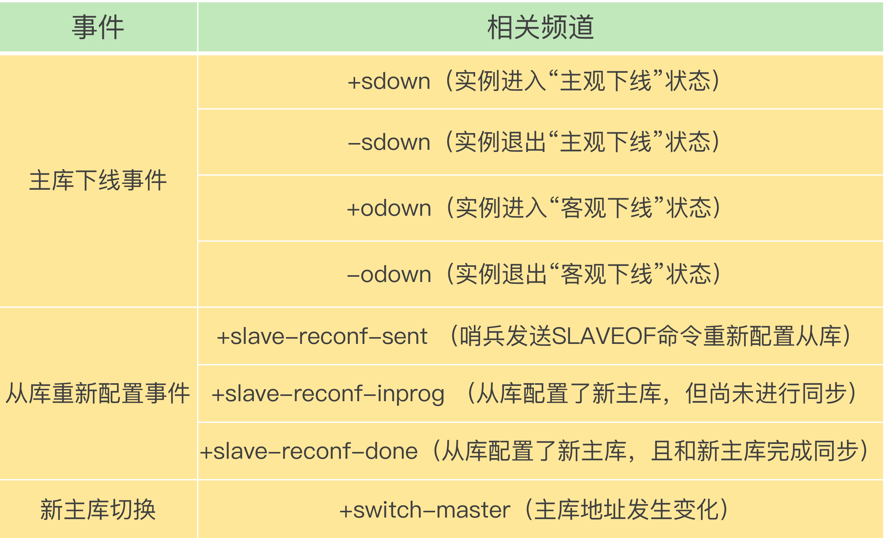
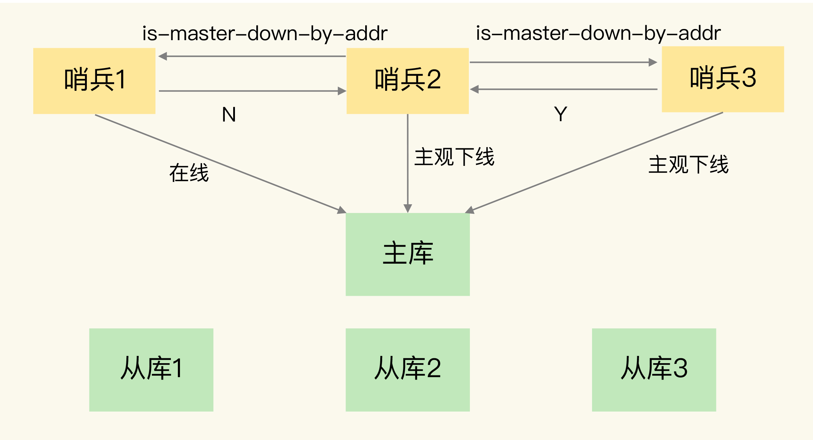
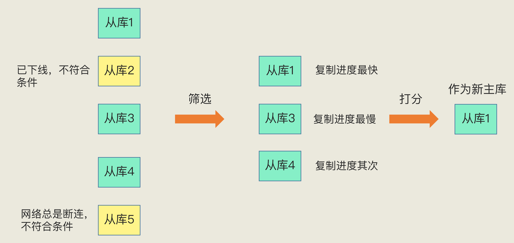

# 哨兵集群

如果从库发生故障了，客户端可以继续向主库或其他从库发送请求，进行相关的操作，但是如果主库发生故障了，那就直接会影响到从库的同步，因为从库没有相应的主库可以进行数据复制操作了

在 Redis 主从集群中，哨兵机制是实现主从库自动切换的关键机制，它有效地解决了主从复制模式下故障转移

哨兵就是一个运行在特定模式下的 Redis 实例，只不过它并不服务请求操作，只是完成监控、选主和通知的任务

在配置哨兵的信息时，只需要用到主库的 IP 和端口，并没有配置其他哨兵的连接信息

多个实例组成哨兵集群，即使有哨兵实例出现故障挂掉了，其他哨兵还能继续协作完成主从库切换的工作，包括判定主库是不是处于下线状态，选择新主库，以及通知从库和客户端

## 基于主库的 pub/sub 机制的哨兵集群

归功于 Redis 提供的 pub/sub 机制，使得虽然哨兵机器只配置了主库信息，但哨兵实例之间可以相互发现

哨兵只要和主库建立起了连接，就可以在主库上发布消息了，比如说发布它自己的连接信息（IP 和端口）。同时，它也可以从主库上订阅消息，获得其他哨兵发布的连接信息。当多个哨兵实例都在主库上做了发布和订阅操作后，它们之间就能知道彼此的 IP 地址和端口

除了哨兵实例，编写的应用程序也可以通过 Redis 进行消息的发布和订阅。为了区分不同应用的消息，Redis 会以频道的形式，对这些消息进行分门别类的管理。所谓的频道，就是消息的类别。当消息类别相同时，它们就属于同一个频道。反之，就属于不同的频道。只有订阅了同一个频道的应用，才能通过发布的消息进行信息交换

在主从集群中，主库上有一个名为 \_\_sentinel\_\_:hello 的频道，不同哨兵就是通过它来相互发现，实现互相通信的

通过 pub/sub 机制，哨兵之间可以组成集群

## INFO 命令

哨兵除了彼此之间建立起连接形成集群外，还需要和从库建立连接

在哨兵的监控任务中，它需要对主从库都进行心跳判断，而且在主从库切换完成后，它还需要通知从库，让它们和新主库进行同步

哨兵向主库发送 INFO 命令来获取从库的 IP 地址和端口

哨兵 2 给主库发送 INFO 命令，主库接受到这个命令后，就会把从库列表返回给哨兵。接着，哨兵就可以根据从库列表中的连接信息，和每个从库建立连接，并在这个连接上持续地对从库进行监控。哨兵 1 和 3 可以通过相同的方法和从库建立连接

通过 INFO 命令，获得了从库连接信息，也能和从库建立连接，并进行监控

## 基于哨兵自身的 pub/sub 机制的客户端事件通知

每个哨兵实例也提供 pub/sub 机制，客户端可以从哨兵订阅消息。哨兵提供的消息订阅频道有很多，不同频道包含了主从库切换过程中的不同关键事件

客户端读取哨兵的配置文件后，可以获得哨兵的地址和端口，和哨兵建立网络连接。然后可以在客户端执行订阅命令，来获取不同的事件消息

有了这些事件通知，客户端不仅可以在主从切换后得到新主库的连接信息，还可以监控到主从库切换过程中发生的各个重要事件。这样客户端就可以知道主从切换进行到哪一步了，有助于了解切换进度

## 客观下线仲裁过程

- 任何一个实例只要自身判断主库主观下线后，就会给其他实例发送 is-master-down-by-addr 命令

- 其他实例会根据自己和主库的连接情况，做出 Y 或 N 的响应，Y 相当于赞成票，N 相当于反对票

- 一个哨兵获得了仲裁所需的赞成票数后，就可以标记主库为客观下线。这个所需的赞成票数是通过哨兵配置文件中的 quorum 配置项设定的。例如，现在有 5 个哨兵，quorum 配置的是 3，那么，一个哨兵需要 3 张赞成票，就可以标记主库为客观下线了。这 3 张赞成票包括哨兵自己的一张赞成票和另外两个哨兵的赞成票

- 这个哨兵就可以再给其他哨兵发送命令，表明希望由自己来执行主从切换，并让所有其他哨兵进行投票。这个投票过程称为 Leader 选举。因为最终执行主从切换的哨兵称为 Leader，投票过程就是确定 Leader

- 在投票过程中，任何一个想成为 Leader 的哨兵，要满足两个条件：第一，拿到半数以上的赞成票；第二，拿到的票数同时还需要大于等于哨兵配置文件中的 quorum 值

- 投票过程中，未投过票的哨兵会给第一个向它发送投票请求的哨兵回复 Y，给后续再发送投票请求的哨兵回复 N

- Leader 开始执行选主操作，而且在选定新主库后，会给其他从库和客户端通知新主库的信息

- 此轮如果没有产生 Leader，哨兵集群会等待一段时间（也就是哨兵故障转移超时时间的 2 倍），再重新选举。哨兵集群能够进行成功投票，很大程度上依赖于选举命令的正常网络传播。如果网络压力较大或有短时堵塞，就可能导致没有一个哨兵能拿到半数以上的赞成票。所以，等到网络拥塞好转之后，再进行投票选举，成功的概率就会增加

通常至少会配置 3 个哨兵实例

要保证所有哨兵实例的配置是一致的，尤其是主观下线的判断值 down-after-milliseconds

哨兵在判定主观下线和选举哨兵领导者时，都需要和其他节点进行通信，交换信息，哨兵实例越多，通信的次数也就越多，而且部署多个哨兵时，会分布在不同机器上，节点越多带来的机器故障风险也会越大，这些问题都会影响到哨兵的通信和选举，出问题时也就意味着选举时间会变长，切换主从的时间变久

## 选主机制

哨兵选择新主库的过程为筛选 + 打分。简单来说，在多个从库中，先按照一定的筛选条件，把不符合条件的从库去掉。然后，再按照一定的规则，给剩下的从库逐个打分，将得分最高的从库选为新主库

### 筛选

- 保证所选的从库仍然在线运行

- 判断从库之前的网络连接状态

### 打分

按照三个规则依次进行三轮打分，打分标准为：

- 从库优先级

- 从库复制进度

- 从库 ID 号

只要在某一轮中，有从库得分最高，那么它就是主库了，选主过程到此结束；如果没有出现得分最高的从库，那么就继续进行下一轮

第一轮：优先级最高的从库得分高；通过 slave-priority 配置项，给不同的从库设置不同优先级

第二轮：和旧主库同步程度最接近的从库得分高；如果选择和旧主库同步最接近的那个从库作为主库，那么这个新主库上就有最新的数据；在主从库同步的命令传播的过程中，主库会用 master_repl_offset 记录当前的最新写操作在 repl_backlog_buffer 中的位置，而从库会用 slave_repl_offset 这个值记录当前的复制进度；从库的 slave_repl_offset 最接近 master_repl_offset，那么它的得分就最高，可以作为新主库

第三轮：ID 号小的从库得分高；每个实例都会有一个 ID，在优先级和复制进度都相同的情况下，ID 号最小的从库得分最高，会被选为新主库