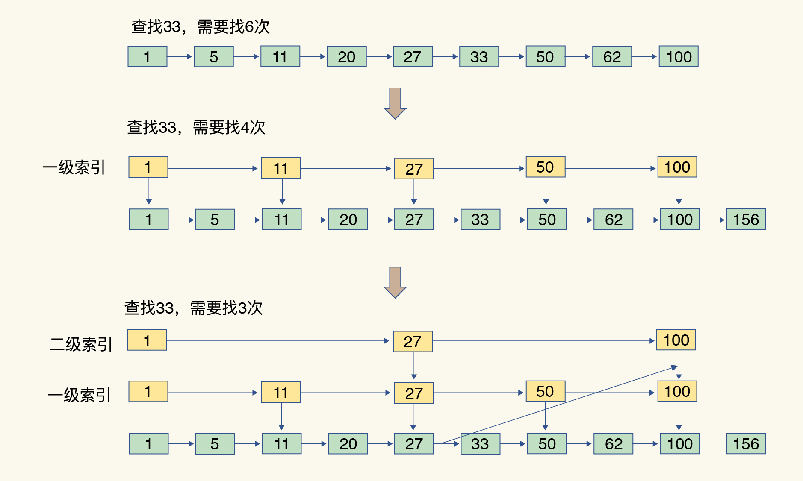

# skiplist

在链表的基础上，增加了多级索引，通过索引位置的几个跳转，实现数据的快速定位



## 数据结构

```cpp
// 跳表节点
typedef struct zskiplistNode {
    // 元素值
    sds ele;
    // 元素权重值
    double score;
    // 后向指针
    struct zskiplistNode *backward;
    // 柔性数组，表示节点的层级
    struct zskiplistLevel {
        struct zskiplistNode *forward;  // 前进指针
        unsigned long span;  // 跨度，到下一个节点的距离
    } level[];  // 柔性数组，表示节点的层级
} zskiplistNode;

// 跳表
typedef struct zskiplist {
    struct zskiplistNode *header, *tail;  // 头节点和尾节点
    unsigned long length;  // 节点数量
    int level;  // 最大层级
    // 第 0 层是全部数据
} zskiplist;
```

## 层级算法

Redis 使用幂次定律（power law）随机生成节点层级

Level 1: 100% (所有节点)、Level 2: 25%、Level 3: 6.25%、Level 4: 1.5625%、Level 5: 0.390625%...以此类推

```cpp
#define ZSKIPLIST_MAXLEVEL 32  // 最大32层
#define ZSKIPLIST_P 0.25       // 概率因子

int zslRandomLevel(void) {
    int level = 1;
    // 每次有 1/4 的概率增加一层
    while ((random() & 0xFFFF) < (ZSKIPLIST_P * 0xFFFF))
        level += 1;
    return (level < ZSKIPLIST_MAXLEVEL) ? level : ZSKIPLIST_MAXLEVEL;
}
```

## 插入操作

```cpp
zskiplistNode *zslInsert(zskiplist *zsl, double score, sds ele) {
    // 记录每一层中，新节点的前驱节点（即新节点应该插在哪个节点后面）
    zskiplistNode *update[ZSKIPLIST_MAXLEVEL];
    zskiplistNode *x;
    // 记录从 header 到每层 update 节点经过的节点数量（用于计算跨度）
    unsigned int rank[ZSKIPLIST_MAXLEVEL];
    int i, level;
    
    serverAssert(!isnan(score));
    x = zsl->header;
    
    // Step 1: 从高层向低层查找插入位置
    for (i = zsl->level-1; i >= 0; i--) {
        // 存储从header到每层update节点的排名
        rank[i] = i == (zsl->level-1) ? 0 : rank[i+1];
        
        // 在当前层查找合适的插入位置
        while (x->level[i].forward &&
              (x->level[i].forward->score < score ||
               (x->level[i].forward->score == score &&
                sdscmp(x->level[i].forward->ele, ele) < 0))) {
            rank[i] += x->level[i].span;
            x = x->level[i].forward;
        }
        update[i] = x;  // 记录每层需要更新的节点
    }
    
    // Step 2: 随机生成新节点的层数
    level = zslRandomLevel();
    
    // Step 3: 如果新节点层数大于当前最大层数
    if (level > zsl->level) {
        for (i = zsl->level; i < level; i++) {
            rank[i] = 0;
            update[i] = zsl->header;
            update[i]->level[i].span = zsl->length;
        }
        zsl->level = level;
    }
    
    // Step 4: 创建新节点
    x = zslCreateNode(level, score, ele);
    
    // Step 5: 更新各层指针
    for (i = 0; i < level; i++) {
        x->level[i].forward = update[i]->level[i].forward;
        update[i]->level[i].forward = x;
        
        // 更新跨度
        x->level[i].span = update[i]->level[i].span - (rank[0] - rank[i]);
        update[i]->level[i].span = (rank[0] - rank[i]) + 1;
    }
    
    // Step 6: 更新高层级的跨度
    for (i = level; i < zsl->level; i++) {
        update[i]->level[i].span++;
    }
    
    // Step 7: 设置后退指针
    x->backward = (update[0] == zsl->header) ? NULL : update[0];
    if (x->level[0].forward)
        x->level[0].forward->backward = x;
    else
        zsl->tail = x;
    
    zsl->length++;
    return x;
}
```


## 查找操作

```cpp
zskiplistNode *zslGetElementByRank(zskiplist *zsl, unsigned long rank) {
    zskiplistNode *x;
    unsigned long traversed = 0;  // 已经遍历的节点数
    int i;
  
    // 从头节点开始
    x = zsl->header;
  
    // 从最高层开始遍历
    for (i = zsl->level-1; i >= 0; i--) {
        // 当同层下一个节点存在，且遍历过的节点数加上下一个节点的跨度不超过目标排名
        while (x->level[i].forward && 
               (traversed + x->level[i].span) <= rank) {
            // 累加跨度
            traversed += x->level[i].span;
            // 向前移动
            x = x->level[i].forward;
        }
        // 如果正好找到
        if (traversed == rank) {
            return x;
        }
    }
    return NULL;
}
```

