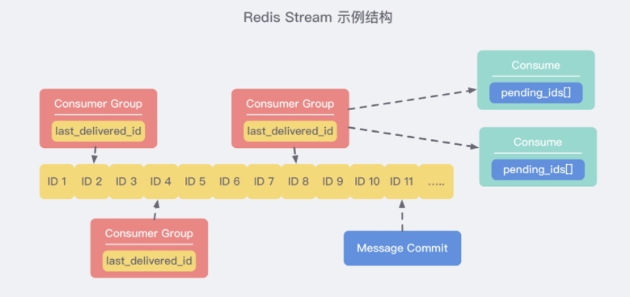
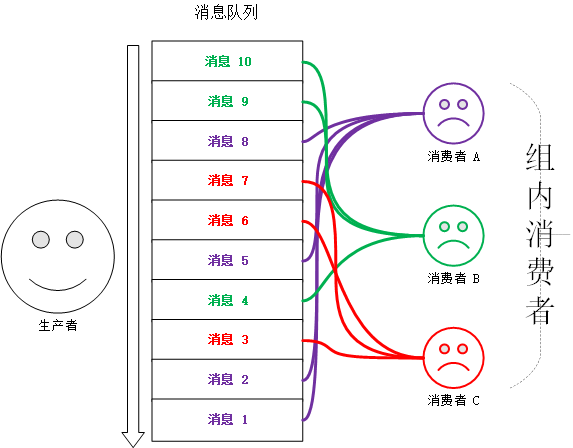

# stream

## 消息队列存取需求

在分布式系统中，当两个组件要基于消息队列进行通信时，一个组件会把要处理的数据以消息的形式传递给消息队列，然后这个组件就可以继续执行其他操作了；远端的另一个组件从消息队列中把消息读取出来，再在本地进行处理

在使用消息队列时，消费者可以异步读取生产者消息，然后再进行处理。这样一来，即使生产者发送消息的速度远远超过了消费者处理消息的速度，生产者已经发送的消息也可以缓存在消息队列中，避免阻塞生产者

消息队列在存取消息时，必须要满足三个需求，分别是消息保序、处理重复的消息和保证消息可靠性

### 消息保序

消费者是异步处理消息，但是消费者仍然需要按照生产者发送消息的顺序来处理消息，避免后发送的消息被先处理了

### 重复消息处理

消费者从消息队列读取消息时，有时会因为网络堵塞而出现消息重传的情况，消费者可能会收到多条重复的消息

### 消息可靠性保证

消费者在处理消息的时候，可能出现因为故障或宕机导致消息没有处理完成的情况

消息队列需要能提供消息可靠性的保证，当消费者重启后，可以重新读取消息再次进行处理，否则就会出现消息漏处理的问题了

## 基于 List 的解决方案

生产者可以使用 LPUSH 命令把要发送的消息依次写入 List，而消费者则可以使用 RPOP 命令，从 List 的另一端按照消息的写入顺序，依次读取消息并进行处理

### 消息保序

在生产者往 List 中写入数据时，List 并不会主动地通知消费者有新消息写入，如果消费者想要及时处理消息，就需要在程序中不停地调用 RPOP 命令，会导致消费者程序的 CPU 一直消耗在执行 RPOP 命令上，带来不必要的性能损失

Redis 提供了 BRPOP 命令，客户端在没有读到队列数据时，自动阻塞直到有新的数据写入队列，再开始读取新数据。和消费者程序自己不停地调用 RPOP 命令相比，这种方式能节省 CPU 开销

### 重复信息处理

List 本身是不会为每个消息生成 ID 号的，所以消息的全局唯一 ID 号就需要生产者程序在发送消息前自行生成；生成之后，在用 LPUSH 命令把消息插入 List 时，需要在消息中包含这个全局唯一 ID

消费者程序要把已经处理过的消息的 ID 号记录下来，就可以对比收到的消息 ID 和记录的已处理过的消息 ID，来判断当前收到的消息有没有经过处理

### 消息可靠性保证

List 类型提供了 BRPOPLPUSH 命令，作用是让消费者程序从一个 List 中读取消息，同时 Redis 会把这个消息再插入到另一个 List（可以叫作备份 List）留存

如果消费者程序读了消息但没能正常处理，等它重启后，就可以从备份 List 中重新读取消息并进行处理了

### 不足

生产者消息发送很快，而消费者处理消息的速度比较慢，这就导致 List 中的消息越积越多，给 Redis 的内存带来很大压力

List 作为消息队列不支持消费组，不能启动多个消费者程序一起处理 List 中的消息

## 基于 Stream 的解决方案

Stream 是 Redis 专门为消息队列设计的数据类型，它提供了丰富的消息队列操作命令

Stream 是一个序列，使用XADD向其中添加的消息不会被自动删除（在 Stream 长度限制之内），所有消息始终在那里

### 基本结构

- Consumer Group：消费者组可以看成 Stream 的一种数据结构；消费者可以使用 XREAD 单独消费，也可以多个消费者加入一个消费者组进行组内消费；同一条消息只会被一个消费者消费

- last_delivered_id：表示消费者组在 Stream 上的消费位置信息；每个消费者组都有一个 Stream 内唯一的名称；消费者组不会自动创建，需要使用 XGROUP CREATE 显示创建，并指明开始消费的消息 ID，用来初始化该变量

- pending_ids：每个消费者内部的状态变量，表示已经被获取但未 ACK 的消息，用来保证消息被客户端至少消费一次

- ID：第一部分是数据插入时，以毫秒为单位计算的当前服务器时间，第二部分表示插入消息在当前毫秒内的消息序号；保证了 ID 自增，支持范围查找；支持客户端自定义，但需满足整数-整数格式

- 消息内容：普通键值对

### 消费者组

当多个消费者同时消费一个消息队列时，可以重复的消费相同的消息，就是消息队列中有 10 条消息，三个消费者都可以消费到这 10 条消息

消费者组为需要多个消费者配合协作来消费同一个消息队列，就是消息队列中有 10 条消息，三个消费者分别消费其中的某些消息

每个消费者组内可以挂多个消费者分担读取消息进行消费，消费完成后，各自向 Redis 发送 XACK，标记自己的消费组已经消费到了哪个位置，而且消费组之间互不影响

### Stream 上限

消息积累太多，Stream 的链表会变得很长，XDEL 不会删除消息，只是给消息做了个标志位

Redis 提供了定长的 Stream 功能，在 XADD 的指令提供一个定长长度 maxlen；当 Stream 达到指定长度后会自动淘汰老的信息，确保最多不超过指定长度

### PEL

Stream 在每个消费者结构中保存了正在处理中的消息 ID 列表 PEL，如果消费者收到了消息处理完了但是没有回复 ACK，就会导致 PEL 列表不断增长，如果有很多消费组的话，那么这个 PEL 占用的内存就会放大

客户端断开连接重连后，读取数据时使用 0-0 来读取所有 PEL 消息及 last_delivered_id 之后消息