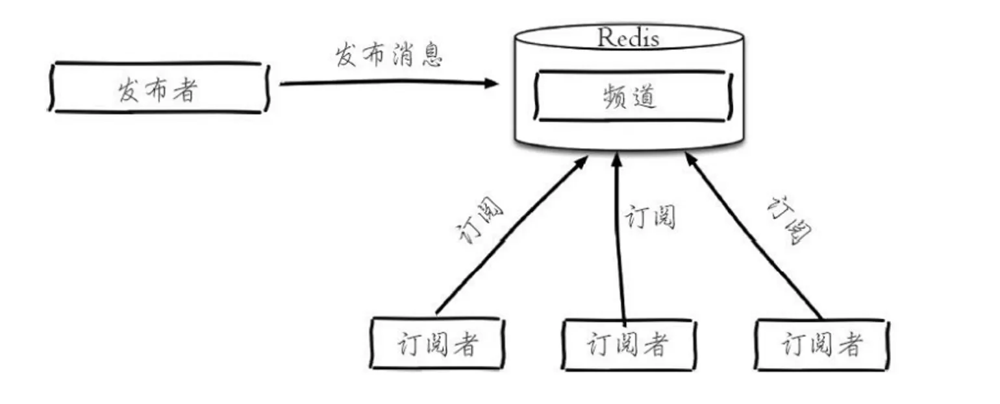

# pub/sub

提供了基于发布订阅模式的消息机制，消息发布者和订阅者不进行直接通信，发布者客户端向指定的频道发布消 息，订阅该频道的每个客户端都可以收到该消息



- 消息发送后，若没有订阅者在线，消息会丢失
- 订阅者只能收到订阅后的消息，无法获取历史消息
- 一条消息会被所有订阅该频道的客户端接收
- 适用于简单的实时通知场景，不适合需要持久化或可靠性的复杂消息队列需求

## 命令

```sh
# 订阅一个或多个频道
SUBSCRIBE channel [channel ...]
# 按模式订阅频道，支持通配符
PSUBSCRIBE pattern [pattern ...]

# 退订指定频道
# 默认取消所有订阅
UNSUBSCRIBE [channel ...]
# 取消模式订阅
PUNSUBSCRIBE [pattern ...]

# 发送消息
# 返回的是接收这条消息的订阅者数量
PUBLISH channel message

# 查看 Pub/Sub 系统的状态信息
PUBSUB subcommand [args]
```

## 使用场景

- 简单 MQ 功能，实现上下游的解耦