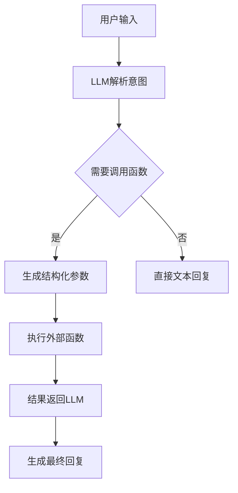

# AIGC、Agent 、MCP 的概念和关系

## AIGC

AIGC 全称为 AI Generated Content，指的是利用人工智能技术自动生成文本、图片、音频、视频等多种内容的过程

### 多模态

- 单模态：只处理一种类型的数据，比如只处理文本、图像
- 多模态：能够同时处理两种及以上类型的数据，如既能理解图片内容，又能理解文本描述，甚至还能结合音频、视频等信息进行综合分析和生成

### RAG

大型语言模型虽然拥有海量的知识和强大的语言理解与生成能力，但也存在一些关键限制：

- 知识局限性、过时性： LLM 的知识主要来源于其训练数据截止日期之前的信息。对于训练数据之后发生的事件、新研究、最新数据或特定领域的细节，LLM 可能不知道或给出过时的信息
- 幻觉： 当 LLM 遇到其知识库中不明确或不存在的信息时，它可能会“捏造”出看似合理但事实上错误或不存在的答案
- 缺乏来源、可验证性： LLM 通常无法提供其生成答案的具体来源依据，使得验证答案的准确性变得困难
- 特定领域知识不足： 通用 LLM 可能缺乏对某个特定公司、组织或个人私有知识库的深入了解

RAG 全称 Retrieval-Augmented Generation，检索增强生成技术，是一种将信息检索（IR） 与大型语言模型（LLM） 的文本生成能力相结合的人工智能框架

当 LLM 需要回答一个问题或生成文本时，不是仅依赖其内部训练时学到的知识，而是先从一个外部知识库中检索出相关的信息片段，然后将这些检索到的信息与原始问题/指令一起提供给 LLM，让 LLM 基于这些最新、最相关的上下文信息来生成更准确、更可靠、更少幻觉的答案

## Agent

Agent 在计算机科学和人工智能领域指的是一个能够感知环境、自主决策并采取行动以实现特定目标的实体或系统。它可以是软件程序、机器人硬件，甚至是生物实体（如人类或动物），但在 AI 领域通常指软件智能体

Agent 和 AIGC 最大的区别：

- AIGC 主要以生成式任务为主，而 Agent 是可以通过自主决策能力完成更多通用任务的智能系统
- 常见的 AGIC 的核心就是一个生成模型，而 Agent 是一个集 Function Call模型、软件工程于一体的复杂的系统，需要处理模型和外界的信息交互
- Agent 可以集成 AIGC 能力完成某些特定的任务，也就是 AIGC 可以是 Agent 系统里面的一个子模块

### Function Call 模型

RAG 技术是为了解决模型无法和外接数据交互的问题，但是 RAG 的局限在于只赋予了模型检索数据的能力，而 Function Calling 允许模型理解用户请求中的潜在意图，并自动生成结构化参数来调用外部任何函数、工具，从而突破纯文本生成的限制，实现与真实世界的交互，比如可以调用查天气、发邮件、数学计算等工具

### Agent

Agent 与 Function Call 不同的是，Agent 完成一次任务，实际上会循环调用模型，可能会调用多次 Function Calling，每次需要调用什么工具，完全由模型决策

## MCP

MCP 全称 Model Context Protocol 模型上下文协议。MCP 协议旨在解决 LLM 与外部数据源、工具间的集成难题。通过标准化通信协议，将传统的 M×N 集成问题（即多个模型与多个数据源的点对点连接）转化为 M+N模式，大幅降低开发成本

