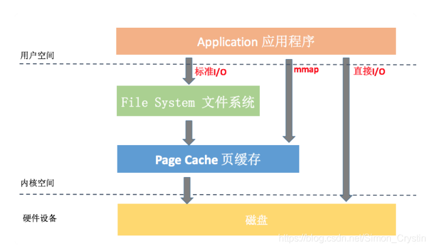

# 文件 IO

## 文件描述符

内核会为每个进程维护一个打开文件的列表，该列表称为文件表。列表的每一项是一个打开的文件的信息，包括指向该文件 inode 内存拷贝的指针以及关联的元数据

当通过 `fork` 创建子进程时，子进程会维护一份父进程的文件表副本。在该副本中，打开文件列表及其访问模式、当前文件位置以及其他元数据，都和父进程的文件表相同

- 内核为每个进程都维护了一个文件表，文件表在底层是一个数组，索引从 0 开始，索引即为文件描述符，几乎所有对文件的操作均以文件描述符作为基本参数

- 每个文件描述符都对应一个文件指针，该指针指向系统中已经打开的文件信息，该文件信息也是一个数组，打开的文件信息包括文件偏移量、状态标志以及 inode 指针

- inode 指针指向系统中的 inode 表，inode 表中的每个数据项都对应一个具体的磁盘文件

- 同一个进程内可以有两个文件指针指向同一个打开的文件信息

- 不同进程下可以有两个文件指针指向同一个打开的文件信息

- 打开的文件信息包括文件偏移量和状态标志

## IO 分类

IO 结构模型分为 Direct IO、mmap 和标准 IO

### 标准 IO

大多数文件系统的默认 IO 操作都是标准 IO

在 Linux 的标准 IO 机制中，数据先从磁盘复制到内核空间的缓冲区，然后从内核空间缓冲区复制到应用程序的地址空间

1. 进程发起写请求，调用 `write`

2. `write` 更新内核空间中的页缓存，此次写请求需要更新两个页，分别是页缓存 1 和页缓存 2，此时页缓存中的数据和磁盘中的数据不一致，称这样的页为脏页

3. 内核空间页缓存更新完毕，向进程返回成功。此时并未将页缓存中的数据刷新到磁盘文件

4. 进程收到 `write` 返回成功，继续其他操作处理。一段时间后，发起读请求调用 `read`

5. 内核空间收到 `read` 调用请求，发现需要读取的数据部分落在页缓存 2 和页缓存 3 中，则从缓存中读取其内容

6. `read` 请求发现数据不完全在页缓存 2 和页缓存 3 中，于是读取磁盘文件 1 并将文件中需要读取的数据放到页缓存 3 中

7. `read` 将读取到的数据组装好返回给进程

8. 满足一定条件时，内核空间将页缓存 1 和页缓存 2 中的数据刷新到磁盘

系统在进程发起 `write` 系统调用时，只是将数据写入内核缓冲区中的页缓存即返回，将内核空间页缓存中的数据刷新到磁盘是异步的。相比于同步刷盘，引入页缓存机制，能显著提高 `write` 和 `read`的性能，而且还不会修改读写语义（写完之后能立刻读到写的内容）

页回写的时机可以分时间和空间两个维度分析：

- 当内核缓冲区中某一个脏页存在的时长超过设定的阈值时，该脏页回写磁盘。该参数是 /proc/sys/vm/dirty_expire_centisecs，默认值是 30s

- 当内核缓冲区中脏页的数量达到一定比例，或者说空闲缓冲页比率小于设定的阈值时，脏页回写磁盘，回收缓冲页。该参数是 /proc/sys/vm/dirty_background_ratio，默认值是 10%，即空闲的页缓存比率小于 10% 时，触发页回写

优点：

- 在一定程度上分离了内核空间和用户空间，保护系统本身的运行安全

- 可以减少读盘的次数，从而提高性能

缺点：

- 数据在传输过程中需要在用户空间和内核空间之间进行多次数据拷贝操作，这些数据拷贝操作所带来的 CPU 以及内存开销是非常大的

- 延迟写机制可能会导致数据丢失，page cache 中被修改的内存称为脏页，内核通过 flush 线程定期将数据写入磁盘；在实际应用中，如果某些数据非常重要，是完全不允许有丢失风险的，这时应该采用同步写机制，在应用程序中使用 sync、fsync、msync 等系统调用时，内核都会立刻将相应的数据写回到磁盘

### 用户态缓冲 IO

在标准 IO 基础上，通过引入用户态缓冲，减少系统 IO 调用的次数和内核态用户态上下文切换

`fopen`、`fclose`、`fgetc`、`fputc` 等是带用户缓冲 IO 相关的函数

### 直接 IO

直接 IO 就是应用程序直接访问磁盘数据，而不经过内核缓冲区，这样做的目的是减少一次从内核缓冲区到用户程序缓存的数据复制

优点：

- 应用程序自己选择缓存机制，提高数据的存取效率

- 写操作：由于其不使用 page cache，所以其写文件如果返回成功，数据就落盘了（不考虑磁盘自带的缓存）

缺点：

- 如果访问的数据不在应用程序缓存中，那么每次数据都会直接从磁盘加载，这种直接加载会非常慢

- 在部分操作系统中，`write` 系统调用能够确保文件数据落盘，但是文件元数据不一定落盘

- 强制的地址对齐限制，必须使用 `posix_memalign` 开启地址对其的内存，再将数据拷贝至这个内存中。这个对齐的大小也跟文件系统和存储介质相关，因为文件系统中存储数据是按 IO Block 为单位

- 由于设备之间的数据传输是通过 DMA 完成的，因此用户空间的数据缓冲区内存页必须进行页锁定 page pinning，这是为了防止其物理页框地址被交换到磁盘或者被移动到新的地址而导致 DMA 去拷贝数据的时候在指定的地址找不到内存页从而引发缺页错误，而页锁定的开销并不比 CPU 拷贝小，所以为了避免频繁的页锁定系统调用，应用程序必须分配和注册一个持久的内存池，用于数据缓冲

### 内存映射 mmap

内存映射就是将内核空间的一段内存区域映射到用户空间。映射成功后，用户对这段内存区域的修改可以直接反映到内核空间，相反内核空间对这段区域的修改也直接反映用户空间

内存映射对于内核空间与用户空间两者之间需要大量数据传输等操作的话效率是非常高的。当然，也可以将内核空间的一段内存区域同时映射到多个进程，这样还可以实现进程间的共享内存通信

`mmap` 返回的虚拟内存地址处在堆栈之间的空余部分，与文件的 page chache 具有相同的物理页，这样就免去了从内核缓冲区向用户态的数据拷贝

使用 `mmap`` 操作文件时，创建新的虚拟内存区域和建立文件磁盘地址和虚拟内存区域映射这两步，没有任何文件拷贝操作。而之后访问数据时发现内存中并无数据而发起的缺页异常过程，可以通过已经建立好的映射关系，只使用一次数据拷贝，就从磁盘中将数据传入内存的用户空间中，供进程使用

通过 `mmap` 将用户态内存与文件建立映射后，即使调用 `close`，依旧可以写文件，因为存储映射还在

使用 `munmap` 取消存储映射，取消映射后再对用户态内存进行操作就不会反应到文件中

优点：

- 实现了用户空间和内核空间的高效交互方式，两空间的各自修改操作可以直接反映在映射的区域内，从而被对方空间及时捕捉，并且可以节省一半的内存占用

- 提供进程间共享内存及相互通信的方式，不管是父子进程还是无亲缘关系的进程，都可以将自身用户空间映射到同一个文件或匿名映射到同一片区域，从而通过各自对映射区域的改动，达到进程间通信和进程间共享的目的

- 读写文件时不会带来上下文切换，`write`、`read` 都需要从用户态切换到内核态，再从内核态切换到用户态

限制：

- `mmap`` 映射区域大小必须是物理页大小（page_size）的整倍数

- `mmap` 必须将文件的 len 字节信息映射到进程空间的映射区，需要在一开始就确定 len 的大小，不太适用于随机读写的场景

- 由于需要进行映射，会占用进程映射区的空间，因此映射的大小有限制

- `mmap` 是一个开销很大的虚拟存储操作，这种操作需要修改页表以及用内核缓冲区里的文件数据汰换掉当前 TLB 里的缓存以维持虚拟内存映射的一致性

因为映射后的内存是物理页的整数倍，所以一般内存将大于文件大小。拓展出的内存将被填位 0。越界访问拓展出的内存将不会报错，但写操作不会作用在文件中

进行完内存映射后可以再改变文件大小，使访问的内存合法。这样方便随时扩充文件空间，随时写入文件，不造成空间浪费

与共享内存的区别：

- `shm` 的内存共享效率比 `mmap` 效率要高，但 `mmap` 操作更简单，存储量也更大

- `mmap` 使用普通文件提供的内存映射，适用于任何进程之间；使用特殊文件提供匿名内存映射，适用于具有亲缘关系的进程之间

- 机器重启后，`mmap` 因为是映射磁盘文件所以数据不会丢失，而 `shm` 会丢失数据

## DMA

传统 IO 需要 CPU 把数据从磁盘控制器的缓冲区拷贝到主存里的内核缓冲区，然后再把内核缓冲区拷贝到用户缓冲区

从内核缓冲区到用户缓冲区，因为缓冲区都是在内存里，所以这一步只能由 CPU 亲自完成。从磁盘控制器的缓冲区到内存，是两个设备之间的数据传输，这一步并非一定要 CPU 来完成，可以借助 DMA 来完成，从而减轻 CPU 的负担

DMA 全称是 Direct Memory Access，即直接存储器存取，是一种用来提供在外设和存储器之间或者存储器和存储器之间的高速数据传输。整个数据拷贝过程无须 CPU 参与，数据直接通过 DMA 控制器进行快速地移动拷贝，节省 CPU 的资源去做其他工作

一次读操作或写操作，会触发 2 次用户态和内核态的上下文切换，2 次 CPU 拷贝数据。借助 DMA，将 2 次 CPU 拷贝数据转换成 1 次 CPU 拷贝数据和 1 次 DMA 拷贝