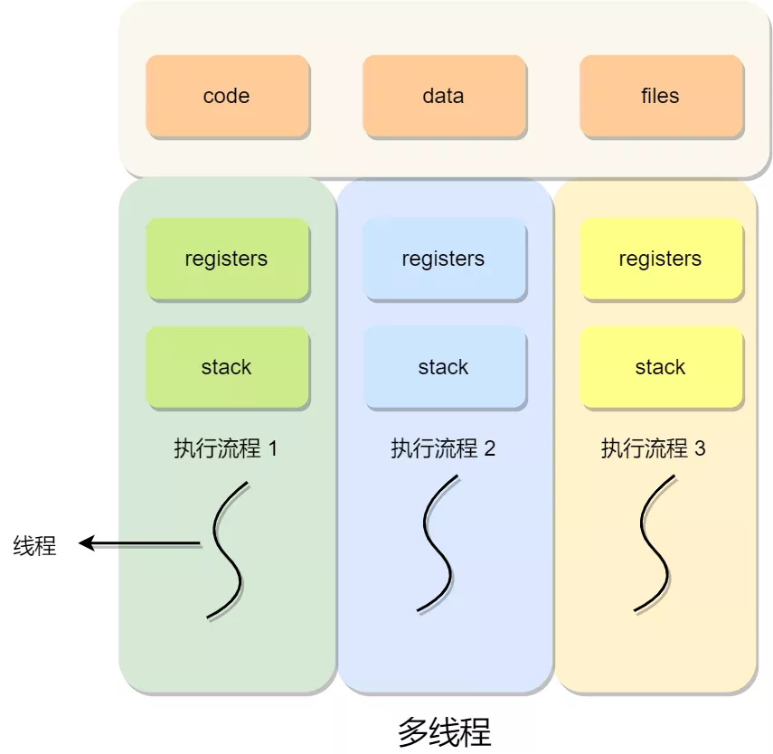

# 上下文

## CPU 上下文

在每个任务运行前，CPU 需要知道任务从哪里加载，又从哪里开始运行。操作系统需要事先帮 CPU 设置好 CPU 寄存器和程序计数器

CPU 寄存器和程序计数器是 CPU 在运行任何任务前，所必须依赖的环境，这些环境就叫做 CPU 上下文

CPU 上下文切换就是先把前一个任务的 CPU 上下文（CPU 寄存器和程序计数器）保存起来，然后加载新任务的上下文到这些寄存器和程序计数器，最后再跳转到程序计数器所指的新位置，运行新任务

系统内核会存储保持下来的上下文信息，当此任务再次被分配给 CPU 运行时，CPU 会重新加载这些上下文，这样就能保证任务原来的状态不受影响，让任务看起来还是连续运行

CPU 上下文切换分成：进程上下文切换、线程上下文切换和中断上下文切换

## 进程上下文

进程是由内核管理和调度的，所以进程的切换只能发生在内核态

进程的上下文切换不仅包含了虚拟内存、栈、全局变量等用户空间的资源，还包括了内核堆栈、寄存器等内核空间的资源

系统会把交换的信息保存在进程的 PCB，当要运行另外一个进程的时候，需要从这个进程的 PCB 取出上下文，然后恢复到 CPU 中，这使得这个进程可以继续执行

为了保证所有进程可以得到公平调度，CPU 时间被划分为一段段的时间片，这些时间片再被轮流分配给各个进程。这样，当某个进程的时间片耗尽了，就会被系统挂起，切换到其它正在等待 CPU 的进程运行

进程在系统资源不足（比如内存不足）时，要等到资源满足后才可以运行，这个时候进程也会被挂起，并由系统调度其他进程运行

- 当某个进程的时间片耗尽了，就会被系统挂起，切换到其它正在等待 CPU 的进程运行

- 进程在系统资源不足（比如内存不足）时，要等到资源满足后才可以运行，这个时候进程也会被挂起，并由系统调度其他进程运行

- 当进程通过睡眠函数 sleep 这样的方法将自己主动挂起时，自然也会重新调度

- 当有优先级更高的进程运行时，为了保证高优先级进程的运行，当前进程会被挂起，由高优先级进程来运行

- 发生硬件中断时，CPU 上的进程会被中断挂起，转而执行内核中的中断服务程序

## 线程上下文

线程与进程最大的区别在于，线程是调度的基本单位，而进程则是资源拥有的基本单位。说白了，所谓内核中的任务调度，实际上的调度对象是线程；而进程只是给线程提供了虚拟内存、全局变量等资源

同一个进程内多个线程之间可以共享代码段、数据段、打开的文件等资源，但每个线程都有独立一套的寄存器和栈，这样可以确保线程的控制流是相对独立的

线程上下文切换分为同一进程线程切换和不同进程线程切换：

- 当两个线程不是属于同一个进程，则切换的过程就跟进程上下文切换一样

- 当两个线程是属于同一个进程，因为虚拟内存是共享的，所以在切换时，虚拟内存这些资源就保持不动，只需要切换线程的私有数据、寄存器等不共享的数据

## 中断上下文

为了快速响应硬件的事件，中断处理会打断进程的正常调度和执行，转而调用中断处理程序，响应设备事件。而在打断其他进程时，就需要将进程当前的状态保存下来，这样在中断结束后，进程仍然可以从原来的状态恢复运行

跟进程上下文不同，中断上下文切换并不涉及到进程的用户态。即便中断过程打断了一个正处在用户态的进程，也不需要保存和恢复这个进程的虚拟内存、全局变量等用户态资源

中断上下文，其实只包括内核态中断服务程序执行所必需的状态，包括 CPU 寄存器、内核堆栈、硬件中断参数等