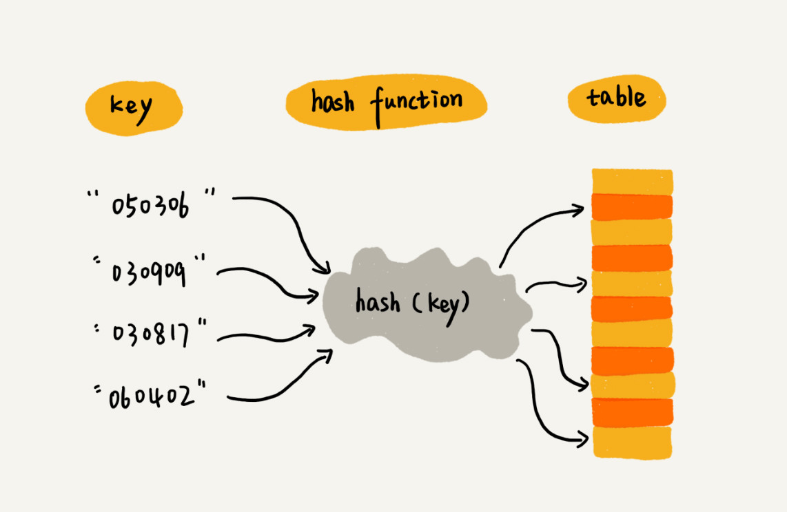
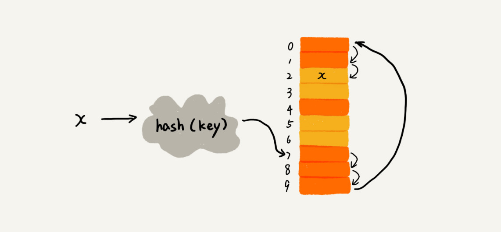
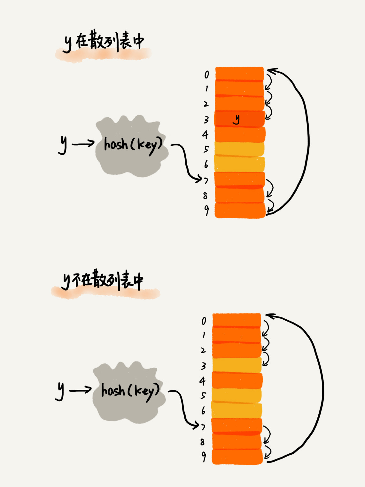
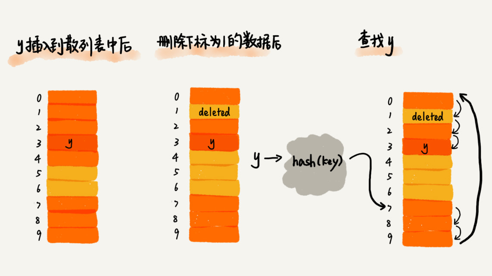

# 哈希表

哈希表用的是数组支持按照下标随机访问数据特性，所以哈希表其实就是数组的一种扩展，由数组演化而来

数组存储的值与数组下标形成映射，所以利用数组支持根据下标随机访问时间复杂度 O(1) 的特性，可以快速查找

存储的值为哈希键（key）
将哈希键转换为数组下标的映射方法为哈希函数（hash function），得到的值为哈希值（value)



通过哈希函数把元素的键值映射为下标，然后将数据存储在数组中对应下标的位置

当按照键值查询数据时，可以用同样的哈希函数将键值转化为数组下标，从对应的数组下标的位置获取数据

## 哈希函数

把它定义成 hash(key)，key 表示元素的键值，经过哈希函数计算得到哈希值

哈希函数设计的基本要求：

- 哈希函数计算得到的哈希值是一个非负整数；因为数组下标从 0 开始，所以散列值必须是非负整数

- 如果 key1 = key2，那 hash(key1) == hash(key2)；相同的 key，经过哈希函数得到的值也应该相同

- 如果 key1 != key2，那 hash(key1) != hash(key2)；无法避免哈希冲突

## 哈希冲突

再好的哈希函数也无法避免哈希冲突，常用开放寻址法和链表法来解决

### 开放寻址法

核心思想是如果出现了哈希冲突，就重新探测一个空闲位置将其插入；插入方法有：线性探测、二次探测和双重哈希

1.  线性探测：当往哈希表中插入数据时，如果某个数据经过哈希函数之后，存储位置已经被占用了，就从当前位置开始，依次往后查找，看是否有空闲位置，直到找到为止



从图中可以看出，哈希表大小为 10，已经有 6 个元素插入到哈希表中；x 经过哈希函数得到哈希值 7，但这个位置已经有数据了，所以产生了冲突；按顺序一个一个往后找，看有没有空闲位置，遍历到尾部都没有找到空闲位置，于是再从表头开始找，直到找到空位 2，于是将其值插入到这个位置

在哈希表中查找元素的过程类似于插入过程；通过哈希函数求出查找元素的键值对应的哈希值，然后比较数组中下标为哈希值的元素和要查找的元素；如果相等，说明是要查找的元素，如果不是，则按顺序往后依次查找，如果遍历到数组中的空位位置，还没找到，则说明查找到的元素不在哈希表中



哈希表跟数组一样，不仅支持插入、查找，还支持删除，对于使用线性探测的哈希表，删除操作有些不同，不能单纯地把要删除的元素设置为空，因为在查找的时候，通过找到一个空闲位置来判定数据在不在哈希表中，如果这个空闲位置是后来删除的，就会导致原来的查找算法失败，本来存在数据会被认为不存在；为解决这个问题，可以将删除的元素特殊标记为 deleteed，当线性探测查找的时候，遇到标记为 deleted 的空间，并不停下来而是继续探测



线性探测存在很大的问题，当散列表插入的数据越来越多时，哈希冲突发生的可能性就越来越大，空闲位置会越来越少，线性探测的时间就会越来越久；极端情况下可能需要探测整个哈希表，所以最坏的时间复杂度是 O(n)；同理，删除和查找时也有可能会线性探测整张哈希表才能查找或删除数据
    
2. 二次探测：线性探测每次探测的步长是 1，二次探测步长是线性探测的二次方

线性探测的下标序列：hash(key)+0、hash(key)+1、hash(key)+2、...

二次探测的下标序列是：hash(key)+0^2、hash(key)+1^2、hash(key)+2^2、...

3. 双重哈希：先用一个哈希函数，如果计算得到的存储位置被占用，再用第二个哈希函数，以此类推直到找到空闲的存储位置

### 链表法

在每一个表格元素中维护一个 `list`，哈希函数为元素分配一个 `list`，然后在 `list` 上执行元素的插入、搜寻、删除等操作

使用链表法，装载因子将大于 1

但不管采用哪种探测方法，当哈希表中位置不多时，哈希冲突的概率大大提高；为了保证哈希表的操作效率，一般情况下尽可能保证哈希表中有一定比例的空闲槽位，用装载因子来表示空位的多少

```
装载因子 = 填入表中的元素个数 / 散列表长度
```