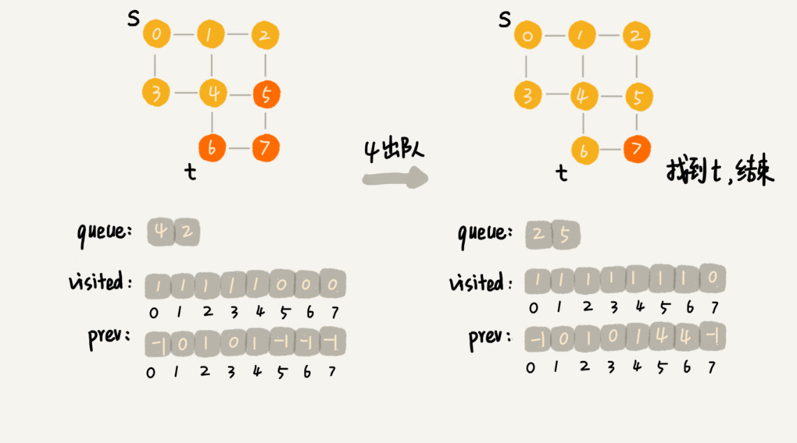

# 图

图是非线性表数据结构，涉及到图的搜索、最短路径、最小生成树、二分图等


## 定义

- 图中的元素称作顶点（vertex）

- 图中的一个顶点可以与任意其他顶点建立连接关系，建立的关系叫作边（edge）

- 跟顶点相连接的边的条数为顶点的度（degree）

- 边有方向则为有向图，没方向则为无向图

- 无向图中顶点有度，有向图中顶点有入度（In-degree，表示有多少条边指向这个顶点）和出度（Out-degree，表示有多少条边以这个顶点为起点指向其他顶点）

- 带权图（weighted graph）每条边都有一个权重（weight）


## 存储

### 领接矩阵存储

底层依赖一个二维数组

- 无向图：如果顶点 i 与顶点 j 之间有边，则将 `A[i][j]` 和 `A[j][i]` 标记为 1

- 有向图：如果顶点 i 指向顶点 j ，则将 `A[i][j]` 标记为 1；

- 带权图： `A[i][j]` 存储相应权值


用领接矩阵表示图，虽然简单、直观，因为基于数组所以在获取两个顶点关系时非常高效，同时可以将很多图的运算转换成矩阵的运算，但比较浪费存储空间

对于无向图，如果 `A[i][j]` 等于 1，那么 `A[j][i]` 也肯定等于1，则只需要存储一个就可以了，所以浪费了一半的存储空间

对于稀疏图（Sparse Matrix），即顶点很多但每个顶点的边并不多，用领接矩阵存储更加浪费空间

### 邻接表存储

每个顶点对应一个链表，链表中存储的是与这个顶点相连接的其他顶点


领接矩阵存储起来浪费空间，但使用节省时间；领接表存储节省空间，但使用浪费时间

```cpp
struct Graph {
  int node_cnt;
  vector<vector<int>> edge;

  Graph(int nums) {
    edge = vector<vector<int>>(nums);
    node_cnt = nums;
  }

  void add(int s, int e) {
    edge[s].push_back(e);
    edge[e].push_back(s);
  }
  void bfs(int start, int end);
}
```

## 搜索

深度优先搜索算法和广度优先搜索算法都是基于图这种数据结构

图上的搜索算法就是，在图中找出从一个顶点出发到另一个顶点的路径；具体方法包括：深度优先、广度优先、 A* 等

深度优先搜索和广度优先搜索既可用在无向图，也可用在有向图

### 广度优先搜索

一种地毯式层层推进的搜索策略，即先查找离起始顶点最近的，然后是次近的，依次往外搜索


广度搜索的路径是最短路径

```cpp
void Graph::bfs(int start, int end) {
  if (start == end)
    return;
  vector<bool> visited(node_cnt, false);
  vector<int> prev(node_cnt, -1);
  visited[start] = true;
  prev[start] = start;
  std::queue<int> queue;
  queue.push(start);
  while (queue.size() != 0) {
    int top = queue.front();
    for (int i = 0; i < edge[top].size(); ++i) {
      int next = edge[top][i];
      if (end != next) {
        if (!visited[next]) {
          queue.push(next);
          visited[next] = true;
          prev[next] = top;
        }
      } else {
        prev[next] = top;
        return;
      }
    }
    queue.pop();
  }
}
```

`visited` 用来记录已经被访问的顶点，用来避免顶点被重复访问

`queue` 用来存储已经被访问、但相连的顶点还没有被访问的顶点

`prev` 用来记录搜索路径




最坏情况下，终止顶点 t 离起始顶点 s 很远，需要遍历完整个图才能找到，所以广度优先搜索的时间复杂度是 O(V+E)，其中，V 表示顶点的个数，E 表示边的个数；对于一个连通图来说，也就是说一个图中的所有顶点都是连通的，E 肯定要大于等于 V - 1，所以，广度优先搜索的时间复杂度也可以简写为 O(E)

空间复杂度是 O(V)

### 深度优先搜索

深度优先搜索用的是回溯思想，这种思想解决问题的过程，非常适合用递归来实现

深度优先搜索找出来的路径并不是最短路径


```cpp
void Graph::dfs(int start, int end) {
  if (start == end)
    return;
  function<bool(int, int, vector<int> &)> helper =
      [this, &helper](int start, int end, vector<int> &path) -> bool {
    path.push_back(start);
    for (int i = 0; i < edge[start].size(); ++i) {
      if (edge[start][i] == end) {
        path.push_back(end);
        return true;
      } else {
        if (helper(edge[start][i], end, path)) {
          return true;
        } else {
            path.pop_back();
          }
      }
    }
      return false;
  };
  vector<int> path;
  helper(start, end, path);
}
```

图上的深度优先搜索算法的时间复杂度是 O(E)，空间复杂度就是 O(V)