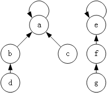
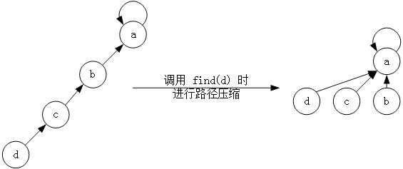
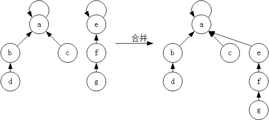

# 并查集

并查集既是一种数据结构，也是一种算法，支持查找和合并两种操作，不支持分割一个集合

用集合的某个元素来来代表这个集合，这个元素称为集合的代表元，集合内的所有元素组织成以代表元为根的树状结构



对于每个元素都有指针指向其父节点，代表元的父节点是自己

## 查找操作

查找元素所在集合的代表元

每次查找的时候，将查找 x 到代表元路径上的所有点父节点设为根节点来实现路径压缩，使得查找操作平均时间复杂度为 O(1)



## 合并操作

把 x 和 y 所在集合合并，其中将秩低的集合合并至秩高的集合，即总是将较矮的树合并至较高的树



## 用途

- 维护无向图的连通性，判断两个点是否在同一连通块内，和判断增加一条边是否产生环

- 计算有多少个不相交的集合

## 实现

```cpp
class UnionFind {
private :
    vector<int> parent;  // 父节点
    vector<int> rank;  // 秩

public:
    UnionFind(int n) {
        parent = vector<int>(n + 1);
        rank = vector<int>(n + 1, 0);
        for(int i = 1; i < parent.size(); ++i) {
            parent[i] = i;  // 初始化时每个结点的父节点都是自己
        }
    }

    int Find(int x) {
        if(x != parent[x]) {
            parent[x] = Find(parent[x]);  // 压缩路径
        }
        return parent[x]; 
    }

    bool Union(int x, int y) {
        int px = Find(x), py = Find(y);
        if(px == py) return false;
        if(rank[px] > rank[py]) parent[py] = px;
        if(rank[px] < rank[py]) parent[px] = py;
        if(rank[px] == rank[py]) {
            parent[py] = px;
            rank[px]++;
        }
        return true;
    }
}
```