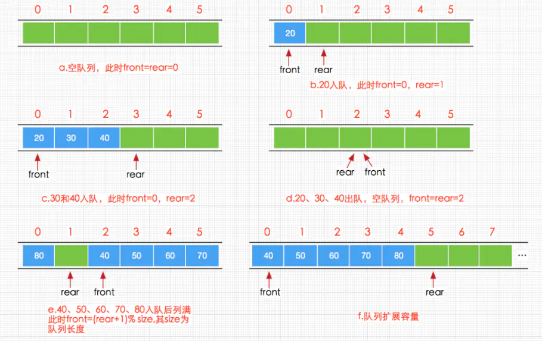

# 循环队列

对于长度一定的数组，存储的空间是确认的，在队列的入队和出队的过程中，数组中的存储空间需要不断的重复使用

使用两个参数：front、rear，front 代表的是队列第一个元素的下标，而 rear 代表的是队列最后一个有效元素的下一个元素的下标



循环队列通常会预留一个位置来判断队列为空和队列为满两种情况

入队算法：rear = (rear + 1) % 数组长度

出队算法：front = (front + 1) % 数组长度

## 实现

```cpp
class CircleQueue {
public:
  CircleQueue() : q(MAX_CAPACITY) {}
  virtual ~CircleQueue() = default;

  virtual bool empty(int) = 0;
  virtual bool full(int) = 0;
  virtual bool push(int) = 0;
  virtual bool pop(int&) = 0;

protected:
  const uint32_t MAX_CAPACITY = 50;
  std::vector<int> q;
};
```

### 锁版本

```cpp
class MtxCircleQueue : public CircleQueue {
public:
  MtxCircleQueue() : CircleQueue(), head(0), tail(0) {}
  virtual ~MtxCircleQueue() {
    std::lock_guard<std::mutex> lg(mtx);
    q.clear();
  }

  virtual bool empty() {
    std::lock_guard<std::mutex> lg(mtx);
    return _empty();
  }
  virtual bool full() {
    std::lock_guard<std::mutex> lg(mtx);
    return _full(); 
  }

  virtual bool push(int a) override {
    std::lock_guard<std::mutex> lg(mtx);
    if (_full()) {
      return false;
    }
    q[tail] = a;
    tail = (tail + 1) % MAX_CAPACITY;
    return true;
  }

  virtual bool pop(int &a) override {
    std::lock_guard<std::mutex> lg(mtx);
    if (_empty()) {
      return false;
    }
    a = q[head];
    head = (head + 1) % MAX_CAPACITY;
    return true;
  }

private:
  int head;
  int tail;
  std::mutex mtx;
  inline bool _empty() { return head == tail; }
  inline bool _full() { return (tail + 1) % MAX_CAPACITY == head; }
};
```

### 一个原子变量

```cpp
class AtomicSeqCstCircleQueue : public CircleQueue {
public:
  AtomicSeqCstCircleQueue() : CircleQueue(), head(0), tail(0), flag(false) {}
  virtual ~AtomicSeqCstCircleQueue() {
    lock();
    q.clear();
    unlock();
  }

  inline void lock() {
    bool expected = false;
    bool desired = true;
    do {
      expected = false;
      desired = true;
    } while (!flag.compare_exchange_strong(expected, desired));
  }

  inline void unlock() {
    bool expected = true;
    bool desired = false;
    do {
      expected = true;
      desired = false;
    } while (!flag.compare_exchange_strong(expected, desired));
  }
  
  virtual bool empty() {
    lock();
    bool ret = _empty();
    unlock();
    return ret;
  }
  virtual bool full() { 
    lock();
    bool ret = _full();
    unlock();
    return ret; 
  }

  virtual bool push(int a) override {
    lock();
    if (_full()) {
      unlock();
      return false;
    }
    q[tail] = a;
    tail = (tail + 1) % MAX_CAPACITY;
    unlock();
    return true;
  }

  virtual bool pop(int &a) override {
    lock();
    if (_empty()) {
      unlock();
      return false;
    }
    a = q[head];
    head = (head + 1) % MAX_CAPACITY;
    unlock();
    return true;
  }

private:
  int head;
  int tail;
  std::atomic_bool flag;
  inline bool _empty() { return head == tail; }
  inline bool _full() { return (tail + 1) % MAX_CAPACITY == head; }
};
```

### 两个原子变量

```cpp
class AtomicDoubleSeqCstCircleQueue : public CircleQueue {
public:
  AtomicDoubleSeqCstCircleQueue()
      : CircleQueue(), head(0), tail(0), tail_update(0) {}
  virtual ~AtomicDoubleSeqCstCircleQueue() {}
  
  virtual bool empty() {
    return tail.load() == head.load();
  }
  
  virtual bool full() {
    return (tail.load() + 1) % MAX_CAPACITY == head.load();
  }

  virtual bool push(int a) override {
    int now = 0;
    // 分配位置
    do {
      now = tail.load();
      if ((now + 1) % MAX_CAPACITY == head.load()) {
        return false;
      }
    } while (!tail.compare_exchange_strong(now, (now + 1) % MAX_CAPACITY));
    // 写入数据
    q[now] = a;
    // 更新数据可用标志
    int tu = now;
    do {
      tu = now;
    } while (tail_update.compare_exchange_strong(tu, (tu + 1) % MAX_CAPACITY));
    return true;
  }

  virtual bool pop(int &a) override {
    int now = 0;
    do {
      now = head.load();
      if (now == tail_update.load()) {
        return false;  // 只检查可用的数据
      }
      a = q[now];  // 读取数据
    } while (!head.compare_exchange_strong(now, (now + 1) % MAX_CAPACITY));
    return true;
  }

private:
  std::atomic_int head;  // 队列头指针
  std::atomic_int tail;  // 已分配但可能还未写入数据的位置
  std::atomic_int tail_update;  // 已完整写入数据的位置
};
```

### Acq-Rel

```cpp
class AtomicAcqRelCircleQueue : public CircleQueue {
public:
  AtomicAcqRelCircleQueue() : CircleQueue(), head(0), tail(0), tail_update(0) {}
  virtual ~AtomicAcqRelCircleQueue() {}
  
  virtual bool empty() {
    return tail.load(std::memory_order_relaxed) == head.load(std::memory_order_relaxed);
  }
  
  virtual bool full() {
    return (tail.load(std::memory_order_relaxed) + 1) % MAX_CAPACITY == head.load(std::memory_order_relaxed);
  }

  virtual bool push(int a) override {
    int now = 0;
    do {
      // push 是唯一写 tail 的地方
      // 所以可以使用 relaxed，不用同步消费者
      now = tail.load(std::memory_order_relaxed);
      // head 即可能被 push 更新，也可能被 pop 更新
      // 所以使用 acquire 读取 head
      // 这样能看到之前用 release 发布的更新
      if ((now + 1) % MAX_CAPACITY == head.load(std::memory_order_acquire)) {
        return false;
      }
    } while (!tail.compare_exchange_strong(now, (now + 1) % MAX_CAPACITY,
                                           std::memory_order_release,
                                           std::memory_order_relaxed));
    q[now] = a;
    int tu = now;
    do {
      tu = now;
    } while (tail_update.compare_exchange_strong(tu, (tu + 1) % MAX_CAPACITY,
                                                 std::memory_order_release,
                                                 std::memory_order_relaxed));
    return true;
  }

  virtual bool pop(int &a) override {
    int now = 0;
    do {
      now = head.load(std::memory_order_relaxed);
      if (now == tail.load(std::memory_order_acquire)) {
        return false;
      }
      if (now == tail_update.load(std::memory_order_acquire)) {
        return false;
      }
      a = q[now];
    } while (!head.compare_exchange_strong(now, (now + 1) % MAX_CAPACITY,
                                           std::memory_order_release,
                                           std::memory_order_relaxed));
    return true;
  }

private:
  std::atomic_int head;
  std::atomic_int tail;
  std::atomic_int tail_update;
};
```

