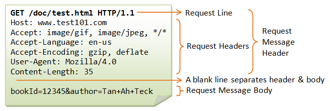
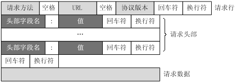
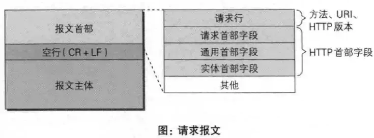
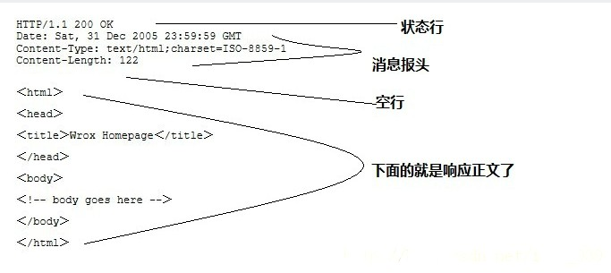
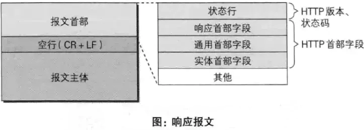
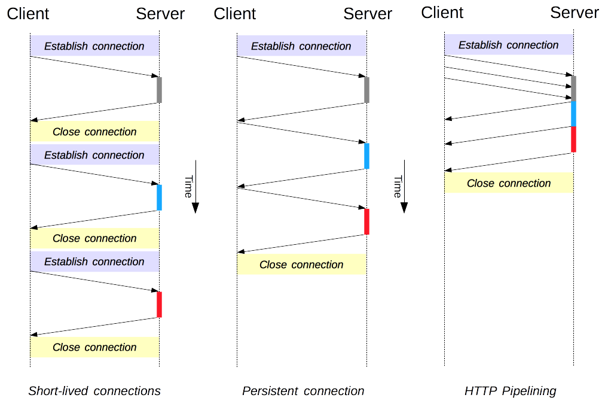
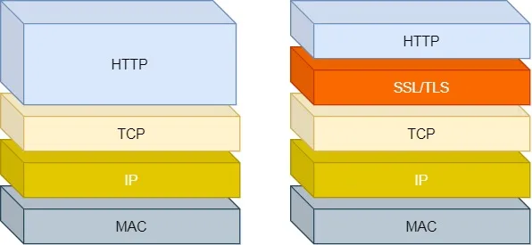

# http

HTTP（HyperTextTransferProtocol) 为超文本传输协议，其中超文本指文字、图片、视频、音频等的混合体，比如最熟悉的 html

## URI

URI (Unifrom Resource Identifier) 统一资源标识符，包含 URL (Uniform Resource Locator) 统一资源定位符和 URN (Uniform Resource Name) 统一资源名称


URI 本质上是一个字符串，这个字符串的作用是唯一地标记资源的位置或者名字


- scheme：资源使用哪种协议来访问，最常见的是 http、ftp 等

- user:passwd@：身份信息，表示登录主机时的用户名和密码，但现在已经不推荐使用这种形式了，因为它把敏感信息以明文形式暴露出来，存在严重的安全隐患

- host:port：主机名，表示资源所在的主机名

- path：表示资源所在位置，采用了类似文件系统目录的表示方式，通常以 `/` 开始

- query：查询参数，用一个 `?` 开始，后接多个 kv 形式的字符串，这些字符串用字符 `&` 连接，表示对资源附加的额外要求

- #fragment：片段标识符，它是 URI 所定位的资源内部的一个锚点，浏览器可以在获取资源后直接跳转到它指示的位置

## URL 构成


```cpp
/*
http://www.aspxfans.com:8080/news/index.asp?boardID=5&ID=24618&page=1#name

该 URL 的域名部分为 www.aspxfans.com
一个 URL 中，也可以使用 IP 地址作为域名使用

跟在域名后面的是端口，域名和端口之间使用 : 作为分隔符
端口不是一个 URL 必须的部分，如果省略端口部分，将采用默认端口

从域名后的 / 开始到 ? 为止，为路径，如果没有 ? 则是到 #，如果没有 # 则是到文件末
*/
```

## URL 编码

在 URI 里只能使用 ASCII 码，若使用非 ASCII 字符和不安全字符（` `、`<`、`>`、`#`、`%`、`|` 等），则需要在这些重新编码

URL 编码是百分号编码，将需要转码的字符按指定编码方式（默认使用 UTF-8 编码）转化为字节流，每个字节用 16 进制表示，并添加 `%` 组成一个编码

- Reserved 保留字符是那些具有特殊含义的字符，例如：`/` 字符用于 URL 不同部分的分界符

- Unreserved 非保留字符没有特殊含义，包含希腊字母、数字、`-`、`.`、`_`、`~`


除了保留字符和非保留字符之外的所有字符均需要编码，并且保留字符不代表某种特性的含义时也需要进行编码

特殊的是，空格 ` ` 在 `Content-Type：application/x-www-form-urlencoded` 的情况下，URL 请求查询字符串中出现空格时，需替换为 `+`，其他情况空格编码为 `%20`

## 报文

HTTP 请求报文和响应报文结构基本相同，都是由起始行、头部字段集合和消息正文组成

- 起始行：描述请求或响应的基本信息

- 头部字段集合：使用 kv 详细说明报文

- 消息正文：实际传输的数据，不一定是文本，可以是图片、视频等二进制数据

### 请求报文

请求报文主要由四大部分组成：请求行、请求头、空行、请求数据

请求头与请求数据间的空行，用来区分请求头和请求数据







### 响应报文

响应报文主要由四个部分组成：状态行、消息报头、空行和响应正文






### 头部字段

HTTP 头字段非常灵活，不仅可以使用标准里的 Host、Connection 等已有头，也可以任意添加自定义头

- 字段名不区分大小写

- 字段名里不允许出现空格，可以使用连字符 `-`，但不能使用下划线 `_`

- 字段名后面必须紧接着 `:`，不能有空格，而 `:` 后的字段值前可以有多个空格

- 字段的顺序是没有意义的

- 字段原则上不能重复，除非这个字段本身的语义允许，例如 Set-Cookie

常见字段有：

- Host：指定服务器的域名

- Content-Length：本次请求体长度

- Connection：客户端要求服务器使用 TCP 持久连接，以便其他请求复用；HTTP/1.1 默认持久连接

- Content-Type：服务器告诉客户端本次数据格式

- Accept：客户端声明能接受的数据格式

- Content-Encoding：数据的压缩方法

- Accept-Encoding：客户端能接受的压缩方法

## HTTP 方法

客户端发送的请求报文第一行为请求行，包含了方法字段

- Get: 获取资源

- Head: 获取资源元信息，主要用于确认 URL 的有效性以及资源更新的日期时间等

- Post: 向资源提交数据，数据包含在请求体中

- Put: 上传文件，从客户端向服务器传送的数据取代指定的文档的内容

- Patch: 对资源进行部分修改，Put 用于完全替代原始资源，Patch 允许部分修改

- Delete: 删除文件，不带验证机制

- Options: 查询 URL 能够支持的方法

- Connect：HTTP/1.1 协议中预留给能够将连接改为管道方式的代理服务器

- Trace：追踪请求

### Get 和 Head 区别

Get 适用于向服务器请求资源，一般将数据存于 url

Head 类似于简化版的 Get 请求，服务端收到 Head 请求时只返回响应头并且响应头与 Get 完全一致

### Post 和 Put 区别

Post 适用于向服务端发送数据，将数据存在 body 当中，通常表示的是 create 的含义

Put 类似于 Post 方法，也可以向服务器提交数据，是 update 的含义

## Get 和 Post 区别

- Get 通常将数据存于 url 中，Post 将数据存在 body 中，但语法上 Get 也可以将数据存在 body 中，Post 也可以将数据存在 url。但浏览器对 url 长度有限制，Get 能携带的数据一般不超过 2KB

- Get 是只读的，Post 会对数据增删改

- Get 因为只读所以是幂等的，Post 因为会修改服务器数据所以不是幂等的

- 不能因为 Post 参数存储在实体主体中就认为它的安全性更高，因为照样可以通过一些抓包工具查看

- URL 只支持 ASCII 码，因此 Get 的参数中如果存在中文等字符就需要先进行编码，Post 参数支持标准字符集

## 状态码

服务器返回的响应报文中第一行为状态行，包含了状态码以及原因短语，用来告知客户端请求的结果

状态码|类别|含义
-|-|-
1XX|Informational（信息性状态码）|接收的请求正在处理
2XX|Success（成功状态码）|请求正常处理完毕
3XX|Redirection（重定向状态码）|请求的资源发生了变动，需要用新的 URL 重新发送请求
4XX|Client Error（客户端错误状态码）|客户端发送的报文有误，服务器无法处理
5XX|Server Error（服务器错误状态码）|服务器处理请求出错

- 100 Continue：表明到目前为止都很正常，客户端可以继续发送请求或者忽略这个响应

- 200 OK：一切正常

- 204 No Content：请求已经成功处理，但是返回的响应报文不包含实体的主体部分。一般在只需要从客户端往服务器发送信息，而不需要返回数据时使用

- 206 Partial Content：响应返回的 body 数据并不是资源的全部，而是其中的一部分，也是服务器处理成功的状态

- 301 Moved Permanently：永久性重定向，请求的资源已经不存在了，需改用新的 URL 再次访问

- 302 Found：临时性重定向，请求的资源还在，但暂时需要用另一个 URL 来访问

- 303 See Other：和 302 有着相同的功能，但是 303 明确要求客户端应该采用 GET 方法获取资源

- 304 Not Modified：请求报文首部包含一些条件，不满足条件，则服务器会返回 304 

- 307 Temporary Redirect：临时重定向，与 302 的含义类似，但是 307 要求浏览器不会把重定向请求的 POST 方法改成 GET 方法

- 400 Bad Request：请求报文错误

- 401 Unauthorized：该状态码表示发送的请求需要有认证信息

- 403 Forbidden：服务器禁止访问资源

- 404 Not Found：请求的资源在服务器上不存在或未找到

- 500 Internal Server Error：服务器正在执行请求时发生错误

- 501 Not Implemented：请求的功能不支持

- 503 Service Unavailable：服务器暂时处于超负载或正在进行停机维护，现在无法处理请求

## HTTP 请求响应过程及特征

### 过程

输入网址并点击回车时，浏览器内部会进行如下操作

1. 输入 url，浏览器先解析 url 地址是否合法，同时获取 url 中的域名和文件名，根据这些信息生成 HTTP 请求消息

2. 游览器检查是否有缓存（游览器缓存-系统缓存-路由器缓存），如果有直接显示

3. 在发送 http 请求前，需要域名解析（DNS 解析），解析获取对应过的 ip 地址

4. 浏览器向服务器发起 TCP 连接请求

5. 连接成功后，浏览器发送 HTTP 请求

6. 服务器收到处理的请求，先发送应答给浏览器

7. 游览器收到 HTTP 响应

8. 游览器解析响应，如果响应可以缓存，则存入缓存

9. 浏览器解析 HTML 代码，并请求 HTML 代码中的资源

10. 浏览器接受完响应报文后，TCP 连接会关闭

11. 浏览器渲完成后呈现给用户

### 特征

- 客户（浏览器）-服务器模式

- 客户向服务器请求服务时，只需传送请求方法和路径

- HTTP 允许传输任意类型的数据对象，正在传输的类型由 Content-Type 加以标记

- 无连接，限制每次连接只处理一个请求

- 无状态，对于事务处理没有记忆能

## 连接管理



### 短连接和长连接

当浏览器访问一个包含多张图片的 HTML 页面时，除了请求访问的 HTML 页面资源，还会请求图片资源。如果每进行一次 HTTP 通信就要新建一个 TCP 连接，那么开销会很大

长连接只需要建立一次 TCP 连接就能进行多次 HTTP 通信

- 从 HTTP/1.1 开始默认是长连接的，如果要断开连接，需要由客户端或者服务器端提出断开

- 在 HTTP/1.1 之前默认是短连接，需要一个 keep-alive 参数告诉服务器建立一个长连接

- 户端请求头添加 `Connection: close` 字段主动关闭连接

- 服务端通常不会主动关闭连接，但可以通过设置时长、请求数等方式约定断开连接的条件

### 流水线

默认情况下，HTTP 请求是按顺序发出的，下一个请求只有在当前请求收到响应之后才会被发出

由于受到网络延迟和带宽的限制，在下一个请求被发送到服务器之前，可能需要等待很长时间

流水线是在同一条长连接上连续发出请求，而不用等待响应返回，这样可以减少延迟

服务器还是按顺序响应请求，不存在并行响应

## HTTP 包体长度

HTTP 基于 TCP 协议，包头部分可以通过 `\r\n\r\n` 分界，但获取包体通常有两种方法：

1. 包头中设置 `Content-Length` 字段，标识包体长度

2. 使用 HTTP Chunk：

- 将整个 HTTP 包体分为多个块，每个块都有自己的字段来说明自身的长，对端收到块后去掉说明部分，并将多个块合并在一起

- 传输方在包头中设置 `Transfer-Encoding:chunked` 替代 `Content-Length`

- 块格式 `[chunkSize][\r\n][data]...[0][\r\n][\r][\n]`，最后一个块长度为 0

- `chunkSize` 以十六进制的 ASCII 码表示，如 `chunkSize = 86`，先将 86 转成十六进制 56，再将字符 5 和 6 转成 ASCII 码，因此 `chunkSize=0x350x36`

## Cookie

HTTP 是无状态的，这既是优点也是缺点。优点是服务器没有状态差异，可以很容易地组成集群，缺点就是无法支持需要记录状态的事务操作

HTTP/1.1 在头部字段中新增 Cookie 来保存状态信息，服务端使用 `set-cookie` 标识客户端身份，客户端将 Cookie 保存在本地并在客户端之后向同一服务器再次发起请求时携带上发送给服务端，用于告知服务端两个请求是否来自同一浏览器

由于之后每次请求都会需要携带 Cookie 数据，因此会带来额外的性能开销（尤其是在移动环境下）

随着现代浏览器开始支持各种各样的存储方式，Cookie 渐渐被淘汰。新的浏览器 API 已经允许开发者直接将数据存储到本地，如使用 Web storage API（本地存储和会话存储）或 IndexedDB

### 用途

- 会话状态管理（如用户登录状态、购物车、游戏分数或其它需要记录的信息）

- 个性化设置（如用户自定义设置、主题等）

- 浏览器行为跟踪（如跟踪分析用户行为等）

### 组成

Cookie实际上是一小段的文本信息，以 kv 的格式保存，浏览器在一个 cookie 字段里可以存放多对数据，用 `;` 分割

- Name：一个唯一确定的 Cookie 名称

- Expires：过期时间

- Max-Age：过期的相对时间，单位是秒，浏览器用收到报文的时间点再加上 Max-Age，就可以得到失效的绝对时间

- Domain：生成该 Cookie 的域名

- Path：该 Cookie 是在当前的哪个路径下生成的

### 分类

- 会话期 Cookie：浏览器关闭之后它会被自动删除，也就是说它仅在会话期内有效

- 持久性 Cookie：指定过期时间（Expires）或有效期（max-age）之后就成为了持久性的 Cookie

## Session

Cookie 将用户信息存储在用户浏览器中，Session 将用户信息存储在服务器端，而且存储在服务器端的信息更加安全

Session 可以存储在服务器上的文件、数据库或者内存中

### 创建过程

1. 用户进行登录时，用户提交包含用户名和密码的表单，放入 HTTP 请求报文中

2. 服务器验证该用户名和密码，如果正确则把用户信息存储到 Redis 中，它在 Redis 中的 Key 称为 Session ID

3. 服务器返回的响应报文的 Set-Cookie 首部字段包含了这个 Session ID，客户端收到响应报文之后将该 Cookie 值存入浏览器中

4. 客户端之后对同一个服务器进行请求时会包含该 Cookie 值，服务器收到之后提取出 Session ID，从 Redis 中取出用户信息，继续之前的业务操作

### 安全问题

Session ID 不能让它被恶意攻击者轻易获取，那么就不能产生一个容易被猜到的 Session ID 值，同时需要经常重新生成 Session ID

### Cookie 和 Session 选择

- Cookie 只能存储 ASCII 码字符串，而 Session 则可以存储任何类型的数据，因此在考虑数据复杂性时首选 Session

- Cookie 存储在浏览器中容易被恶意查看，如果非要将一些隐私数据存在 Cookie 中，可以将 Cookie 值进行加密，然后在服务器进行解密

- 对于大型网站，如果用户所有的信息都存储在 Session 中，那么开销是非常大的，因此不建议将所有的用户信息都存储到 Session 中

## 缓存控制

### 服务端控制缓存

服务器响应请求返回资源的同时标记资源的有效期

服务器标记资源有效期使用的头字段是 `Cache-Control`，`no-store` 不允许缓存，用于某些变化非常频繁的数据，`no-cache` 可以缓存但在使用之前必须要去服务器验证是否过期，`must-revalidat` 如果缓存不过期就可以继续使用，但过期了就必须去服务器验证

### 客户端控制缓存

请求应答的双方都可以用 `Cache-Control` 这个字段进行缓存控制，互相协商缓存的使用策略

## HTTP 传输大文件

### 数据压缩

通过 `accept-encoding` 请求头告诉服务器浏览器支持的压缩方式，服务器压缩后将压缩方式写入 `content-encoding`

这种方式只对文本有较好地压缩率，对图片音频等效果较差

### 分块传输

`Transfer-Encoding: chunked` 表示报文 body 不是一次性发送，而是分为多个 chunked 分块发送

`Tfansfer-Encoding: chunked` 和 `Content-Length` 互斥，不可同时出现

### 范围请求

范围请求允许客户端只获取文件的某一部分

1. 客户端先发个 `HEAD` 请求看看服务器是否支持范围请求

2. 服务器必须在 `Accept-Ranges` 响应头中告知客户端是否具有范围请求的能力

3. 请求头 `Ranges` 是 HTTP 范围请求的专用字段，格式是 bytes=x-y 表示 x ~ y 之间的范围

4. 服务端在收到 Ranges 请求头时，首先验证 x-y 的范围是否合法，其次计算读取偏移量，返回 206 状态码和所读取的文件，最后在响应头加上 `Content-Range` 表示实际返回的偏移量和总数，格式为 bytes x-y/length

## HTTPS

HTTP 有以下安全性问题：

- 使用明文进行通信，内容可能会被窃听

- 不验证通信方的身份，通信方的身份有可能遭遇伪装

- 无法证明报文的完整性，报文有可能遭篡改

让 HTTP 先和 SSL 通信，再由 SSL 和 TCP 通信，也就是说 HTTPS 使用了隧道进行通信

通过使用 SSL，HTTPS 具有了混合加密（防窃听）、认证（防伪装）和摘要算法（防篡改）




### HTTPS 加密方式

HTTPS 采用混合的加密机制

对称加密算法加密数据 + 非对称加密算法交换密钥 + 数字证书验证身份

### 缺点

因为需要进行加密解密等过程，因此速度会更慢

需要支付证书授权的高额费用

## HTTP 与 HTTPS 区别

- HTTP 的 URL 以 http:// 开头，而 HTTPS 的 URL 以 https:// 开头

- HTTP 是不安全的，而 HTTPS 是安全的

- HTTP 标准端口是 80 ，而 HTTPS 的标准端口是 443

- 在 OSI 网络模型中，HTTP 工作于应用层，而 HTTPS 的安全传输机制工作在会话层

- HTTP 无法加密，而 HTTPS 对传输的数据进行加密

- HTTP 无需证书，而 HTTPS 需要 CA 机构颁发的 SSL 证书

## HTTP/2.0

HTTP/1.1 优点：

- 默认使用长连接

- 支持流水线

- 缓存、断点传输、Host 字段

HTTP/1.x 缺陷：

- 不会压缩请求和响应首部，从而导致不必要的网络流量

- 每次互相发送相同的首部造成的浪费较多

- 服务器是按请求的顺序响应的，如果服务器响应慢，会招致客户端一直请求不到数据，也就是队头阻塞

- 没有请求优先级控制

- 请求只能从客户端开始，服务器只能被动响应

HTTP/2 协议是基于 HTTPS 的，所以 HTTP/2 的安全性是有保障的

### 压缩首部

如果同时发出多个请求，请求的首部是一样的或是相似的，协议会消除重复部分

### 二进制分帧

HTTP/2 不再采用 HTTP/1.1 里的纯文本形式的报文，而是全面采用了二进制格式

HTTP/2把原来的的消息分散为数个小片的二进制帧，用 HEADER 帧存放头数据、DATA 帧存放实体数据



同一个消息的往返帧都会分配一个唯一的流 ID，在里面流动的是一串有先后顺序的数据帧，这些数据帧按照次序组装起来就是 HTTP/1 里的请求报文和响应报文

每个二进制帧会标识该帧属于哪个流，因此浏览器收到数据后可以按照流来对数据进行合并而不会出现合并后数据错乱的问题

对同一域名下所有请求只有一个 TCP 连接，服务器可以在一个 TCP 连接上并行的传输多个请求数据

客户端可以指定数据流的优先级

二进制分帧移除串行请求，解决队头阻塞，降低了延迟，大幅度提高了连接的利用率

### 服务器推送

当请求一个页面时，浏览器会先发送一次请求 html，然后再去请求 css 等资源，这样浏览器需要发送多次请求才能渲染出页面

如果服务器可以预判客户端请求，在浏览器第一次请求时就将资源一并推送则只需要一轮 HTTP 通信，从而提高性能

### HTTP/2 缺陷

多个 HTTP 请求在复用一个 TCP 连接，下层的 TCP 协议是不知道有多少个 HTTP 请求的，一旦发生了丢包现象，就会触发 TCP 的重传机制，这样在一个 TCP 连接中的所有的 HTTP 请求都必须等待这个丢了的包被重传回来

### HTTP/3

HTTP/2 虽然使用二进制分帧解决了队头阻塞问题，但在 TCP 协议里仍会有阻塞

HTTP/3 把 HTTP 下层的 TCP 协议改成了 UDP，真正完美解决了队头阻塞