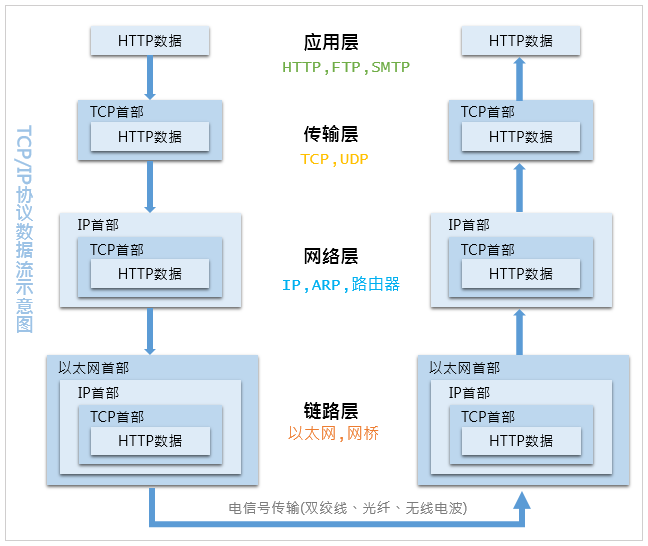

# 网络协议分层

## OSI 七层协议分层

发送方从最高层开始，从上到下按顺序传输数据，每一层接收到由上层处理的数据时，添加该层的首部并可能会对数据进行处理（如表示层）。而接收端则将顺序反过来，从首层开始，将数据的内容与该层对应的首部拆开，传给上一层

### 分层

- 应用层：最靠近用户的一层，是为计算机用户提供应用接口，也为用户直接提供各种网络服务，常见应用层的网络服务协议有：HTTP，HTTPS，FTP，POP3、SMTP 等

- 表示层：表示层提供各种用于应用层数据的编码和转换功能，确保一个系统的应用层发送的数据能被另一个系统的应用层识别；数据压缩、加密以及数据描述是主要功能

- 会话层：负责建立、管理和终止表示层实体之间的通信会话

- 运输层：传输层建立了主机端到端的链接，传输层的作用是为上层协议提供端到端的可靠和透明的数据传输服务，包括处理差错控制和流量控制等问题

- 网络层：通过 IP 寻址来建立两个节点之间的连接，选择合适的路由和交换节点，正确无误地按照地址传送给目的端的运输层（IP 协议层）

- 数据链路层：在物理层提供的服务基础上，在通信的实体间建立数据链路连接，传输以帧为单位的数据包

- 物理层：利用传输介质为数据链路层提供物理连接，负责处理数据传输

### 各层上的设备

- 物理层：网线、集线器

- 数据链路层：网卡、网桥、交换机

- 网络层：路由器

- 传输层、会话层：计算机

- 表示层：不同格式的文件

- 应用层：应用程序

## TCP/IP 四层模型

- 网络接口层

- 网络层

- 传输层

- 应用层

### 网络接口层

以太网规定一组电信号就是一个数据包，一个数据包被称为一帧

整个数据帧由首部、数据和尾部三部分组成

- 首部固定为 14 个字节，包含了目标 MAC 地址、源 MAC 地址和类型

- 数据 MTU 最短为 46 个字节，最长为 1500 个字节，如果需要传输的数据很长，就必须分割成多个帧进行发送

- 尾部固定为 4 个字节，表示数据帧校验序列，用于确定数据包在传输过程中是否损坏

以太网内采用广播形式，把数据包发给该子网内所有主机，子网内每台主机在接收到这个包以后，都会读取首部里的目标 MAC 地址，然后和自己的 MAC 地址进行对比，如果相同就做下一步处理，如果不同则丢弃这个包

存在问题：发送者如何知道接收者的 MAC 地址；发送者如何知道接收者和自己同属一个子网；如果接收者和自己不在同一个子网，数据包如何发给对方

### 网络层

网络层的主要工作是定义网络地址，区分网段，子网内 MAC 寻址，对于不同子网的数据包进行路由

为了解决网络接口层的问题，网络层引入了 IP 协议、ARP 协议、路由协议

### 传输层

有了网络接口层的 MAC 地址和网络层的 IP 地址，数据包就从可以从一个主机发送到另一台主机。实际上数据包是从一个主机的某个应用程序发出，然后由对方主机的应用程序接收。而每台电脑都有可能同时运行着很多个应用程序，所以当数据包被发送到主机上以后，是无法确定哪个应用程序要接收这个包

传输层的主要工作是定义端口，标识应用程序身份，实现端口到端口的通信，TCP 协议可以保证数据传输的可靠性

### 应用层

有了前三层协议，数据已经可以从一个主机上的应用程序传输到另一台主机的应用程序了，但此时传过来的数据是字节流，不能很好的被程序识别，操作性差

应用层定义了各种各样的协议来规范数据格式，常见的有 HTTP、FTP、SMTP 等

## 数据在各层之间的传递

- 报文：应用层的传输单元

- 数据段：传输层的传输单元，对应用层的报文封装，添加端口等信息

- 数据片：网络层的传输单元，对传输层的数据段封装，添加 IP 头部等信息，定义传输的具体细节

- 数据帧：数据链路层传输单元，对网络层的数据片封装

应用数据在在向下的过程中，需要添加下层协议所需要的首部或者尾部，而在向上的过程中不断拆开首部和尾部

## 数据切分与重组

- 网络层数据片在链路层分帧传输的原因是 MTU，数据帧格式限制了一帧数据不能超过 MTU

- 应用层数据报文在网络层分片传输的原因是 MSS

### MTU

一个 IP 数据片在网络中传输，如果它的长度大于 MTU 值就要进行分片传输，使得每片数据报的长度小于等于 MTU

分片传输的 IP 数据片不一定按序到达，但 IP 首部中的信息能让这些数据报片按序组装

使用 UDP 很容易导致 IP 分片，因为 TCP 有 MSS 所以很难发送一个需要进行分片的报文