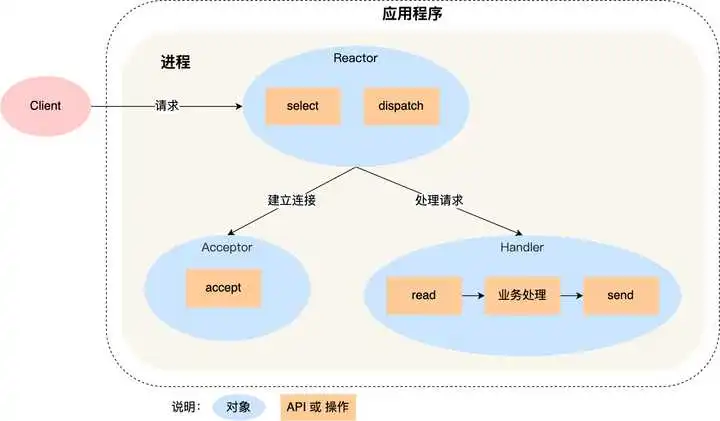
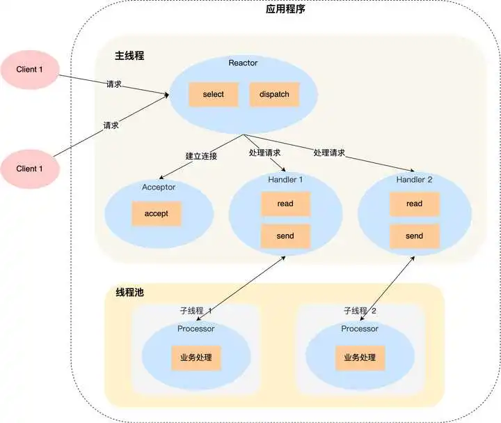
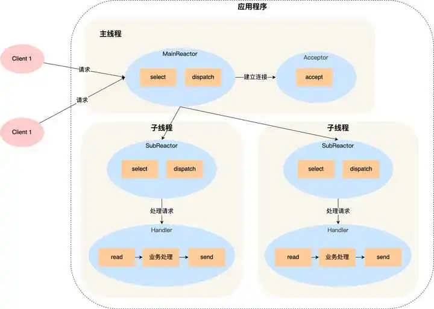

# Reactor

Reactor 模式其实就是利用面向对象的思想对非阻塞同步 IO 复用的封装，即 IO 多路复用监听事件，收到事件后根据事件类型分配给某个线程或进程

Reactor 模式主要由 Reactor 和处理资源池组成：

- Reactor 负责监听和分发事件，事件包括连接和读写

- 处理资源池负责处理事件

Reactor 模式是灵活多变的，可根据不同场景特殊设计：

- Reactor 数量灵活

- 处理资源池可以是单个进程、线程，也可以是多个进程、线程

## 单 Reactor 单线程模型

单 Reactor 单线程模型中有 Reactor、Acceptor、Handler 三个对象

- Reactor 对象负责监听和分发事件

- Acceptor 对象负责处理新连接

- Handler 对象负责处理业务

整体流程：

1. Reactor 对象通过 IO 复用监控事件，收到事件后通过事件类型进行转发

2. 如果是连接建立的事件，则由 Acceptor 对象进行处理，并创建 Handler 对象负责处理后续事件

3. 如果不是建立连接事件，则交由当前连接对应的 Handler 进行处理

4. Handler 通过 `read`、业务处理、`send` 完成完整业务流程

单 Reactor 单线程模型只是在代码上进行了组件的区分，但是整体操作还是单线程，不能充分利用硬件资源，并且当业务处理耗时较长时，会造成响应延迟

单 Reactor 单线程的方案不适用计算机密集型的场景，只适用于业务处理非常快速的场景

## 单 Reactor 多线程模型

1. Reactor 对象通过 IO 复用监控事件，收到事件后通过事件类型进行转发

2. 如果是连接建立的事件，则由 Acceptor 对象进行处理，并创建 Handler 对象负责处理后续事件

3. 如果不是建立连接事件，则交由当前连接对应的 Handler 进行处理

4. Handler 对象不再负责业务处理，只负责接收、发送数据，Handler 通过 `read` 读取数据后会分发给子线程 Processor 对象进行业务处理

5. 子线程 Processor 完成业务处理后，将结果发给主线程中的 Handler 对象进行处理

6. Handler 对象收到结果后通过 `send` 将结果返回

将业务处理交由线程池来处理，使得 Reactor 能更专注的做事件分发工作了，提升整个应用的吞吐

又因为 Reactor 承担了所有事件的监听和响应，且只在主线程中运行，所以当面对瞬间高并发场景时容易成为性能瓶颈

## 主从 Reactor 多线程模型

1. 主线程中的 MainReactor 对象通过 IO 复用监控连接事件，收到事件后通过 Acceptor 对象将新连接分配给子线程的 SubReactor

2. 子线程中的 SubReactor 对象将接收的新连接加入自己的 IO 复用中继续监控，并创建一个 Handler 对象处理后续事件

3. 当有新事件发生时，由 SubReactor 对象调用相应 Handler 对象进行处理

4. Handler 对象通过 `read`、业务处理、`send` 完成完整业务处理

主从 Reactor 多线程模型中，主线程和子线程分工明确，主线程只负责接收新连接，子线程负责完成后续的业务处理，子线程处理完成后无须返回数据，直接就可以在子线程中将结果返回