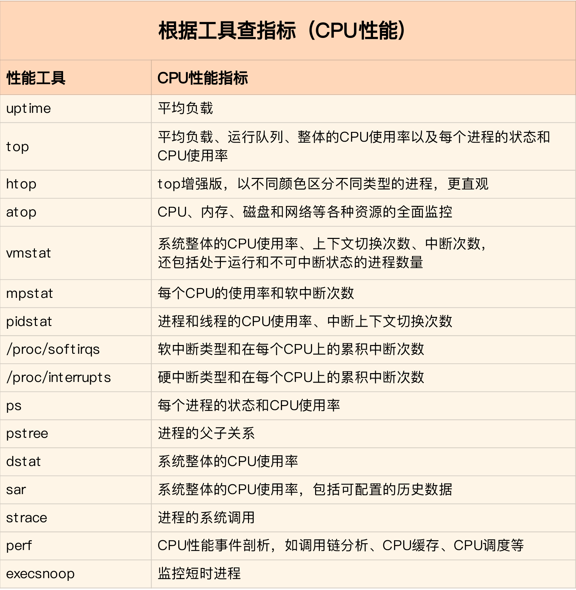
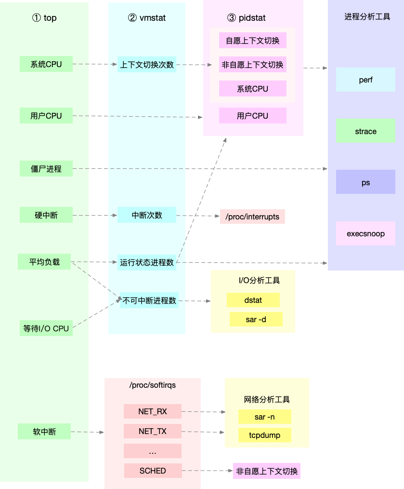

# 性能分析

Linux 性能工具图谱

## CPU 性能

- 从 `top` 的输出可以得到各种 CPU 使用率以及僵尸进程和平均负载等信息

- 从 `vmstat` 的输出可以得到上下文切换次数、中断次数、运行状态和不可中断状态的进程数

- 从 `pidstat` 的输出可以得到进程的用户 CPU 使用率、系统 CPU 使用率、以及自愿上下文切换和非自愿上下文切换情况

## 内存性能

