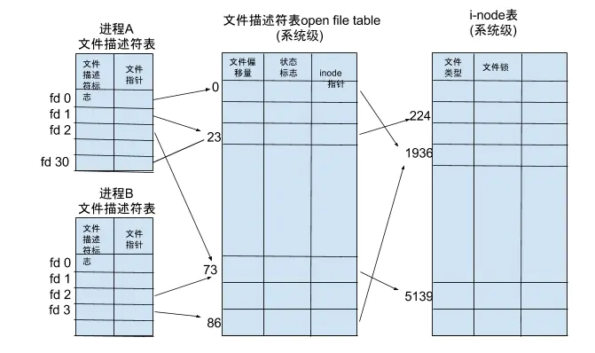

# 文件描述符

Linux 系统中把一切都看做是文件。当进程打开现有文件或创建新文件时，内核向进程返回一个文件描述符，文件描述符就是内核为了高效管理已被打开的文件所创建的索引，用来指向被打开的文件，所有执行 IO 操作的系统调用都会通过文件描述符

每个文件描述符会与一个打开的文件相对应，不同的文件描述符也可能指向同一个文件，相同的文件可以被不同的进程打开，也可以在同一个进程被多次打开

常见的文件描述符是 0、1、2，分别表示标准输入、标准输出和错误输出。一个进程创建时，这个三个文件就也被它打开了

系统为维护文件描述符，建立了三个表：进程级的文件描述符表、系统级的文件描述符表和文件系统的 inode 表

- 进程级文件描述表底层是一个数组，索引从 0 开始，索引即为文件描述符

- 系统级文件描述符表存储每个打开文件的信息，包括文件偏移量、状态标志以及 inode 指针

- inode 表中的每个数据项都对应一个具体的磁盘文件