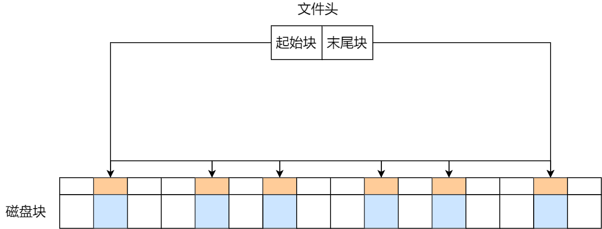
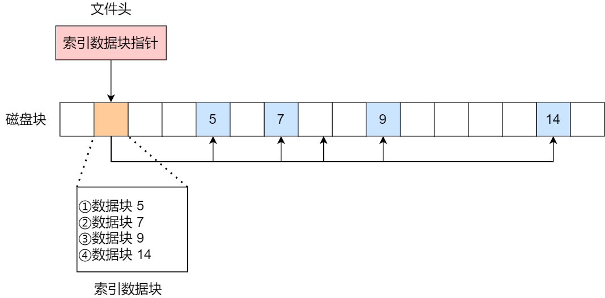
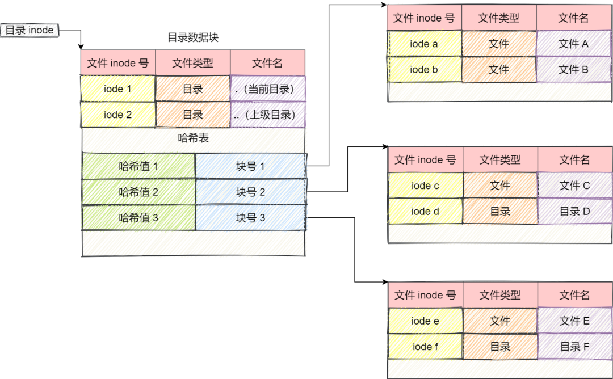
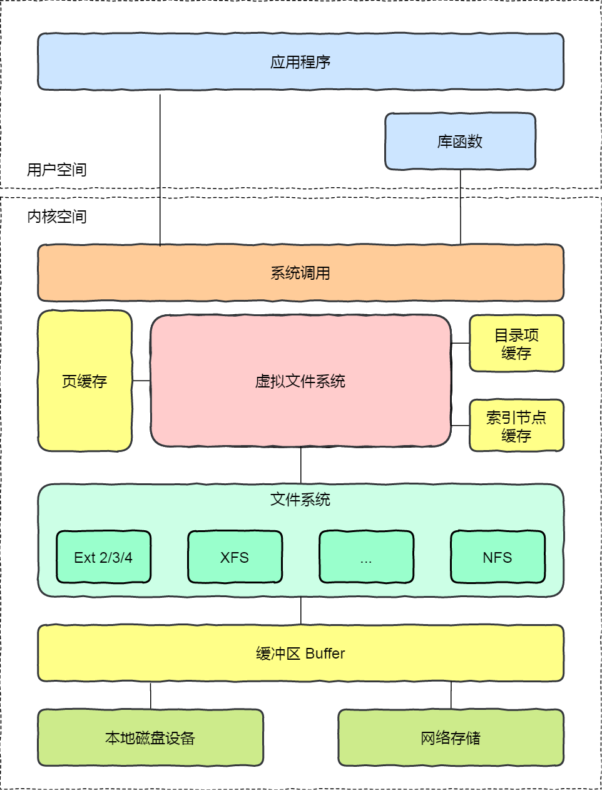
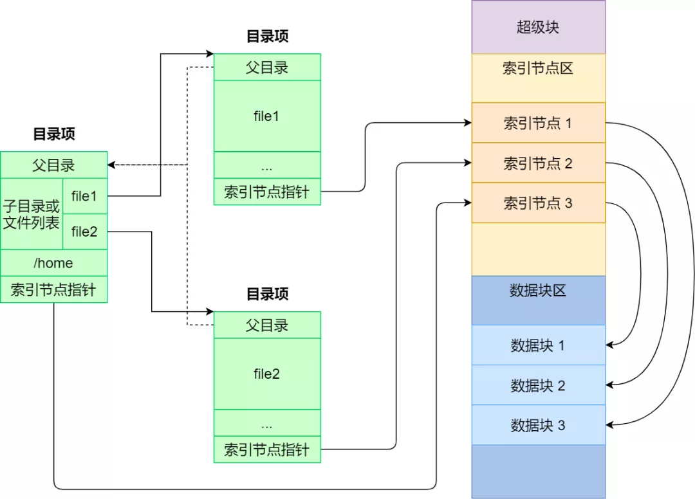
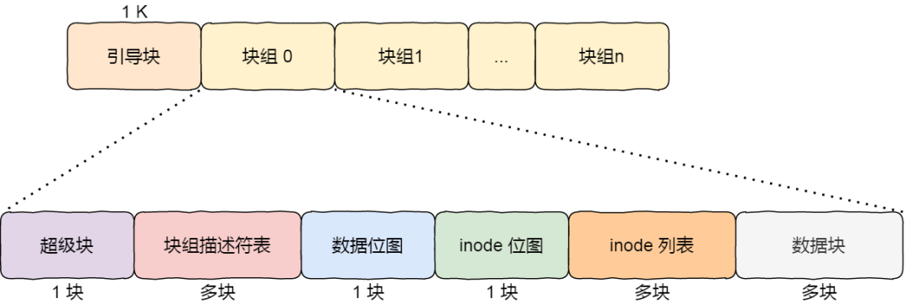
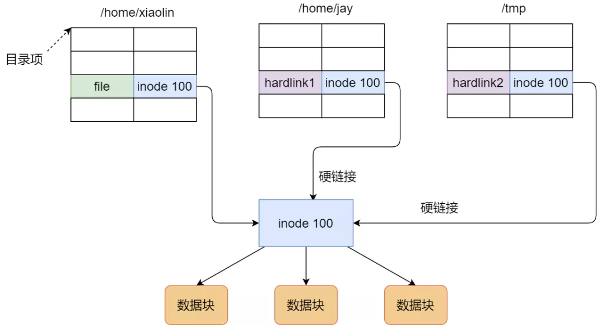
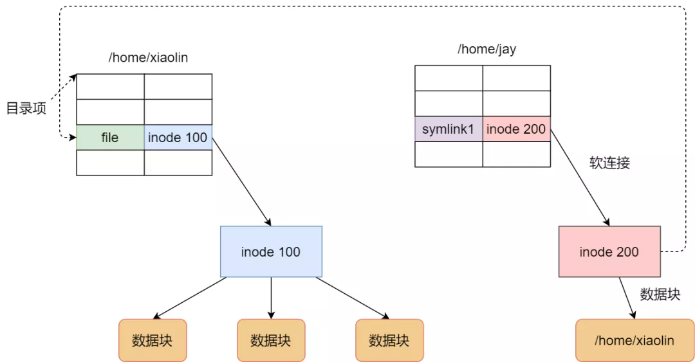

# 文件系统

文件系统本身是对存储设备上的文件进行组织管理的机制。组织方式不同，就会形成不同的文件系统。比如常见的 ext、xfs、zfs 以及网络文件系统 nfs 等等

## 文件存放

数据在磁盘上的存放方式有两种，连续空间存放方式和非连续空间存放方式

### 连续空间存放方式

- 文件存放在磁盘连续的物理空间中，并且因为文件的数据都是紧密相连所以读写效率很高，一次磁盘寻道就可以读出整个文件

- 必须先知道一个文件的大小，这样文件系统才会根据文件的大小在磁盘上找到一块连续的空间分配给文件

- 有磁盘空间碎片和文件长度扩展的缺陷

### 非连续空间存放方式

非连续空间存放方式分为链表方式和索引方式

链表的方式存放是离散的，不用连续的，从而可以消除磁盘碎片，大大提高磁盘空间的利用率，同时文件的长度可以动态扩展

#### 隐式链表方式

隐式链表的实现方式是在文件头保存第一块和最后一块的位置，并且每个数据块里面留出一个指针空间用来存放下一个数据块的位置，从链头开始就可以顺着指针找到所有的数据块

隐式链表的存放方式的缺点在于无法直接访问数据块，只能通过指针顺序访问文件，以及数据块指针消耗了一定的存储空间

隐式链接分配的稳定性较差，系统在运行过程中由于软件或者硬件错误导致链表中的指针丢失或损坏，会导致文件数据的丢失



#### 显式链表方式

显式链表把用于链接文件各数据块的指针显式地存放在内存的文件分配表 FAT 中，每个表项中存放磁盘块地址和下个表项指针

一个磁盘对应一个 FAT

由于查找记录的过程是在内存中进行的，因而不仅显著地提高了检索速度，而且大大减少了访问磁盘的次数，但也正是整个表都存放在内存中的关系，其不适用于大磁盘

#### 索引方式

索引方式通过在磁盘中为每个文件创建一个索引数据块，里面存放的是指向文件数据块的指针列表，并且文件头有索引数据块的指针，这样就可以通过文件头知道索引数据块的位置，再通过索引数据块里的索引信息找到对应的数据块



由于索引数据也是存放在磁盘块的，如果文件很小只需一块磁盘块，但还是需要额外分配一块来存放索引数据，所以缺陷之一就是存储索引带来的开销

如果文件很大，大到一个索引数据块放不下索引信息，可以通过将链表和索引组合的方式来处理大文件的存放

在索引数据块留出一个存放下一个索引数据块的指针，于是当一个索引数据块的索引信息用完了，就可以通过指针的方式，找到下一个索引数据块的信息。这种方式同时会有链表方式存在的问题，万一某个指针损坏了，后面的数据也就会无法读取了


也可以使用多级索引，通过一个索引块来存放多个索引数据块，一层套一层索引


## 空闲空间管理

### 空闲表

为所有空闲空间建立一张表，表内容包括空闲区的第一个块号和该空闲区的块个数

当请求分配磁盘空间时，系统依次扫描空闲表里的内容，直到找到一个合适的空闲区域为止

当用户撤销一个文件时，系统回收文件空间需顺序扫描空闲表，寻找一个空闲表条目并将释放空间的第一个物理块号及它占用的块数填到这个条目中

如果存储空间中有着大量的小的空闲区，则空闲表变得很大，这样查询效率会很低

### 空闲链表

每一个空闲块里有一个指针指向下一个空闲块，这样也能很方便地找到空闲块并管理起来

当创建文件时，就从链头上依次取下一块或几块。当回收空间时，把这些空闲块依次接到链头上

每当在链上增加或移动空闲块时需要做很多 IO 操作，所以工作效率低，并且数据块的指针消耗了一定的存储空间

### 位图

利用二进制的一位来表示磁盘中一个盘块的使用情况，磁盘上所有的盘块都有一个二进制位与之对应

Linux 文件系统不仅用位图来管理数据空闲块，还用于 inode 空闲块的管理，因为 inode 也是存储在磁盘的，自然也要对其管理

## 目录存储

和普通文件不同的是，普通文件的块里面保存的是文件数据，而目录文件的块里面保存的是目录里面一项一项的文件信息

在目录文件的块中，最简单的保存格式就是列表，就是一项一项地将目录下的文件信息列在表里。列表中每一项就代表该目录下的文件的文件名和对应的 inode，通过这个 inode，就可以找到真正的文件

如果一个目录有超级多的文件，要想在这个目录下找文件，如果按照列表一项一项地找，效率就不高了。于是，保存目录的格式改成哈希表，对文件名进行哈希计算，把哈希值保存起来，如果要查找一个目录下面的文件名，可以通过名称取哈希。如果哈希能够匹配上，就说明这个文件的信息在相应的块里面



## 虚拟文件系统

文件系统的种类众多，而操作系统希望对用户提供一个统一的接口，于是在用户层与文件系统层引入了中间层，这个中间层就称为虚拟文件系统 VFS

VFS 定义了一组所有文件系统都支持的数据结构和标准接口



Linux 支持的文件系统根据存储位置的不同，可以把文件系统分为三类：

- 磁盘的文件系统，它是直接把数据存储在磁盘中，比如 Ext 2/3/4、XFS 等都是这类文件系统

- 内存的文件系统，这类文件系统的数据不是存储在硬盘的，而是占用内存空间，如经常用到的 /proc 和 /sys 文件系统都属于这一类，读写这类文件，实际上是读写内核中相关的数据

- 网络的文件系统，用来访问其他计算机主机数据的文件系统，比如 NFS、SMB

VFS 背后的思想就是建立一个通用的文件模型，使得它能兼容所有的文件系统

这个通用的文件模型是以 ext 为模版构建，每个特定的文件系统都需要将它物理结构转换为通用文件模型。例如，通用文件模型中所有的目录都是文件，它包含文件和目录。而在其他的文件类型中，比如 FAT 它的目录就不属于文件。这时内核就会在内存中生成这样的目录文件，以满足通用文件模型的要求

### 组成

Linux 文件系统会为每个文件分配两个数据结构：索引节点 inode 和目录项 dentry，它们主要用来记录文件的元信息和目录层次结构

- inode 用来记录文件的元信息，比如 inode 编号、文件大小、访问权限、创建时间、修改时间、数据在磁盘的位置等

- dentry 用来记录文件的名字、inode 指针以及与其他 dentry 的层级关联关系。多个目录项关联起来，就会形成目录结构

由于 inode 唯一标识一个文件，而 dentry 记录着文件的名，所以 dentry 和 inode 的关系是多对一，也就是说一个文件可以有多个别名，例如硬链接的实现就是多个 dentry 中的 inode 指向同一个文件



vfs 把所有的 dentry 都放到 dentry_hashtable 这个哈希表中，key 就是由目录项对象和文件名哈希产生。同时，为了避免缓存过大，dentry 缓存会清理缓存链表尾部没有用过的 dentry 缓存项

目录也是文件，也是用 inode 唯一标识，和普通文件不同的是普通文件在磁盘里面保存的是文件数据，而目录文件在磁盘里面保存子目录或文件

### 磁盘划分

将磁盘划分为若干个块组，每个块组的长度都相同

一个文件占用的存储空间是块组长度的整数倍，一个块组不能用来存储两个文件



每个块组都由超级块、块组描述符表、块位图、 inode 位图、inode 表、数据块六个部分组成

- 第一个块是引导块，在系统启动时用于启用引导，接着后面就是一个一个连续的块组

- 超级块包含的是文件系统的重要信息，比如 inode 总个数、块总个数、每个块组的 inode 个数、每个块组的块个数、块长度等

每个块组中存储的超级块内容都是相同的，这样做是为了在系统崩溃损坏超级块的情况下，有其他副本可以用来恢复数据

```cpp
struct ext2_super_block{
    __le32 s_inodes_count;         /*inode数据*/
    __le32 s_blocks_count;         /*块数目*/
    __le32 s_r_blocks_count;       /* 已分配块的数目*/
    __le32 s_free_blocks_count;    /*空闲块数目*/
    __le32 s_free_inodes_count;    /*空闲inode数目*/
    __le32 s_first_data_block;     /*第一个数据块*/
    __le32 s_log_block_size;       /*块长度*/
    __le32 s_log_frag_size;        /*碎片长度*/
    __le32 s_blocks_per_group;     /*每个块组包含的块数*/
    __le32 s_frags_per_group;      /*每个块组包含的碎片*/
    __le32 s_inodes_per_group;     /*每个块组的inode数目*/
    __le32 s_mtime;                /*装载时间*/
    __le32 s_wtime;                /*写入时间*/
    __le16 s_mnt_count;            /*装载计数*/
    __le16 s_max_mnt_count;        /*最大装载计数*/
    // ...
}
```

- 块组描述符表中存放着块组描述符，每个块组描述符存储一个块组的描述信息

组描述符包含文件系统中各个块组的状态，比如块组中空闲块和 inode 的数目等

```cpp
struct ext2_group_desc{
    __le32 bg_block_bitmap;         /*块位图块*/
    __le32 bg_inode_bitmap;         /*inode位图块*/
    __le32 bg_inode_table;          /*inode表块*/
    __le16 bg_free_blocks_count;    /*空闲块数目*/
    __le16 bg_free_inodes_count;    /*空闲inode数目*/
    __le16 bg_used_dirs_count;      /*目录数目*/
    __le16 bg_pad;
    __le32 bg_reserved[3];
    // ...
}
```

- 数据位图和 inode 位图是比特位串，该结构中每个比特位都对应于一个数据块或 inode，用来标识对应的数据块或 inode 是空闲还是被使用

- inode 列表包含了块组中所有的 inode，inode 用于保存文件系统中与各个文件和目录相关的所有元数据

```cpp
struct ext2_inode{
    __le16 i_mode;                     /*访问权限*/
    __le16 i_uid;                      /*所有者UID的低16位*/
    __le32 i_size;                     /*长度，按字节计算*/
    __le32 i_atime;                    /*访问时间*/
    __le32 i_ctime;                    /*创建时间*/
    __le32 i_mtime;                    /*修改时间*/
    __le32 i_dtime;                    /*删除时间*/
    __le16 i_gid;                      /*组ID的低16位*/
    __le16 i_links_count;              /*链接计数*/
    __le32 i_blocks;                   /*块数目*/
    __le32 i_flags;                    /*文件标志*/
    __le32 i_blocks[EXT2_N_BLOCKS];    /*块指针*/
    __le32 i_generation;               /*文件版本，用于NFS*/
    // ...
}
```

- 数据块保存文件的有用数据

每个块组里有很多重复的信息，比如超级块和块组描述符表，这两个都是全局信息，这么做是有两个原因：

- 如果系统崩溃破坏了超级块或块组描述符，有关文件系统结构和内容的所有信息都会丢失。如果有冗余的副本，该信息是可能恢复

- 通过使文件和管理数据尽可能接近，减少了磁头寻道和旋转，这可以提高文件系统的性能

### 数据存放

根据文件的大小，存放的方式会有所变化：

- 如果存放文件所需的数据块小于 10 块，则直接存放数据块指针

- 如果存放文件所需的数据块超过 10 块，则采用一级索引方式

- 如果前面两种方式都不够存放大文件，则采用二级索引方式

- 如果二级间接索引也不够存放大文件，则采用三级索引方式

从而 inode 就需要包含 13 个指针，10 个指向数据块的指针，第 11 个指向索引块的指针，第 12 个指向二级索引块的指针，第 13 个指向三级索引块的指针

这个方案虽然解决大文件的存储，但是对于大文件的访问仍需要大量的查询，效率比较低

### 读取操作流程

假设打开一个 /foo/bar 的文件，将发起三次读请求

1. 读取根目录的 inode 并从中找到 foo 的 inode

2. 读取 foo 的 inode 并从中找到 bar 的 inode

3. 根据 inode 打开 bar 文件

### 写入操作流程

假设创建 /foo/bar，将发起三次写请求

1. 读取根目录 inode 并从中找到 foo 的 inode

2. 读取 foo 的 inode，读取相应块组

3. 写 inode bitmap、inode table 和 data table

## Journaling

在文件系统新写入一个数据块需要发起多次 IO，如果在这个过程中因为断电、内核 bug 等各种原因导致这些数据没有完整的写入，会导致文件系统的数据不一致

一种解决方案叫做日志 Journaling，在数据库技术中叫做 Write Ahead Logging，其基本思路是，在实际往磁盘写入数据之前，一次性把所有要写入的内容（即日志包括 bitmap，inode，数据块）先写到磁盘的某个地方，然后再实际写入data bitmap，inode 和数据块

## 硬链接和软链接

硬链接是多个 dentry 指向同一个 inode，但是 inode 是不可以跨越文件系统的，每个文件系统都有各自的 inode 数据结构和列表，所以硬链接是不可用于跨文件系统的

由于多个 dentry 都是指向一个 inode，那么只有删除文件的所有硬链接以及源文件时，系统才会彻底删除该文件



软链接相当于重新创建一个文件，这个文件有独立的 inode，但是这个文件的内容是另外一个文件的路径，所以访问软链接的时候，实际上相当于访问到了另外一个文件

软链接是可以跨文件系统的，甚至目标文件被删除了，链接文件还是在的，只不过指向的文件找不到了而已

