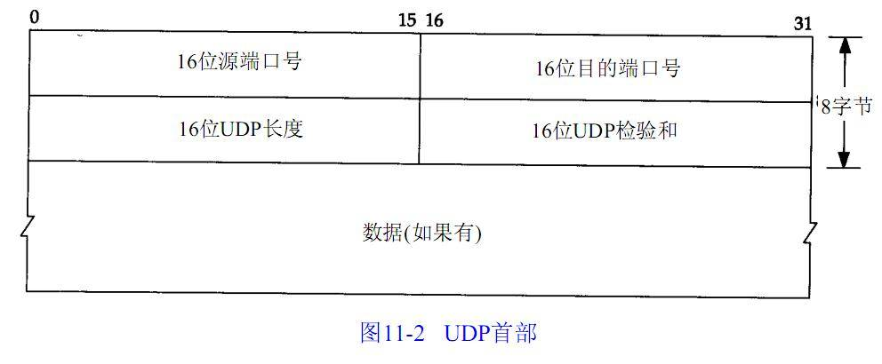

# udp

UDP（User Datagram Protocol）是无连接的，尽最大可能交付，没有拥塞控制，面向报文（对于应用程序传下来的报文不合并也不拆分，只是添加 UDP 首部），支持一对一、一对多、多对一和多对多的交互通信

UDP 数据包由首部和数据两部分组成，首部长度为 8 个字节，主要包括源端口和目标端口；数据最大为 65527 个字节，整个数据包的长度最大可达到 65535 个字节

从 UDP 数据包的包头可以看出，UDP 的最大包长度是 2^16-1 的个字节，由于 UDP 包头占 8 个字节，而在 IP 层进行封装后的 IP 包头占去 20 字节，网络接口层最大包长 1500 字节，所以 UDP 数据包的最大理论长度是 1500 - 8 - 20 = 1472 字节

UDP 协议没有确认机制，数据包一旦发出，无法知道对方是否收到，因此可靠性较差

## TCP 与 UDP 的特点与区别

UDP 是无连接的，尽最大可能交付，没有拥塞控制，面向报文（对于应用程序传下来的报文不合并也不拆分，只是添加 UDP 首部），支持一对一、一对多、多对一和多对多的交互通信

TCP 提供一种面向连接的、可靠的字节流服务，利用校验、确认和重传机制来保证可靠传输，给数据分节进行排序，并使用累积确认保证数据的顺序不变和非重复，使用滑动窗口机制来实现流量控制，通过动态改变窗口的大小进行拥塞控制

## UDP 实现可靠传输

UDP 不属于连接协议，具有资源消耗少，处理速度快的优点，所以通常音频、视频和普通数据在传送时，使用 UDP 较多，因为即使丢失少量的包，也不会对接受结果产生较大的影响

改进 UDP 即在应用层自己实现一些保障可靠传输的机制，在应用层实现 TCP 协议的可靠数据传输机制

### 应答确认

Seq/Ack 应答机制

### 重传

为了保证可靠性，需要在发送数据的时候添加重传定时器，来保证丢失的数据会被重传。重传的定时器可以定时回调发送重传的数据，也支持将接收到 ACK 的数据从定时器中取出

接收端接收到消息时设定一个定时器，当超时时将这段时间内所有要发送的 ACK 组合在一起发送；还有一种是捎带 ACK，即定时器未到但恰好也有数据要发送给对端，那么就将 ACK 捎带在这个数据包中一起发送出去

### 定义协议头

数据添加一个自己的协议头以使双端来识别必要的消息，可以通过不同的控制标识组合来实现一个变长的协议头，有效利用数据包的传输数据量

### 有序接受

添加包序号

### 滑动窗口流量控制

滑动窗口协议